# Aplicación: Índice de Pobreza Multidimensional en Colombia. 

Nos centramos en la incidencia de la pobreza multidimensional descrito previamente. En este caso, requerimos $K = 9$ indicadores que se miden como privaciones: $y_{di}^{k} = 1$ si la persona tiene la privación y $y_{di}^{k} = 0$ si la persona no ha tenido la privación.

El índice requiere información para cada individuo $i = 1, \ldots, N_d$ en los dominios $d = 1, \ldots, D$, donde $N_d$ denota el tamaño de la población del dominio $d$.

La función indicadora $I(\cdot)$ es igual a 1 cuando se cumple la condición $q_{di} \ge z$. Para este estudio, utilizamos el valor de 0.4 para $z$, es decir, $I(\cdot)$ es igual a 1 cuando $q_{di} \ge 0.4$. $q_{di}$ es una cantidad ponderada que considera los $K = 9$ indicadores que conforman el índice. El valor de $q_{di}$ el dominio $d$ se calcula como:

  
$$
  q_{di} = \frac{1}{12}\sum_{k =1}^{12}y_{di}^{k} 
$$
  
 
Donde: 
  
| Categoría  | Variable          | Descripción                                                                |
|------------|-------------------|----------------------------------------------------------------------------|
| Educación  | nbi_hnolee_ee     | Al menos un mayor de 10 años no sabe leer en el hogar                      |
|            | nbi_hlogroeduc_ee | Todos los integrantes del hogar entre 18 y 64 están privados en la nbi_educ individual |
|            | nbi_heducninios   | Al menos un menor de edad no asiste o está rezagado                         |
| Vivienda   | nbi_hhacina       |                                                                             |
|            | nbi_henergia      |                                                                             |
|            | nbi_htic          |                                                                             |
| Salud      | nbi_hagua_ee      |                                                                             |
|            | nbi_hsaneamiento_ee |                                                                             |
|            | nbi_hsalud_ee     |                                                                             |
| Empleo     | nbi_hpartemp      | Al menos un individuo del hogar tiene empleo temporal según la condición y edad |
|            | nbi_hempe         | Todos los individuos ocupados del hogar cumplen ciertas condiciones de empleo |
|            | nbi_hjub          | Al menos un individuo del hogar es jubilado según edad y pensión            |


Los datos de la encuesta y el censo han sido preparados previamente, la información sobre la cual realizaremos la predicción corresponde a Colombia en el 2019 


```r
encuesta_ipm <-
  readRDS("Modelo_bayes_HxA_Hogar/COL/Data/Encuestas/encuesta_nbi.rds")
statelevel_predictors_df <-
  readRDS("Modelo_bayes_HxA_Hogar/COL/Data/statelevel_predictors_df_dam2.rds") 

byAgrega <- c("dam",
              "dam2",
              "area",
              "sexo",
              "etnia",
              "anoest",
              "edad")
```

Agregando la información para los municipios de Colombia para los indicadores que conformarán el IPM


```r
names_ipm <- c(
  "nbi_hnolee_ee" ,
  "nbi_hlogroeduc_ee" ,
  "nbi_heducninios" ,
  "nbi_hhacina" ,
  "nbi_henergia" ,
  "nbi_htic" ,
  "nbi_hagua_ee" ,
  "nbi_hsaneamiento_ee" ,
  "nbi_hsalud_ee" ,
  "nbi_hpartemp" ,
  "nbi_hempe" ,
  "nbi_hjub"
)  

encuesta_df <- map(setNames(names_ipm,names_ipm),
                   function(y){
                     encuesta_ipm$temp <- as.numeric(encuesta_ipm[[y]])
                     encuesta_ipm %>% 
                       group_by_at(all_of(byAgrega)) %>%
                       summarise(n = n(),
                                 yno = sum(temp),
                                 ysi = n - yno, .groups = "drop") %>% 
                       inner_join(statelevel_predictors_df,
                                  by = c("dam","dam2"))
                   })
```

La base resultante quedan de la siguiente forma:

<table class="table table-striped lightable-classic" style="width: auto !important; margin-left: auto; margin-right: auto; font-family: Arial Narrow; width: auto !important; margin-left: auto; margin-right: auto;">
<caption>(\#tab:unnamed-chunk-3)nbi_hnolee_ee</caption>
 <thead>
  <tr>
   <th style="text-align:left;"> dam </th>
   <th style="text-align:left;"> dam2 </th>
   <th style="text-align:left;"> area </th>
   <th style="text-align:left;"> sexo </th>
   <th style="text-align:left;"> etnia </th>
   <th style="text-align:left;"> anoest </th>
   <th style="text-align:left;"> edad </th>
   <th style="text-align:right;"> n </th>
   <th style="text-align:right;"> yno </th>
   <th style="text-align:right;"> ysi </th>
   <th style="text-align:right;"> area1 </th>
   <th style="text-align:right;"> sexo2 </th>
   <th style="text-align:right;"> edad2 </th>
   <th style="text-align:right;"> edad3 </th>
   <th style="text-align:right;"> edad4 </th>
   <th style="text-align:right;"> edad5 </th>
   <th style="text-align:right;"> etnia2 </th>
   <th style="text-align:right;"> anoest2 </th>
   <th style="text-align:right;"> anoest3 </th>
   <th style="text-align:right;"> anoest4 </th>
   <th style="text-align:right;"> etnia1 </th>
   <th style="text-align:right;"> tiene_acueducto </th>
   <th style="text-align:right;"> piso_tierra </th>
   <th style="text-align:right;"> alfabeta </th>
   <th style="text-align:right;"> hacinamiento </th>
   <th style="text-align:right;"> tasa_desocupacion </th>
   <th style="text-align:right;"> luces_nocturnas </th>
   <th style="text-align:right;"> cubrimiento_cultivo </th>
   <th style="text-align:right;"> cubrimiento_urbano </th>
   <th style="text-align:right;"> modificacion_humana </th>
   <th style="text-align:right;"> accesibilidad_hospitales </th>
   <th style="text-align:right;"> accesibilidad_hosp_caminado </th>
  </tr>
 </thead>
<tbody>
  <tr>
   <td style="text-align:left;"> 11 </td>
   <td style="text-align:left;"> 11001 </td>
   <td style="text-align:left;"> 1 </td>
   <td style="text-align:left;"> 1 </td>
   <td style="text-align:left;"> 3 </td>
   <td style="text-align:left;"> 3 </td>
   <td style="text-align:left;"> 2 </td>
   <td style="text-align:right;"> 2439 </td>
   <td style="text-align:right;"> 51 </td>
   <td style="text-align:right;"> 2388 </td>
   <td style="text-align:right;"> 0.9979 </td>
   <td style="text-align:right;"> 0.5219 </td>
   <td style="text-align:right;"> 0.2690 </td>
   <td style="text-align:right;"> 0.2316 </td>
   <td style="text-align:right;"> 0.2251 </td>
   <td style="text-align:right;"> 0.0886 </td>
   <td style="text-align:right;"> 0.0093 </td>
   <td style="text-align:right;"> 0.2098 </td>
   <td style="text-align:right;"> 0.3810 </td>
   <td style="text-align:right;"> 0.2938 </td>
   <td style="text-align:right;"> 0.0027 </td>
   <td style="text-align:right;"> 0.0219 </td>
   <td style="text-align:right;"> 0.0026 </td>
   <td style="text-align:right;"> 0.0143 </td>
   <td style="text-align:right;"> 0.0848 </td>
   <td style="text-align:right;"> 0.0176 </td>
   <td style="text-align:right;"> 22.0069 </td>
   <td style="text-align:right;"> 9.1869 </td>
   <td style="text-align:right;"> 19.7751 </td>
   <td style="text-align:right;"> 0.5697 </td>
   <td style="text-align:right;"> 61.3823 </td>
   <td style="text-align:right;"> 259.2423 </td>
  </tr>
  <tr>
   <td style="text-align:left;"> 47 </td>
   <td style="text-align:left;"> 47001 </td>
   <td style="text-align:left;"> 1 </td>
   <td style="text-align:left;"> 2 </td>
   <td style="text-align:left;"> 3 </td>
   <td style="text-align:left;"> 3 </td>
   <td style="text-align:left;"> 2 </td>
   <td style="text-align:right;"> 2386 </td>
   <td style="text-align:right;"> 167 </td>
   <td style="text-align:right;"> 2219 </td>
   <td style="text-align:right;"> 0.9150 </td>
   <td style="text-align:right;"> 0.5158 </td>
   <td style="text-align:right;"> 0.2705 </td>
   <td style="text-align:right;"> 0.2125 </td>
   <td style="text-align:right;"> 0.1913 </td>
   <td style="text-align:right;"> 0.0719 </td>
   <td style="text-align:right;"> 0.0354 </td>
   <td style="text-align:right;"> 0.2539 </td>
   <td style="text-align:right;"> 0.4149 </td>
   <td style="text-align:right;"> 0.1837 </td>
   <td style="text-align:right;"> 0.0169 </td>
   <td style="text-align:right;"> 0.3002 </td>
   <td style="text-align:right;"> 0.0312 </td>
   <td style="text-align:right;"> 0.0364 </td>
   <td style="text-align:right;"> 0.2845 </td>
   <td style="text-align:right;"> 0.0015 </td>
   <td style="text-align:right;"> 4.3364 </td>
   <td style="text-align:right;"> 0.4577 </td>
   <td style="text-align:right;"> 1.7512 </td>
   <td style="text-align:right;"> 0.3278 </td>
   <td style="text-align:right;"> 210.3355 </td>
   <td style="text-align:right;"> 611.8750 </td>
  </tr>
  <tr>
   <td style="text-align:left;"> 23 </td>
   <td style="text-align:left;"> 23001 </td>
   <td style="text-align:left;"> 1 </td>
   <td style="text-align:left;"> 2 </td>
   <td style="text-align:left;"> 3 </td>
   <td style="text-align:left;"> 3 </td>
   <td style="text-align:left;"> 2 </td>
   <td style="text-align:right;"> 2359 </td>
   <td style="text-align:right;"> 257 </td>
   <td style="text-align:right;"> 2102 </td>
   <td style="text-align:right;"> 0.8192 </td>
   <td style="text-align:right;"> 0.5149 </td>
   <td style="text-align:right;"> 0.2631 </td>
   <td style="text-align:right;"> 0.2146 </td>
   <td style="text-align:right;"> 0.1961 </td>
   <td style="text-align:right;"> 0.0761 </td>
   <td style="text-align:right;"> 0.0170 </td>
   <td style="text-align:right;"> 0.2857 </td>
   <td style="text-align:right;"> 0.3634 </td>
   <td style="text-align:right;"> 0.1920 </td>
   <td style="text-align:right;"> 0.0072 </td>
   <td style="text-align:right;"> 0.1251 </td>
   <td style="text-align:right;"> 0.1412 </td>
   <td style="text-align:right;"> 0.0657 </td>
   <td style="text-align:right;"> 0.2275 </td>
   <td style="text-align:right;"> 0.0010 </td>
   <td style="text-align:right;"> 3.8284 </td>
   <td style="text-align:right;"> 19.0431 </td>
   <td style="text-align:right;"> 1.0209 </td>
   <td style="text-align:right;"> 0.4172 </td>
   <td style="text-align:right;"> 48.4391 </td>
   <td style="text-align:right;"> 234.8668 </td>
  </tr>
  <tr>
   <td style="text-align:left;"> 47 </td>
   <td style="text-align:left;"> 47001 </td>
   <td style="text-align:left;"> 1 </td>
   <td style="text-align:left;"> 1 </td>
   <td style="text-align:left;"> 3 </td>
   <td style="text-align:left;"> 3 </td>
   <td style="text-align:left;"> 2 </td>
   <td style="text-align:right;"> 2333 </td>
   <td style="text-align:right;"> 185 </td>
   <td style="text-align:right;"> 2148 </td>
   <td style="text-align:right;"> 0.9150 </td>
   <td style="text-align:right;"> 0.5158 </td>
   <td style="text-align:right;"> 0.2705 </td>
   <td style="text-align:right;"> 0.2125 </td>
   <td style="text-align:right;"> 0.1913 </td>
   <td style="text-align:right;"> 0.0719 </td>
   <td style="text-align:right;"> 0.0354 </td>
   <td style="text-align:right;"> 0.2539 </td>
   <td style="text-align:right;"> 0.4149 </td>
   <td style="text-align:right;"> 0.1837 </td>
   <td style="text-align:right;"> 0.0169 </td>
   <td style="text-align:right;"> 0.3002 </td>
   <td style="text-align:right;"> 0.0312 </td>
   <td style="text-align:right;"> 0.0364 </td>
   <td style="text-align:right;"> 0.2845 </td>
   <td style="text-align:right;"> 0.0015 </td>
   <td style="text-align:right;"> 4.3364 </td>
   <td style="text-align:right;"> 0.4577 </td>
   <td style="text-align:right;"> 1.7512 </td>
   <td style="text-align:right;"> 0.3278 </td>
   <td style="text-align:right;"> 210.3355 </td>
   <td style="text-align:right;"> 611.8750 </td>
  </tr>
  <tr>
   <td style="text-align:left;"> 11 </td>
   <td style="text-align:left;"> 11001 </td>
   <td style="text-align:left;"> 1 </td>
   <td style="text-align:left;"> 2 </td>
   <td style="text-align:left;"> 3 </td>
   <td style="text-align:left;"> 3 </td>
   <td style="text-align:left;"> 2 </td>
   <td style="text-align:right;"> 2246 </td>
   <td style="text-align:right;"> 58 </td>
   <td style="text-align:right;"> 2188 </td>
   <td style="text-align:right;"> 0.9979 </td>
   <td style="text-align:right;"> 0.5219 </td>
   <td style="text-align:right;"> 0.2690 </td>
   <td style="text-align:right;"> 0.2316 </td>
   <td style="text-align:right;"> 0.2251 </td>
   <td style="text-align:right;"> 0.0886 </td>
   <td style="text-align:right;"> 0.0093 </td>
   <td style="text-align:right;"> 0.2098 </td>
   <td style="text-align:right;"> 0.3810 </td>
   <td style="text-align:right;"> 0.2938 </td>
   <td style="text-align:right;"> 0.0027 </td>
   <td style="text-align:right;"> 0.0219 </td>
   <td style="text-align:right;"> 0.0026 </td>
   <td style="text-align:right;"> 0.0143 </td>
   <td style="text-align:right;"> 0.0848 </td>
   <td style="text-align:right;"> 0.0176 </td>
   <td style="text-align:right;"> 22.0069 </td>
   <td style="text-align:right;"> 9.1869 </td>
   <td style="text-align:right;"> 19.7751 </td>
   <td style="text-align:right;"> 0.5697 </td>
   <td style="text-align:right;"> 61.3823 </td>
   <td style="text-align:right;"> 259.2423 </td>
  </tr>
  <tr>
   <td style="text-align:left;"> 23 </td>
   <td style="text-align:left;"> 23001 </td>
   <td style="text-align:left;"> 1 </td>
   <td style="text-align:left;"> 1 </td>
   <td style="text-align:left;"> 3 </td>
   <td style="text-align:left;"> 3 </td>
   <td style="text-align:left;"> 2 </td>
   <td style="text-align:right;"> 2100 </td>
   <td style="text-align:right;"> 250 </td>
   <td style="text-align:right;"> 1850 </td>
   <td style="text-align:right;"> 0.8192 </td>
   <td style="text-align:right;"> 0.5149 </td>
   <td style="text-align:right;"> 0.2631 </td>
   <td style="text-align:right;"> 0.2146 </td>
   <td style="text-align:right;"> 0.1961 </td>
   <td style="text-align:right;"> 0.0761 </td>
   <td style="text-align:right;"> 0.0170 </td>
   <td style="text-align:right;"> 0.2857 </td>
   <td style="text-align:right;"> 0.3634 </td>
   <td style="text-align:right;"> 0.1920 </td>
   <td style="text-align:right;"> 0.0072 </td>
   <td style="text-align:right;"> 0.1251 </td>
   <td style="text-align:right;"> 0.1412 </td>
   <td style="text-align:right;"> 0.0657 </td>
   <td style="text-align:right;"> 0.2275 </td>
   <td style="text-align:right;"> 0.0010 </td>
   <td style="text-align:right;"> 3.8284 </td>
   <td style="text-align:right;"> 19.0431 </td>
   <td style="text-align:right;"> 1.0209 </td>
   <td style="text-align:right;"> 0.4172 </td>
   <td style="text-align:right;"> 48.4391 </td>
   <td style="text-align:right;"> 234.8668 </td>
  </tr>
</tbody>
</table>

<table class="table table-striped lightable-classic" style="width: auto !important; margin-left: auto; margin-right: auto; font-family: Arial Narrow; width: auto !important; margin-left: auto; margin-right: auto;">
<caption>(\#tab:unnamed-chunk-4)nbi_hlogroeduc_ee</caption>
 <thead>
  <tr>
   <th style="text-align:left;"> dam </th>
   <th style="text-align:left;"> dam2 </th>
   <th style="text-align:left;"> area </th>
   <th style="text-align:left;"> sexo </th>
   <th style="text-align:left;"> etnia </th>
   <th style="text-align:left;"> anoest </th>
   <th style="text-align:left;"> edad </th>
   <th style="text-align:right;"> n </th>
   <th style="text-align:right;"> yno </th>
   <th style="text-align:right;"> ysi </th>
   <th style="text-align:right;"> area1 </th>
   <th style="text-align:right;"> sexo2 </th>
   <th style="text-align:right;"> edad2 </th>
   <th style="text-align:right;"> edad3 </th>
   <th style="text-align:right;"> edad4 </th>
   <th style="text-align:right;"> edad5 </th>
   <th style="text-align:right;"> etnia2 </th>
   <th style="text-align:right;"> anoest2 </th>
   <th style="text-align:right;"> anoest3 </th>
   <th style="text-align:right;"> anoest4 </th>
   <th style="text-align:right;"> etnia1 </th>
   <th style="text-align:right;"> tiene_acueducto </th>
   <th style="text-align:right;"> piso_tierra </th>
   <th style="text-align:right;"> alfabeta </th>
   <th style="text-align:right;"> hacinamiento </th>
   <th style="text-align:right;"> tasa_desocupacion </th>
   <th style="text-align:right;"> luces_nocturnas </th>
   <th style="text-align:right;"> cubrimiento_cultivo </th>
   <th style="text-align:right;"> cubrimiento_urbano </th>
   <th style="text-align:right;"> modificacion_humana </th>
   <th style="text-align:right;"> accesibilidad_hospitales </th>
   <th style="text-align:right;"> accesibilidad_hosp_caminado </th>
  </tr>
 </thead>
<tbody>
  <tr>
   <td style="text-align:left;"> 11 </td>
   <td style="text-align:left;"> 11001 </td>
   <td style="text-align:left;"> 1 </td>
   <td style="text-align:left;"> 1 </td>
   <td style="text-align:left;"> 3 </td>
   <td style="text-align:left;"> 3 </td>
   <td style="text-align:left;"> 2 </td>
   <td style="text-align:right;"> 2439 </td>
   <td style="text-align:right;"> 693 </td>
   <td style="text-align:right;"> 1746 </td>
   <td style="text-align:right;"> 0.9979 </td>
   <td style="text-align:right;"> 0.5219 </td>
   <td style="text-align:right;"> 0.2690 </td>
   <td style="text-align:right;"> 0.2316 </td>
   <td style="text-align:right;"> 0.2251 </td>
   <td style="text-align:right;"> 0.0886 </td>
   <td style="text-align:right;"> 0.0093 </td>
   <td style="text-align:right;"> 0.2098 </td>
   <td style="text-align:right;"> 0.3810 </td>
   <td style="text-align:right;"> 0.2938 </td>
   <td style="text-align:right;"> 0.0027 </td>
   <td style="text-align:right;"> 0.0219 </td>
   <td style="text-align:right;"> 0.0026 </td>
   <td style="text-align:right;"> 0.0143 </td>
   <td style="text-align:right;"> 0.0848 </td>
   <td style="text-align:right;"> 0.0176 </td>
   <td style="text-align:right;"> 22.0069 </td>
   <td style="text-align:right;"> 9.1869 </td>
   <td style="text-align:right;"> 19.7751 </td>
   <td style="text-align:right;"> 0.5697 </td>
   <td style="text-align:right;"> 61.3823 </td>
   <td style="text-align:right;"> 259.2423 </td>
  </tr>
  <tr>
   <td style="text-align:left;"> 47 </td>
   <td style="text-align:left;"> 47001 </td>
   <td style="text-align:left;"> 1 </td>
   <td style="text-align:left;"> 2 </td>
   <td style="text-align:left;"> 3 </td>
   <td style="text-align:left;"> 3 </td>
   <td style="text-align:left;"> 2 </td>
   <td style="text-align:right;"> 2386 </td>
   <td style="text-align:right;"> 627 </td>
   <td style="text-align:right;"> 1759 </td>
   <td style="text-align:right;"> 0.9150 </td>
   <td style="text-align:right;"> 0.5158 </td>
   <td style="text-align:right;"> 0.2705 </td>
   <td style="text-align:right;"> 0.2125 </td>
   <td style="text-align:right;"> 0.1913 </td>
   <td style="text-align:right;"> 0.0719 </td>
   <td style="text-align:right;"> 0.0354 </td>
   <td style="text-align:right;"> 0.2539 </td>
   <td style="text-align:right;"> 0.4149 </td>
   <td style="text-align:right;"> 0.1837 </td>
   <td style="text-align:right;"> 0.0169 </td>
   <td style="text-align:right;"> 0.3002 </td>
   <td style="text-align:right;"> 0.0312 </td>
   <td style="text-align:right;"> 0.0364 </td>
   <td style="text-align:right;"> 0.2845 </td>
   <td style="text-align:right;"> 0.0015 </td>
   <td style="text-align:right;"> 4.3364 </td>
   <td style="text-align:right;"> 0.4577 </td>
   <td style="text-align:right;"> 1.7512 </td>
   <td style="text-align:right;"> 0.3278 </td>
   <td style="text-align:right;"> 210.3355 </td>
   <td style="text-align:right;"> 611.8750 </td>
  </tr>
  <tr>
   <td style="text-align:left;"> 23 </td>
   <td style="text-align:left;"> 23001 </td>
   <td style="text-align:left;"> 1 </td>
   <td style="text-align:left;"> 2 </td>
   <td style="text-align:left;"> 3 </td>
   <td style="text-align:left;"> 3 </td>
   <td style="text-align:left;"> 2 </td>
   <td style="text-align:right;"> 2359 </td>
   <td style="text-align:right;"> 695 </td>
   <td style="text-align:right;"> 1664 </td>
   <td style="text-align:right;"> 0.8192 </td>
   <td style="text-align:right;"> 0.5149 </td>
   <td style="text-align:right;"> 0.2631 </td>
   <td style="text-align:right;"> 0.2146 </td>
   <td style="text-align:right;"> 0.1961 </td>
   <td style="text-align:right;"> 0.0761 </td>
   <td style="text-align:right;"> 0.0170 </td>
   <td style="text-align:right;"> 0.2857 </td>
   <td style="text-align:right;"> 0.3634 </td>
   <td style="text-align:right;"> 0.1920 </td>
   <td style="text-align:right;"> 0.0072 </td>
   <td style="text-align:right;"> 0.1251 </td>
   <td style="text-align:right;"> 0.1412 </td>
   <td style="text-align:right;"> 0.0657 </td>
   <td style="text-align:right;"> 0.2275 </td>
   <td style="text-align:right;"> 0.0010 </td>
   <td style="text-align:right;"> 3.8284 </td>
   <td style="text-align:right;"> 19.0431 </td>
   <td style="text-align:right;"> 1.0209 </td>
   <td style="text-align:right;"> 0.4172 </td>
   <td style="text-align:right;"> 48.4391 </td>
   <td style="text-align:right;"> 234.8668 </td>
  </tr>
  <tr>
   <td style="text-align:left;"> 47 </td>
   <td style="text-align:left;"> 47001 </td>
   <td style="text-align:left;"> 1 </td>
   <td style="text-align:left;"> 1 </td>
   <td style="text-align:left;"> 3 </td>
   <td style="text-align:left;"> 3 </td>
   <td style="text-align:left;"> 2 </td>
   <td style="text-align:right;"> 2333 </td>
   <td style="text-align:right;"> 535 </td>
   <td style="text-align:right;"> 1798 </td>
   <td style="text-align:right;"> 0.9150 </td>
   <td style="text-align:right;"> 0.5158 </td>
   <td style="text-align:right;"> 0.2705 </td>
   <td style="text-align:right;"> 0.2125 </td>
   <td style="text-align:right;"> 0.1913 </td>
   <td style="text-align:right;"> 0.0719 </td>
   <td style="text-align:right;"> 0.0354 </td>
   <td style="text-align:right;"> 0.2539 </td>
   <td style="text-align:right;"> 0.4149 </td>
   <td style="text-align:right;"> 0.1837 </td>
   <td style="text-align:right;"> 0.0169 </td>
   <td style="text-align:right;"> 0.3002 </td>
   <td style="text-align:right;"> 0.0312 </td>
   <td style="text-align:right;"> 0.0364 </td>
   <td style="text-align:right;"> 0.2845 </td>
   <td style="text-align:right;"> 0.0015 </td>
   <td style="text-align:right;"> 4.3364 </td>
   <td style="text-align:right;"> 0.4577 </td>
   <td style="text-align:right;"> 1.7512 </td>
   <td style="text-align:right;"> 0.3278 </td>
   <td style="text-align:right;"> 210.3355 </td>
   <td style="text-align:right;"> 611.8750 </td>
  </tr>
  <tr>
   <td style="text-align:left;"> 11 </td>
   <td style="text-align:left;"> 11001 </td>
   <td style="text-align:left;"> 1 </td>
   <td style="text-align:left;"> 2 </td>
   <td style="text-align:left;"> 3 </td>
   <td style="text-align:left;"> 3 </td>
   <td style="text-align:left;"> 2 </td>
   <td style="text-align:right;"> 2246 </td>
   <td style="text-align:right;"> 740 </td>
   <td style="text-align:right;"> 1506 </td>
   <td style="text-align:right;"> 0.9979 </td>
   <td style="text-align:right;"> 0.5219 </td>
   <td style="text-align:right;"> 0.2690 </td>
   <td style="text-align:right;"> 0.2316 </td>
   <td style="text-align:right;"> 0.2251 </td>
   <td style="text-align:right;"> 0.0886 </td>
   <td style="text-align:right;"> 0.0093 </td>
   <td style="text-align:right;"> 0.2098 </td>
   <td style="text-align:right;"> 0.3810 </td>
   <td style="text-align:right;"> 0.2938 </td>
   <td style="text-align:right;"> 0.0027 </td>
   <td style="text-align:right;"> 0.0219 </td>
   <td style="text-align:right;"> 0.0026 </td>
   <td style="text-align:right;"> 0.0143 </td>
   <td style="text-align:right;"> 0.0848 </td>
   <td style="text-align:right;"> 0.0176 </td>
   <td style="text-align:right;"> 22.0069 </td>
   <td style="text-align:right;"> 9.1869 </td>
   <td style="text-align:right;"> 19.7751 </td>
   <td style="text-align:right;"> 0.5697 </td>
   <td style="text-align:right;"> 61.3823 </td>
   <td style="text-align:right;"> 259.2423 </td>
  </tr>
  <tr>
   <td style="text-align:left;"> 23 </td>
   <td style="text-align:left;"> 23001 </td>
   <td style="text-align:left;"> 1 </td>
   <td style="text-align:left;"> 1 </td>
   <td style="text-align:left;"> 3 </td>
   <td style="text-align:left;"> 3 </td>
   <td style="text-align:left;"> 2 </td>
   <td style="text-align:right;"> 2100 </td>
   <td style="text-align:right;"> 580 </td>
   <td style="text-align:right;"> 1520 </td>
   <td style="text-align:right;"> 0.8192 </td>
   <td style="text-align:right;"> 0.5149 </td>
   <td style="text-align:right;"> 0.2631 </td>
   <td style="text-align:right;"> 0.2146 </td>
   <td style="text-align:right;"> 0.1961 </td>
   <td style="text-align:right;"> 0.0761 </td>
   <td style="text-align:right;"> 0.0170 </td>
   <td style="text-align:right;"> 0.2857 </td>
   <td style="text-align:right;"> 0.3634 </td>
   <td style="text-align:right;"> 0.1920 </td>
   <td style="text-align:right;"> 0.0072 </td>
   <td style="text-align:right;"> 0.1251 </td>
   <td style="text-align:right;"> 0.1412 </td>
   <td style="text-align:right;"> 0.0657 </td>
   <td style="text-align:right;"> 0.2275 </td>
   <td style="text-align:right;"> 0.0010 </td>
   <td style="text-align:right;"> 3.8284 </td>
   <td style="text-align:right;"> 19.0431 </td>
   <td style="text-align:right;"> 1.0209 </td>
   <td style="text-align:right;"> 0.4172 </td>
   <td style="text-align:right;"> 48.4391 </td>
   <td style="text-align:right;"> 234.8668 </td>
  </tr>
</tbody>
</table>

## Definiendo de los modelos en Stan.

Para cada dimensión que compone el IPM se ajusta un modelo mixtos logit Bernoulli estimando mediante técnicas bayesiana. En este código se incluye el uso de la función `future_map` que permite procesar en paralelo cada modelo O puede compilar cada por separado, en nuestro caso se proceso cada modelo por separado.    


```r
library(furrr)
names_cov <-  statelevel_predictors_df %>%
  dplyr::select(-dam,-dam2) %>%
  names()
names_cov <- c("sexo","area",names_cov[16:19])
efec_aleat <-
  paste0("(1|",
         c("dam", "etnia"),
         ")",
         collapse = "+")

formula_mod <-
  formula(paste(
    " cbind(yno, ysi) ~",
    efec_aleat,
    "+",
    paste0(names_cov,
           collapse = " + ")
  ))

formula_mod
```

Ejecutando los modelos 


```r
run_bayesian_model <- function(variable, data) {
  fit <- stan_glmer(
    formula = formula_mod,
    family = binomial(link = "logit"),
    data = data[[variable]],
    cores = 4,
    chains = 4,
    iter = 500,
    open_progress = TRUE
  )
  
  saveRDS(fit, file = paste0("Modelo_bayes_HxA_Hogar/COL/Data/Modelo/fit_", 
                             variable, ".rds"))
}

for (variable in nbi_hogar) {
  run_bayesian_model(variable, encuesta_df)
}
```

### Prueba del $\hat{R}$

En modelos Bayesianos, la prueba **Rhat** es utilizada para evaluar la convergencia de las cadenas MCMC. La idea es verificar si múltiples cadenas MCMC han convergido al mismo valor de la distribución posterior.

#### Fórmula de Rhat

La fórmula para calcular Rhat es la siguiente:

$$ \hat{R} = \sqrt{\frac{\text{Varianza entre cadenas}}{\text{Varianza dentro de cadenas}}} $$

Donde:
- Varianza entre cadenas: Varianza de los valores de un parámetro entre todas las cadenas MCMC.
- Varianza dentro de cadenas: Varianza de los valores de un parámetro dentro de cada cadena MCMC.

#### Interpretación de Rhat

- Si $\hat{R}$ es cercano a 1, indica buena convergencia de las cadenas.
- Valores mayores a 1.1 pueden indicar problemas de convergencia y la necesidad de revisar las cadenas y el modelo.


```r
library(rstantools)
library(bayesplot)
for(ii in 1:12){
modelo_rds <- paste0("Modelo_bayes_HxA_Hogar/COL/Data/Modelo/fit_", names_ipm[ii], ".rds")
s <- rhat(readRDS(modelo_rds))
s <- mcmc_rhat(s) + ggtitle(names_ipm[ii]) 
print(s)
}
```

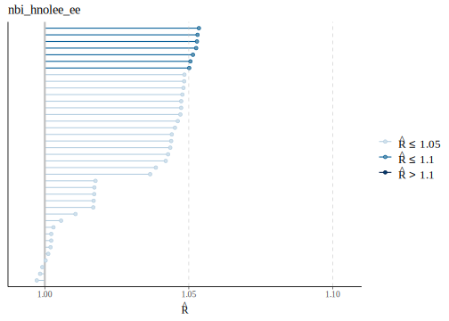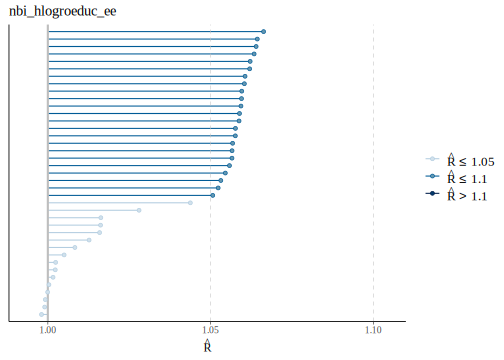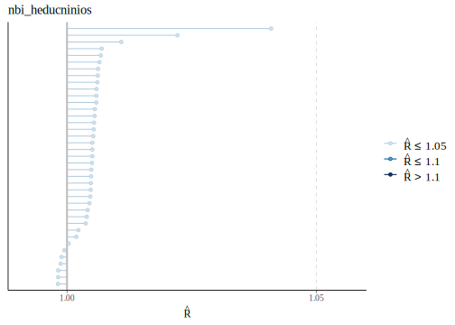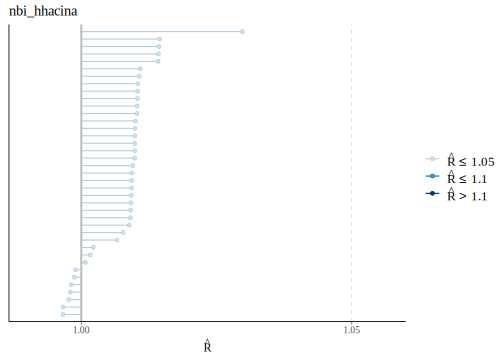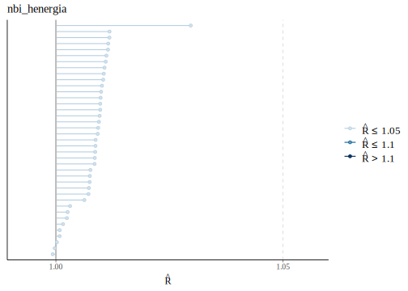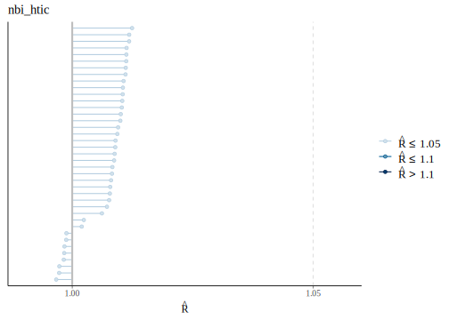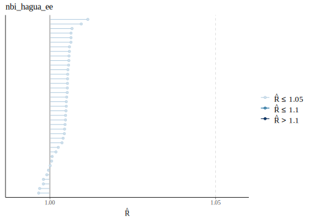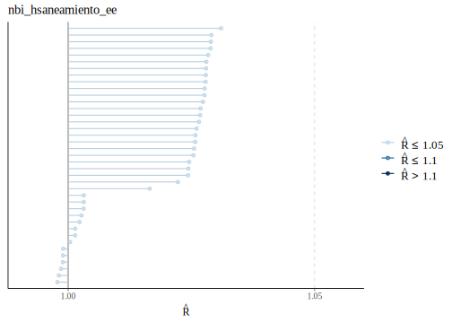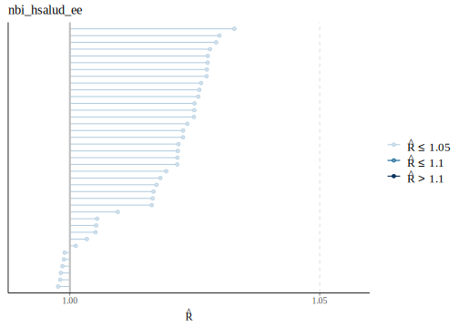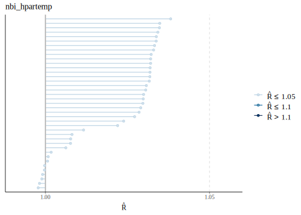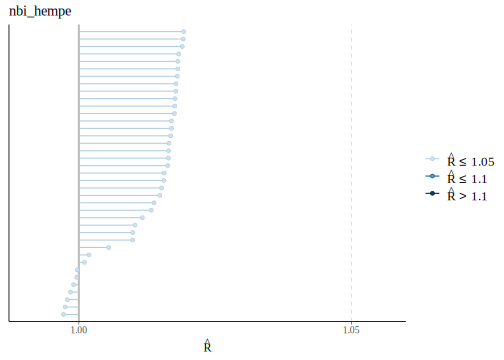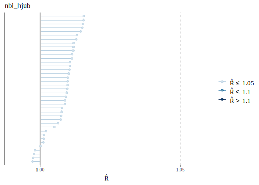


Terminado la compilación de los modelos después de realizar validaciones sobre esto, pasamos hacer las predicciones en el censo. 

## Proceso para la predicción $\pi_{di}^{kl}$

Los modelos fueron compilados de manera separada, por tanto, disponemos de un objeto `.rds` por cada dimensión del IPM 


```r
crear_epred_mat_dummy <- function(variable, newdata) {
  # Paso 1: Cargar el modelo
  modelo_rds <- paste0("Modelo_bayes_HxA_Hogar/COL/Data/Modelo/fit_", variable, ".rds")
  ruta_guardado <- paste0("Modelo_bayes_HxA_Hogar/COL/Data/Modelo/epred_mat_dummy_", variable, ".rds")
  fit <- readRDS(file = modelo_rds)
  
  # Paso 2: Generar epred_mat
  epred_mat <- posterior_epred(
    fit,
    newdata = newdata,
    type = "response",
    allow.new.levels = TRUE
  )
  
  # Paso 3: Generar epred_mat_dummy
  epred_mat_dummy <- rbinom(n = nrow(epred_mat) * ncol(epred_mat), 1, epred_mat)
  epred_mat_dummy <- matrix(epred_mat_dummy, nrow = nrow(epred_mat), 
                            ncol = ncol(epred_mat))
  
  # Guardar epred_mat_dummy como un archivo .rds
  saveRDS(epred_mat_dummy, file = ruta_guardado)
  cat(ruta_guardado, "\n")

}
```

Note que la función se encarga de leer los modelos que fueron estimados previamente, luego se obtienen las $L$ predicciones de $\pi_{di}^{kl}$,


```r
epred_mat <- posterior_epred(
  fit_agua,
  newdata = newdata,
  type = "response",
  allow.new.levels = TRUE
)
```

Los resultados anteriores se deben procesarse para obtener los hard estimates, es decir, términos de carencia (1) y  no carencia (0) para la $k-esima$ carencias. Lo que se realiza con el código


```r
 epred_mat_dummy <- rbinom(n = nrow(epred_mat) * ncol(epred_mat), 1, epred_mat)
  epred_mat_dummy <- matrix(epred_mat_dummy, nrow = nrow(epred_mat), 
                            ncol = ncol(epred_mat))
```


Ahora, debemos leer la información del censo  y crear los **post-estrato **


```r
censo_ipm <- readRDS("Modelo_bayes_HxA_Hogar/COL/Data/Censo/censo_COL.rds") %>%
  rename(dam = depto, dam2 = mpio) %>%
  group_by(dam,   dam2,  area,  sexo,  edad,  etnia, anoest) %>%
  summarise(n = sum(n), .groups = "drop")

statelevel_predictors_df <-
  readRDS("Modelo_bayes_HxA_Hogar/COL/Data/statelevel_predictors_df_dam2.rds") 
```

Para realizar la predicción en el censo debemos incluir la información auxiliar 


```r
poststrat_df <- left_join(censo_ipm, statelevel_predictors_df,
                          by = c("dam", "dam2")) 
```

Ahora, para obtener los  **hard estimates** usamos el siguinte código 


```r
for(ii in 1:12){
crear_epred_mat_dummy(names_ipm[ii],poststrat_df) # OK  
}
```


## Calculando $q_{di}^{l}$, $I\left( q_{di}^{l} \ge z \right)$ y $c_{di}^{l}\left(z\right)$

Dado que los hard estimates fueron organizados en matrices, el calculo de $q^{l}_{id}$ es una simple operación matricial la cual se muestra a continuación 

```r
epred_mat_dummy_hnolee <- readRDS("Modelo_bayes_HxA_Hogar/COL/Data/Modelo/epred_mat_dummy_nbi_hnolee_ee.rds")
epred_mat_dummy_hlogroeduc <- readRDS("Modelo_bayes_HxA_Hogar/COL/Data/Modelo/epred_mat_dummy_nbi_hlogroeduc_ee.rds")
epred_mat_dummy_heducninios <- readRDS("Modelo_bayes_HxA_Hogar/COL/Data/Modelo/epred_mat_dummy_nbi_heducninios.rds")
epred_mat_dummy_hhacina <- readRDS("Modelo_bayes_HxA_Hogar/COL/Data/Modelo/epred_mat_dummy_nbi_hhacina.rds")
epred_mat_dummy_henergia <- readRDS("Modelo_bayes_HxA_Hogar/COL/Data/Modelo/epred_mat_dummy_nbi_henergia.rds")
epred_mat_dummy_htic <- readRDS("Modelo_bayes_HxA_Hogar/COL/Data/Modelo/epred_mat_dummy_nbi_htic.rds")
epred_mat_dummy_hagua <- readRDS("Modelo_bayes_HxA_Hogar/COL/Data/Modelo/epred_mat_dummy_nbi_hagua_ee.rds")
epred_mat_dummy_hsaneamiento <- readRDS("Modelo_bayes_HxA_Hogar/COL/Data/Modelo/epred_mat_dummy_nbi_hsaneamiento_ee.rds")
epred_mat_dummy_hsalud <- readRDS("Modelo_bayes_HxA_Hogar/COL/Data/Modelo/epred_mat_dummy_nbi_hsalud_ee.rds")
epred_mat_dummy_hpartemp <- readRDS("Modelo_bayes_HxA_Hogar/COL/Data/Modelo/epred_mat_dummy_nbi_hpartemp.rds")
epred_mat_dummy_hempe <- readRDS("Modelo_bayes_HxA_Hogar/COL/Data/Modelo/epred_mat_dummy_nbi_hempe.rds")
epred_mat_dummy_hjub <- readRDS("Modelo_bayes_HxA_Hogar/COL/Data/Modelo/epred_mat_dummy_nbi_hjub.rds")
```


```r
chain_q  <-
(1/12)*(epred_mat_dummy_hnolee +
epred_mat_dummy_hlogroeduc +
epred_mat_dummy_heducninios +
epred_mat_dummy_hhacina +
epred_mat_dummy_henergia +
epred_mat_dummy_htic +
epred_mat_dummy_hagua +
epred_mat_dummy_hsaneamiento +
epred_mat_dummy_hsalud +
epred_mat_dummy_hpartemp +
epred_mat_dummy_hempe +
epred_mat_dummy_hjub )
```


Ahora, es posible tener el calculo de $I\left( q_{di}^{l} \ge z \right)$, tomando como umbral $z=0.4$. 


```r
chain_Ind <- chain_q
chain_Ind[chain_Ind < 0.4] <- 0
chain_Ind[chain_Ind != 0] <- 1
```

seguidamente calculamos $c_{di}^{l}\left(z\right)$ 


```r
chain_ci <- matrix(0,nrow = nrow(chain_q), ncol = ncol(chain_q))
chain_ci[chain_Ind == 1] <- chain_q[chain_Ind == 1]
```


```r
datos<-data.frame(t(chain_q[1:5,1:10]), t(chain_Ind[1:5,1:10]), t(chain_ci[1:5,1:10]),
                  N = censo_ipm$n[1:10] )
colnames(datos) <- c(paste0("q",1:5), paste0("Ind",1:5),paste0("c",1:5),"N")
tba(datos, "Cadenas obtenidas")
```

<table class="table table-striped lightable-classic" style="width: auto !important; margin-left: auto; margin-right: auto; font-family: Arial Narrow; width: auto !important; margin-left: auto; margin-right: auto;">
<caption>(\#tab:unnamed-chunk-19)Cadenas obtenidas</caption>
 <thead>
  <tr>
   <th style="text-align:right;"> q1 </th>
   <th style="text-align:right;"> q2 </th>
   <th style="text-align:right;"> q3 </th>
   <th style="text-align:right;"> q4 </th>
   <th style="text-align:right;"> q5 </th>
   <th style="text-align:right;"> Ind1 </th>
   <th style="text-align:right;"> Ind2 </th>
   <th style="text-align:right;"> Ind3 </th>
   <th style="text-align:right;"> Ind4 </th>
   <th style="text-align:right;"> Ind5 </th>
   <th style="text-align:right;"> c1 </th>
   <th style="text-align:right;"> c2 </th>
   <th style="text-align:right;"> c3 </th>
   <th style="text-align:right;"> c4 </th>
   <th style="text-align:right;"> c5 </th>
   <th style="text-align:right;"> N </th>
  </tr>
 </thead>
<tbody>
  <tr>
   <td style="text-align:right;"> 0.3333 </td>
   <td style="text-align:right;"> 0.3333 </td>
   <td style="text-align:right;"> 0.2500 </td>
   <td style="text-align:right;"> 0.3333 </td>
   <td style="text-align:right;"> 0.5000 </td>
   <td style="text-align:right;"> 0 </td>
   <td style="text-align:right;"> 0 </td>
   <td style="text-align:right;"> 0 </td>
   <td style="text-align:right;"> 0 </td>
   <td style="text-align:right;"> 1 </td>
   <td style="text-align:right;"> 0.0000 </td>
   <td style="text-align:right;"> 0.0000 </td>
   <td style="text-align:right;"> 0.0000 </td>
   <td style="text-align:right;"> 0 </td>
   <td style="text-align:right;"> 0.5 </td>
   <td style="text-align:right;"> 1 </td>
  </tr>
  <tr>
   <td style="text-align:right;"> 0.4167 </td>
   <td style="text-align:right;"> 0.2500 </td>
   <td style="text-align:right;"> 0.4167 </td>
   <td style="text-align:right;"> 0.2500 </td>
   <td style="text-align:right;"> 0.3333 </td>
   <td style="text-align:right;"> 1 </td>
   <td style="text-align:right;"> 0 </td>
   <td style="text-align:right;"> 1 </td>
   <td style="text-align:right;"> 0 </td>
   <td style="text-align:right;"> 0 </td>
   <td style="text-align:right;"> 0.4167 </td>
   <td style="text-align:right;"> 0.0000 </td>
   <td style="text-align:right;"> 0.4167 </td>
   <td style="text-align:right;"> 0 </td>
   <td style="text-align:right;"> 0.0 </td>
   <td style="text-align:right;"> 1 </td>
  </tr>
  <tr>
   <td style="text-align:right;"> 0.2500 </td>
   <td style="text-align:right;"> 0.3333 </td>
   <td style="text-align:right;"> 0.3333 </td>
   <td style="text-align:right;"> 0.3333 </td>
   <td style="text-align:right;"> 0.3333 </td>
   <td style="text-align:right;"> 0 </td>
   <td style="text-align:right;"> 0 </td>
   <td style="text-align:right;"> 0 </td>
   <td style="text-align:right;"> 0 </td>
   <td style="text-align:right;"> 0 </td>
   <td style="text-align:right;"> 0.0000 </td>
   <td style="text-align:right;"> 0.0000 </td>
   <td style="text-align:right;"> 0.0000 </td>
   <td style="text-align:right;"> 0 </td>
   <td style="text-align:right;"> 0.0 </td>
   <td style="text-align:right;"> 9 </td>
  </tr>
  <tr>
   <td style="text-align:right;"> 0.3333 </td>
   <td style="text-align:right;"> 0.3333 </td>
   <td style="text-align:right;"> 0.5833 </td>
   <td style="text-align:right;"> 0.2500 </td>
   <td style="text-align:right;"> 0.3333 </td>
   <td style="text-align:right;"> 0 </td>
   <td style="text-align:right;"> 0 </td>
   <td style="text-align:right;"> 1 </td>
   <td style="text-align:right;"> 0 </td>
   <td style="text-align:right;"> 0 </td>
   <td style="text-align:right;"> 0.0000 </td>
   <td style="text-align:right;"> 0.0000 </td>
   <td style="text-align:right;"> 0.5833 </td>
   <td style="text-align:right;"> 0 </td>
   <td style="text-align:right;"> 0.0 </td>
   <td style="text-align:right;"> 1 </td>
  </tr>
  <tr>
   <td style="text-align:right;"> 0.3333 </td>
   <td style="text-align:right;"> 0.3333 </td>
   <td style="text-align:right;"> 0.2500 </td>
   <td style="text-align:right;"> 0.0833 </td>
   <td style="text-align:right;"> 0.0000 </td>
   <td style="text-align:right;"> 0 </td>
   <td style="text-align:right;"> 0 </td>
   <td style="text-align:right;"> 0 </td>
   <td style="text-align:right;"> 0 </td>
   <td style="text-align:right;"> 0 </td>
   <td style="text-align:right;"> 0.0000 </td>
   <td style="text-align:right;"> 0.0000 </td>
   <td style="text-align:right;"> 0.0000 </td>
   <td style="text-align:right;"> 0 </td>
   <td style="text-align:right;"> 0.0 </td>
   <td style="text-align:right;"> 5 </td>
  </tr>
  <tr>
   <td style="text-align:right;"> 0.2500 </td>
   <td style="text-align:right;"> 0.3333 </td>
   <td style="text-align:right;"> 0.4167 </td>
   <td style="text-align:right;"> 0.3333 </td>
   <td style="text-align:right;"> 0.3333 </td>
   <td style="text-align:right;"> 0 </td>
   <td style="text-align:right;"> 0 </td>
   <td style="text-align:right;"> 1 </td>
   <td style="text-align:right;"> 0 </td>
   <td style="text-align:right;"> 0 </td>
   <td style="text-align:right;"> 0.0000 </td>
   <td style="text-align:right;"> 0.0000 </td>
   <td style="text-align:right;"> 0.4167 </td>
   <td style="text-align:right;"> 0 </td>
   <td style="text-align:right;"> 0.0 </td>
   <td style="text-align:right;"> 22 </td>
  </tr>
  <tr>
   <td style="text-align:right;"> 0.2500 </td>
   <td style="text-align:right;"> 0.1667 </td>
   <td style="text-align:right;"> 0.3333 </td>
   <td style="text-align:right;"> 0.1667 </td>
   <td style="text-align:right;"> 0.2500 </td>
   <td style="text-align:right;"> 0 </td>
   <td style="text-align:right;"> 0 </td>
   <td style="text-align:right;"> 0 </td>
   <td style="text-align:right;"> 0 </td>
   <td style="text-align:right;"> 0 </td>
   <td style="text-align:right;"> 0.0000 </td>
   <td style="text-align:right;"> 0.0000 </td>
   <td style="text-align:right;"> 0.0000 </td>
   <td style="text-align:right;"> 0 </td>
   <td style="text-align:right;"> 0.0 </td>
   <td style="text-align:right;"> 9 </td>
  </tr>
  <tr>
   <td style="text-align:right;"> 0.3333 </td>
   <td style="text-align:right;"> 0.5000 </td>
   <td style="text-align:right;"> 0.4167 </td>
   <td style="text-align:right;"> 0.2500 </td>
   <td style="text-align:right;"> 0.2500 </td>
   <td style="text-align:right;"> 0 </td>
   <td style="text-align:right;"> 1 </td>
   <td style="text-align:right;"> 1 </td>
   <td style="text-align:right;"> 0 </td>
   <td style="text-align:right;"> 0 </td>
   <td style="text-align:right;"> 0.0000 </td>
   <td style="text-align:right;"> 0.5000 </td>
   <td style="text-align:right;"> 0.4167 </td>
   <td style="text-align:right;"> 0 </td>
   <td style="text-align:right;"> 0.0 </td>
   <td style="text-align:right;"> 76 </td>
  </tr>
  <tr>
   <td style="text-align:right;"> 0.5000 </td>
   <td style="text-align:right;"> 0.4167 </td>
   <td style="text-align:right;"> 0.1667 </td>
   <td style="text-align:right;"> 0.2500 </td>
   <td style="text-align:right;"> 0.3333 </td>
   <td style="text-align:right;"> 1 </td>
   <td style="text-align:right;"> 1 </td>
   <td style="text-align:right;"> 0 </td>
   <td style="text-align:right;"> 0 </td>
   <td style="text-align:right;"> 0 </td>
   <td style="text-align:right;"> 0.5000 </td>
   <td style="text-align:right;"> 0.4167 </td>
   <td style="text-align:right;"> 0.0000 </td>
   <td style="text-align:right;"> 0 </td>
   <td style="text-align:right;"> 0.0 </td>
   <td style="text-align:right;"> 796 </td>
  </tr>
  <tr>
   <td style="text-align:right;"> 0.3333 </td>
   <td style="text-align:right;"> 0.0833 </td>
   <td style="text-align:right;"> 0.3333 </td>
   <td style="text-align:right;"> 0.1667 </td>
   <td style="text-align:right;"> 0.3333 </td>
   <td style="text-align:right;"> 0 </td>
   <td style="text-align:right;"> 0 </td>
   <td style="text-align:right;"> 0 </td>
   <td style="text-align:right;"> 0 </td>
   <td style="text-align:right;"> 0 </td>
   <td style="text-align:right;"> 0.0000 </td>
   <td style="text-align:right;"> 0.0000 </td>
   <td style="text-align:right;"> 0.0000 </td>
   <td style="text-align:right;"> 0 </td>
   <td style="text-align:right;"> 0.0 </td>
   <td style="text-align:right;"> 3549 </td>
  </tr>
</tbody>
</table>

## Estimación de $H$, $A$ e $IPM$
Para este proceso debemos realizar sumas ponderadas, dado que cada registro de la base de datos representa  un grupo de observaciones con las mismas características.  


```r
numIPM <- t(chain_ci) %>%
  as.data.frame() %>%
  mutate_all(~ . * censo_ipm$n) %>%
  as.matrix()

chain_N <- t(chain_Ind) %>%
  as.data.frame() %>%
  mutate_all(~ . * censo_ipm$n) %>%
  as.matrix()


IPM_l <- colSums(numIPM)/sum(censo_ipm$n)
Nz_l <- colSums(chain_N)
H_l <- Nz_l/sum(censo_ipm$n)
A_l <- colSums(numIPM)/Nz_l
```

<table class="table table-striped lightable-classic" style="width: auto !important; margin-left: auto; margin-right: auto; font-family: Arial Narrow; width: auto !important; margin-left: auto; margin-right: auto;">
<caption>(\#tab:unnamed-chunk-21)l-iteraciones</caption>
 <thead>
  <tr>
   <th style="text-align:left;">   </th>
   <th style="text-align:right;"> IPM_l </th>
   <th style="text-align:right;"> Nz_l </th>
   <th style="text-align:right;"> H_l </th>
   <th style="text-align:right;"> A_l </th>
   <th style="text-align:right;"> HA_l </th>
  </tr>
 </thead>
<tbody>
  <tr>
   <td style="text-align:left;"> l = 1 </td>
   <td style="text-align:right;"> 0.0827 </td>
   <td style="text-align:right;"> 5796711 </td>
   <td style="text-align:right;"> 0.1696 </td>
   <td style="text-align:right;"> 0.4877 </td>
   <td style="text-align:right;"> 0.0827 </td>
  </tr>
  <tr>
   <td style="text-align:left;"> l = 2 </td>
   <td style="text-align:right;"> 0.0819 </td>
   <td style="text-align:right;"> 5728479 </td>
   <td style="text-align:right;"> 0.1676 </td>
   <td style="text-align:right;"> 0.4889 </td>
   <td style="text-align:right;"> 0.0819 </td>
  </tr>
  <tr>
   <td style="text-align:left;"> l = 3 </td>
   <td style="text-align:right;"> 0.0780 </td>
   <td style="text-align:right;"> 5436367 </td>
   <td style="text-align:right;"> 0.1590 </td>
   <td style="text-align:right;"> 0.4902 </td>
   <td style="text-align:right;"> 0.0780 </td>
  </tr>
  <tr>
   <td style="text-align:left;"> l = 4 </td>
   <td style="text-align:right;"> 0.0924 </td>
   <td style="text-align:right;"> 6485925 </td>
   <td style="text-align:right;"> 0.1898 </td>
   <td style="text-align:right;"> 0.4871 </td>
   <td style="text-align:right;"> 0.0924 </td>
  </tr>
  <tr>
   <td style="text-align:left;"> l = 5 </td>
   <td style="text-align:right;"> 0.0790 </td>
   <td style="text-align:right;"> 5520098 </td>
   <td style="text-align:right;"> 0.1615 </td>
   <td style="text-align:right;"> 0.4892 </td>
   <td style="text-align:right;"> 0.0790 </td>
  </tr>
  <tr>
   <td style="text-align:left;"> l = 6 </td>
   <td style="text-align:right;"> 0.0810 </td>
   <td style="text-align:right;"> 5655742 </td>
   <td style="text-align:right;"> 0.1655 </td>
   <td style="text-align:right;"> 0.4894 </td>
   <td style="text-align:right;"> 0.0810 </td>
  </tr>
  <tr>
   <td style="text-align:left;"> l = 7 </td>
   <td style="text-align:right;"> 0.0860 </td>
   <td style="text-align:right;"> 6045415 </td>
   <td style="text-align:right;"> 0.1769 </td>
   <td style="text-align:right;"> 0.4864 </td>
   <td style="text-align:right;"> 0.0860 </td>
  </tr>
  <tr>
   <td style="text-align:left;"> l = 8 </td>
   <td style="text-align:right;"> 0.0815 </td>
   <td style="text-align:right;"> 5689540 </td>
   <td style="text-align:right;"> 0.1665 </td>
   <td style="text-align:right;"> 0.4898 </td>
   <td style="text-align:right;"> 0.0815 </td>
  </tr>
  <tr>
   <td style="text-align:left;"> l = 9 </td>
   <td style="text-align:right;"> 0.0822 </td>
   <td style="text-align:right;"> 5757858 </td>
   <td style="text-align:right;"> 0.1685 </td>
   <td style="text-align:right;"> 0.4882 </td>
   <td style="text-align:right;"> 0.0822 </td>
  </tr>
  <tr>
   <td style="text-align:left;"> l = 10 </td>
   <td style="text-align:right;"> 0.0804 </td>
   <td style="text-align:right;"> 5606016 </td>
   <td style="text-align:right;"> 0.1640 </td>
   <td style="text-align:right;"> 0.4900 </td>
   <td style="text-align:right;"> 0.0804 </td>
  </tr>
</tbody>
</table>


Por último se realiza las estimaciones puntuales y varianza para $H$, $A$ y $IPM$, esto es:  


```r
estimacion <- data.frame(H = mean(H_l),
           H_sd = sd(H_l),
           A = mean(A_l),
           A_sd = sd(A_l),
           IPM = mean(IPM_l),
           IPM_sd = sd(IPM_l))
```


<table class="table table-striped lightable-classic" style="width: auto !important; margin-left: auto; margin-right: auto; font-family: Arial Narrow; width: auto !important; margin-left: auto; margin-right: auto;">
<caption>(\#tab:unnamed-chunk-23)Estimaciones Nacionales</caption>
 <thead>
  <tr>
   <th style="text-align:right;"> H </th>
   <th style="text-align:right;"> H_sd </th>
   <th style="text-align:right;"> A </th>
   <th style="text-align:right;"> A_sd </th>
   <th style="text-align:right;"> IPM </th>
   <th style="text-align:right;"> IPM_sd </th>
  </tr>
 </thead>
<tbody>
  <tr>
   <td style="text-align:right;"> 0.1688 </td>
   <td style="text-align:right;"> 0.0053 </td>
   <td style="text-align:right;"> 0.4885 </td>
   <td style="text-align:right;"> 0.0023 </td>
   <td style="text-align:right;"> 0.0825 </td>
   <td style="text-align:right;"> 0.0024 </td>
  </tr>
</tbody>
</table>
## Estimaciones desagregadas del IPM

Para realizar las estimaciones desagregadas se desarrollo una función que facilita el calculo, la estructura general el proceso es repetir el proceso anterior por subgrupos, por ejemplo, departamento (*dam*)


```r
source("Modelo_bayes_HxA_Hogar/0funciones/Estimar_ipm.R")
ipm_dam <- estime_IPM(
  poststrat = censo_ipm,
  chain_ci = chain_ci,
  chain_ind = chain_ind,
  byMap = "dam"
) %>% data.frame()
```


<table class="table table-striped lightable-classic" style="width: auto !important; margin-left: auto; margin-right: auto; font-family: Arial Narrow; width: auto !important; margin-left: auto; margin-right: auto;">
<caption>(\#tab:unnamed-chunk-25)Estimaciones por departamento</caption>
 <thead>
  <tr>
   <th style="text-align:left;"> dam </th>
   <th style="text-align:right;"> H </th>
   <th style="text-align:right;"> H_sd </th>
   <th style="text-align:right;"> A </th>
   <th style="text-align:right;"> A_sd </th>
   <th style="text-align:right;"> IPM </th>
   <th style="text-align:right;"> IPM_sd </th>
  </tr>
 </thead>
<tbody>
  <tr>
   <td style="text-align:left;"> 05 </td>
   <td style="text-align:right;"> 0.1204 </td>
   <td style="text-align:right;"> 0.0104 </td>
   <td style="text-align:right;"> 0.4792 </td>
   <td style="text-align:right;"> 0.0047 </td>
   <td style="text-align:right;"> 0.0577 </td>
   <td style="text-align:right;"> 0.0046 </td>
  </tr>
  <tr>
   <td style="text-align:left;"> 08 </td>
   <td style="text-align:right;"> 0.0964 </td>
   <td style="text-align:right;"> 0.0274 </td>
   <td style="text-align:right;"> 0.4562 </td>
   <td style="text-align:right;"> 0.0117 </td>
   <td style="text-align:right;"> 0.0438 </td>
   <td style="text-align:right;"> 0.0119 </td>
  </tr>
  <tr>
   <td style="text-align:left;"> 11 </td>
   <td style="text-align:right;"> 0.0115 </td>
   <td style="text-align:right;"> 0.0248 </td>
   <td style="text-align:right;"> 0.4398 </td>
   <td style="text-align:right;"> 0.0253 </td>
   <td style="text-align:right;"> 0.0049 </td>
   <td style="text-align:right;"> 0.0108 </td>
  </tr>
  <tr>
   <td style="text-align:left;"> 13 </td>
   <td style="text-align:right;"> 0.2465 </td>
   <td style="text-align:right;"> 0.0212 </td>
   <td style="text-align:right;"> 0.4911 </td>
   <td style="text-align:right;"> 0.0064 </td>
   <td style="text-align:right;"> 0.1210 </td>
   <td style="text-align:right;"> 0.0094 </td>
  </tr>
  <tr>
   <td style="text-align:left;"> 15 </td>
   <td style="text-align:right;"> 0.2092 </td>
   <td style="text-align:right;"> 0.0094 </td>
   <td style="text-align:right;"> 0.4668 </td>
   <td style="text-align:right;"> 0.0030 </td>
   <td style="text-align:right;"> 0.0976 </td>
   <td style="text-align:right;"> 0.0042 </td>
  </tr>
  <tr>
   <td style="text-align:left;"> 17 </td>
   <td style="text-align:right;"> 0.1351 </td>
   <td style="text-align:right;"> 0.0135 </td>
   <td style="text-align:right;"> 0.4673 </td>
   <td style="text-align:right;"> 0.0067 </td>
   <td style="text-align:right;"> 0.0631 </td>
   <td style="text-align:right;"> 0.0060 </td>
  </tr>
  <tr>
   <td style="text-align:left;"> 18 </td>
   <td style="text-align:right;"> 0.2743 </td>
   <td style="text-align:right;"> 0.0273 </td>
   <td style="text-align:right;"> 0.4836 </td>
   <td style="text-align:right;"> 0.0079 </td>
   <td style="text-align:right;"> 0.1326 </td>
   <td style="text-align:right;"> 0.0123 </td>
  </tr>
  <tr>
   <td style="text-align:left;"> 19 </td>
   <td style="text-align:right;"> 0.4268 </td>
   <td style="text-align:right;"> 0.0128 </td>
   <td style="text-align:right;"> 0.5003 </td>
   <td style="text-align:right;"> 0.0040 </td>
   <td style="text-align:right;"> 0.2135 </td>
   <td style="text-align:right;"> 0.0062 </td>
  </tr>
  <tr>
   <td style="text-align:left;"> 20 </td>
   <td style="text-align:right;"> 0.2184 </td>
   <td style="text-align:right;"> 0.0243 </td>
   <td style="text-align:right;"> 0.4789 </td>
   <td style="text-align:right;"> 0.0074 </td>
   <td style="text-align:right;"> 0.1045 </td>
   <td style="text-align:right;"> 0.0107 </td>
  </tr>
  <tr>
   <td style="text-align:left;"> 23 </td>
   <td style="text-align:right;"> 0.4002 </td>
   <td style="text-align:right;"> 0.0190 </td>
   <td style="text-align:right;"> 0.5081 </td>
   <td style="text-align:right;"> 0.0054 </td>
   <td style="text-align:right;"> 0.2033 </td>
   <td style="text-align:right;"> 0.0089 </td>
  </tr>
  <tr>
   <td style="text-align:left;"> 25 </td>
   <td style="text-align:right;"> 0.1244 </td>
   <td style="text-align:right;"> 0.0085 </td>
   <td style="text-align:right;"> 0.4673 </td>
   <td style="text-align:right;"> 0.0038 </td>
   <td style="text-align:right;"> 0.0581 </td>
   <td style="text-align:right;"> 0.0038 </td>
  </tr>
  <tr>
   <td style="text-align:left;"> 27 </td>
   <td style="text-align:right;"> 0.6219 </td>
   <td style="text-align:right;"> 0.0309 </td>
   <td style="text-align:right;"> 0.5297 </td>
   <td style="text-align:right;"> 0.0061 </td>
   <td style="text-align:right;"> 0.3293 </td>
   <td style="text-align:right;"> 0.0146 </td>
  </tr>
  <tr>
   <td style="text-align:left;"> 41 </td>
   <td style="text-align:right;"> 0.2140 </td>
   <td style="text-align:right;"> 0.0175 </td>
   <td style="text-align:right;"> 0.4707 </td>
   <td style="text-align:right;"> 0.0057 </td>
   <td style="text-align:right;"> 0.1007 </td>
   <td style="text-align:right;"> 0.0080 </td>
  </tr>
  <tr>
   <td style="text-align:left;"> 44 </td>
   <td style="text-align:right;"> 0.4752 </td>
   <td style="text-align:right;"> 0.0205 </td>
   <td style="text-align:right;"> 0.5337 </td>
   <td style="text-align:right;"> 0.0106 </td>
   <td style="text-align:right;"> 0.2536 </td>
   <td style="text-align:right;"> 0.0117 </td>
  </tr>
  <tr>
   <td style="text-align:left;"> 47 </td>
   <td style="text-align:right;"> 0.2400 </td>
   <td style="text-align:right;"> 0.0259 </td>
   <td style="text-align:right;"> 0.4786 </td>
   <td style="text-align:right;"> 0.0069 </td>
   <td style="text-align:right;"> 0.1148 </td>
   <td style="text-align:right;"> 0.0115 </td>
  </tr>
  <tr>
   <td style="text-align:left;"> 50 </td>
   <td style="text-align:right;"> 0.1741 </td>
   <td style="text-align:right;"> 0.0194 </td>
   <td style="text-align:right;"> 0.4791 </td>
   <td style="text-align:right;"> 0.0068 </td>
   <td style="text-align:right;"> 0.0833 </td>
   <td style="text-align:right;"> 0.0086 </td>
  </tr>
  <tr>
   <td style="text-align:left;"> 52 </td>
   <td style="text-align:right;"> 0.3486 </td>
   <td style="text-align:right;"> 0.0152 </td>
   <td style="text-align:right;"> 0.4940 </td>
   <td style="text-align:right;"> 0.0048 </td>
   <td style="text-align:right;"> 0.1722 </td>
   <td style="text-align:right;"> 0.0070 </td>
  </tr>
  <tr>
   <td style="text-align:left;"> 54 </td>
   <td style="text-align:right;"> 0.2363 </td>
   <td style="text-align:right;"> 0.0326 </td>
   <td style="text-align:right;"> 0.4843 </td>
   <td style="text-align:right;"> 0.0088 </td>
   <td style="text-align:right;"> 0.1142 </td>
   <td style="text-align:right;"> 0.0143 </td>
  </tr>
  <tr>
   <td style="text-align:left;"> 63 </td>
   <td style="text-align:right;"> 0.0741 </td>
   <td style="text-align:right;"> 0.0194 </td>
   <td style="text-align:right;"> 0.4538 </td>
   <td style="text-align:right;"> 0.0101 </td>
   <td style="text-align:right;"> 0.0335 </td>
   <td style="text-align:right;"> 0.0084 </td>
  </tr>
  <tr>
   <td style="text-align:left;"> 66 </td>
   <td style="text-align:right;"> 0.1087 </td>
   <td style="text-align:right;"> 0.0189 </td>
   <td style="text-align:right;"> 0.4703 </td>
   <td style="text-align:right;"> 0.0095 </td>
   <td style="text-align:right;"> 0.0510 </td>
   <td style="text-align:right;"> 0.0084 </td>
  </tr>
  <tr>
   <td style="text-align:left;"> 68 </td>
   <td style="text-align:right;"> 0.1599 </td>
   <td style="text-align:right;"> 0.0109 </td>
   <td style="text-align:right;"> 0.4812 </td>
   <td style="text-align:right;"> 0.0050 </td>
   <td style="text-align:right;"> 0.0769 </td>
   <td style="text-align:right;"> 0.0048 </td>
  </tr>
  <tr>
   <td style="text-align:left;"> 70 </td>
   <td style="text-align:right;"> 0.3866 </td>
   <td style="text-align:right;"> 0.0201 </td>
   <td style="text-align:right;"> 0.5055 </td>
   <td style="text-align:right;"> 0.0053 </td>
   <td style="text-align:right;"> 0.1954 </td>
   <td style="text-align:right;"> 0.0092 </td>
  </tr>
  <tr>
   <td style="text-align:left;"> 73 </td>
   <td style="text-align:right;"> 0.1895 </td>
   <td style="text-align:right;"> 0.0171 </td>
   <td style="text-align:right;"> 0.4823 </td>
   <td style="text-align:right;"> 0.0060 </td>
   <td style="text-align:right;"> 0.0913 </td>
   <td style="text-align:right;"> 0.0075 </td>
  </tr>
  <tr>
   <td style="text-align:left;"> 76 </td>
   <td style="text-align:right;"> 0.0901 </td>
   <td style="text-align:right;"> 0.0127 </td>
   <td style="text-align:right;"> 0.4646 </td>
   <td style="text-align:right;"> 0.0066 </td>
   <td style="text-align:right;"> 0.0418 </td>
   <td style="text-align:right;"> 0.0055 </td>
  </tr>
  <tr>
   <td style="text-align:left;"> 81 </td>
   <td style="text-align:right;"> 0.3387 </td>
   <td style="text-align:right;"> 0.0663 </td>
   <td style="text-align:right;"> 0.4869 </td>
   <td style="text-align:right;"> 0.0142 </td>
   <td style="text-align:right;"> 0.1653 </td>
   <td style="text-align:right;"> 0.0346 </td>
  </tr>
  <tr>
   <td style="text-align:left;"> 85 </td>
   <td style="text-align:right;"> 0.2683 </td>
   <td style="text-align:right;"> 0.0542 </td>
   <td style="text-align:right;"> 0.4808 </td>
   <td style="text-align:right;"> 0.0126 </td>
   <td style="text-align:right;"> 0.1293 </td>
   <td style="text-align:right;"> 0.0277 </td>
  </tr>
  <tr>
   <td style="text-align:left;"> 86 </td>
   <td style="text-align:right;"> 0.4499 </td>
   <td style="text-align:right;"> 0.0619 </td>
   <td style="text-align:right;"> 0.5074 </td>
   <td style="text-align:right;"> 0.0139 </td>
   <td style="text-align:right;"> 0.2289 </td>
   <td style="text-align:right;"> 0.0361 </td>
  </tr>
  <tr>
   <td style="text-align:left;"> 88 </td>
   <td style="text-align:right;"> 0.1822 </td>
   <td style="text-align:right;"> 0.0539 </td>
   <td style="text-align:right;"> 0.4686 </td>
   <td style="text-align:right;"> 0.0187 </td>
   <td style="text-align:right;"> 0.0856 </td>
   <td style="text-align:right;"> 0.0265 </td>
  </tr>
  <tr>
   <td style="text-align:left;"> 91 </td>
   <td style="text-align:right;"> 0.7166 </td>
   <td style="text-align:right;"> 0.0732 </td>
   <td style="text-align:right;"> 0.5593 </td>
   <td style="text-align:right;"> 0.0146 </td>
   <td style="text-align:right;"> 0.4008 </td>
   <td style="text-align:right;"> 0.0420 </td>
  </tr>
  <tr>
   <td style="text-align:left;"> 94 </td>
   <td style="text-align:right;"> 0.6856 </td>
   <td style="text-align:right;"> 0.0696 </td>
   <td style="text-align:right;"> 0.5554 </td>
   <td style="text-align:right;"> 0.0180 </td>
   <td style="text-align:right;"> 0.3811 </td>
   <td style="text-align:right;"> 0.0433 </td>
  </tr>
  <tr>
   <td style="text-align:left;"> 95 </td>
   <td style="text-align:right;"> 0.4829 </td>
   <td style="text-align:right;"> 0.0740 </td>
   <td style="text-align:right;"> 0.5112 </td>
   <td style="text-align:right;"> 0.0174 </td>
   <td style="text-align:right;"> 0.2472 </td>
   <td style="text-align:right;"> 0.0406 </td>
  </tr>
  <tr>
   <td style="text-align:left;"> 97 </td>
   <td style="text-align:right;"> 0.8381 </td>
   <td style="text-align:right;"> 0.0504 </td>
   <td style="text-align:right;"> 0.5863 </td>
   <td style="text-align:right;"> 0.0210 </td>
   <td style="text-align:right;"> 0.4917 </td>
   <td style="text-align:right;"> 0.0384 </td>
  </tr>
  <tr>
   <td style="text-align:left;"> 99 </td>
   <td style="text-align:right;"> 0.7162 </td>
   <td style="text-align:right;"> 0.0535 </td>
   <td style="text-align:right;"> 0.5564 </td>
   <td style="text-align:right;"> 0.0242 </td>
   <td style="text-align:right;"> 0.3991 </td>
   <td style="text-align:right;"> 0.0404 </td>
  </tr>
</tbody>
</table>

Otra estimación desagregada que es posible obtener es la combinación por departamento y sexo, para ellos se usa la sintaxis. 


```r
ipm_dam_sexo <- estime_IPM(
  poststrat = censo_ipm,
  chain_ci = chain_ci,
  chain_ind = chain_ind,
  byMap = c("dam", "sexo")
) %>% data.frame()
```


<table class="table table-striped lightable-classic" style="width: auto !important; margin-left: auto; margin-right: auto; font-family: Arial Narrow; width: auto !important; margin-left: auto; margin-right: auto;">
<caption>(\#tab:unnamed-chunk-28)Estimaciones por departamento y sexo</caption>
 <thead>
  <tr>
   <th style="text-align:left;"> dam </th>
   <th style="text-align:left;"> sexo </th>
   <th style="text-align:right;"> H </th>
   <th style="text-align:right;"> H_sd </th>
   <th style="text-align:right;"> A </th>
   <th style="text-align:right;"> A_sd </th>
   <th style="text-align:right;"> IPM </th>
   <th style="text-align:right;"> IPM_sd </th>
  </tr>
 </thead>
<tbody>
  <tr>
   <td style="text-align:left;"> 05 </td>
   <td style="text-align:left;"> 1 </td>
   <td style="text-align:right;"> 0.1360 </td>
   <td style="text-align:right;"> 0.0152 </td>
   <td style="text-align:right;"> 0.4819 </td>
   <td style="text-align:right;"> 0.0057 </td>
   <td style="text-align:right;"> 0.0655 </td>
   <td style="text-align:right;"> 0.0067 </td>
  </tr>
  <tr>
   <td style="text-align:left;"> 05 </td>
   <td style="text-align:left;"> 2 </td>
   <td style="text-align:right;"> 0.1063 </td>
   <td style="text-align:right;"> 0.0136 </td>
   <td style="text-align:right;"> 0.4765 </td>
   <td style="text-align:right;"> 0.0063 </td>
   <td style="text-align:right;"> 0.0506 </td>
   <td style="text-align:right;"> 0.0059 </td>
  </tr>
  <tr>
   <td style="text-align:left;"> 08 </td>
   <td style="text-align:left;"> 1 </td>
   <td style="text-align:right;"> 0.1030 </td>
   <td style="text-align:right;"> 0.0388 </td>
   <td style="text-align:right;"> 0.4594 </td>
   <td style="text-align:right;"> 0.0145 </td>
   <td style="text-align:right;"> 0.0470 </td>
   <td style="text-align:right;"> 0.0169 </td>
  </tr>
  <tr>
   <td style="text-align:left;"> 08 </td>
   <td style="text-align:left;"> 2 </td>
   <td style="text-align:right;"> 0.0903 </td>
   <td style="text-align:right;"> 0.0389 </td>
   <td style="text-align:right;"> 0.4557 </td>
   <td style="text-align:right;"> 0.0156 </td>
   <td style="text-align:right;"> 0.0408 </td>
   <td style="text-align:right;"> 0.0169 </td>
  </tr>
  <tr>
   <td style="text-align:left;"> 11 </td>
   <td style="text-align:left;"> 1 </td>
   <td style="text-align:right;"> 0.0133 </td>
   <td style="text-align:right;"> 0.0366 </td>
   <td style="text-align:right;"> 0.4425 </td>
   <td style="text-align:right;"> 0.0304 </td>
   <td style="text-align:right;"> 0.0057 </td>
   <td style="text-align:right;"> 0.0160 </td>
  </tr>
  <tr>
   <td style="text-align:left;"> 11 </td>
   <td style="text-align:left;"> 2 </td>
   <td style="text-align:right;"> 0.0099 </td>
   <td style="text-align:right;"> 0.0317 </td>
   <td style="text-align:right;"> 0.4422 </td>
   <td style="text-align:right;"> 0.0316 </td>
   <td style="text-align:right;"> 0.0043 </td>
   <td style="text-align:right;"> 0.0137 </td>
  </tr>
  <tr>
   <td style="text-align:left;"> 13 </td>
   <td style="text-align:left;"> 1 </td>
   <td style="text-align:right;"> 0.2684 </td>
   <td style="text-align:right;"> 0.0314 </td>
   <td style="text-align:right;"> 0.4945 </td>
   <td style="text-align:right;"> 0.0085 </td>
   <td style="text-align:right;"> 0.1325 </td>
   <td style="text-align:right;"> 0.0138 </td>
  </tr>
  <tr>
   <td style="text-align:left;"> 13 </td>
   <td style="text-align:left;"> 2 </td>
   <td style="text-align:right;"> 0.2255 </td>
   <td style="text-align:right;"> 0.0292 </td>
   <td style="text-align:right;"> 0.4880 </td>
   <td style="text-align:right;"> 0.0091 </td>
   <td style="text-align:right;"> 0.1099 </td>
   <td style="text-align:right;"> 0.0130 </td>
  </tr>
  <tr>
   <td style="text-align:left;"> 15 </td>
   <td style="text-align:left;"> 1 </td>
   <td style="text-align:right;"> 0.2291 </td>
   <td style="text-align:right;"> 0.0133 </td>
   <td style="text-align:right;"> 0.4683 </td>
   <td style="text-align:right;"> 0.0040 </td>
   <td style="text-align:right;"> 0.1073 </td>
   <td style="text-align:right;"> 0.0060 </td>
  </tr>
  <tr>
   <td style="text-align:left;"> 15 </td>
   <td style="text-align:left;"> 2 </td>
   <td style="text-align:right;"> 0.1903 </td>
   <td style="text-align:right;"> 0.0130 </td>
   <td style="text-align:right;"> 0.4651 </td>
   <td style="text-align:right;"> 0.0043 </td>
   <td style="text-align:right;"> 0.0885 </td>
   <td style="text-align:right;"> 0.0058 </td>
  </tr>
  <tr>
   <td style="text-align:left;"> 17 </td>
   <td style="text-align:left;"> 1 </td>
   <td style="text-align:right;"> 0.1516 </td>
   <td style="text-align:right;"> 0.0186 </td>
   <td style="text-align:right;"> 0.4686 </td>
   <td style="text-align:right;"> 0.0088 </td>
   <td style="text-align:right;"> 0.0710 </td>
   <td style="text-align:right;"> 0.0084 </td>
  </tr>
  <tr>
   <td style="text-align:left;"> 17 </td>
   <td style="text-align:left;"> 2 </td>
   <td style="text-align:right;"> 0.1199 </td>
   <td style="text-align:right;"> 0.0181 </td>
   <td style="text-align:right;"> 0.4662 </td>
   <td style="text-align:right;"> 0.0095 </td>
   <td style="text-align:right;"> 0.0558 </td>
   <td style="text-align:right;"> 0.0080 </td>
  </tr>
  <tr>
   <td style="text-align:left;"> 18 </td>
   <td style="text-align:left;"> 1 </td>
   <td style="text-align:right;"> 0.3079 </td>
   <td style="text-align:right;"> 0.0401 </td>
   <td style="text-align:right;"> 0.4865 </td>
   <td style="text-align:right;"> 0.0108 </td>
   <td style="text-align:right;"> 0.1496 </td>
   <td style="text-align:right;"> 0.0182 </td>
  </tr>
  <tr>
   <td style="text-align:left;"> 18 </td>
   <td style="text-align:left;"> 2 </td>
   <td style="text-align:right;"> 0.2401 </td>
   <td style="text-align:right;"> 0.0391 </td>
   <td style="text-align:right;"> 0.4806 </td>
   <td style="text-align:right;"> 0.0110 </td>
   <td style="text-align:right;"> 0.1152 </td>
   <td style="text-align:right;"> 0.0176 </td>
  </tr>
  <tr>
   <td style="text-align:left;"> 19 </td>
   <td style="text-align:left;"> 1 </td>
   <td style="text-align:right;"> 0.4497 </td>
   <td style="text-align:right;"> 0.0182 </td>
   <td style="text-align:right;"> 0.5018 </td>
   <td style="text-align:right;"> 0.0057 </td>
   <td style="text-align:right;"> 0.2256 </td>
   <td style="text-align:right;"> 0.0089 </td>
  </tr>
  <tr>
   <td style="text-align:left;"> 19 </td>
   <td style="text-align:left;"> 2 </td>
   <td style="text-align:right;"> 0.4047 </td>
   <td style="text-align:right;"> 0.0185 </td>
   <td style="text-align:right;"> 0.4988 </td>
   <td style="text-align:right;"> 0.0057 </td>
   <td style="text-align:right;"> 0.2018 </td>
   <td style="text-align:right;"> 0.0089 </td>
  </tr>
  <tr>
   <td style="text-align:left;"> 20 </td>
   <td style="text-align:left;"> 1 </td>
   <td style="text-align:right;"> 0.2367 </td>
   <td style="text-align:right;"> 0.0349 </td>
   <td style="text-align:right;"> 0.4820 </td>
   <td style="text-align:right;"> 0.0093 </td>
   <td style="text-align:right;"> 0.1139 </td>
   <td style="text-align:right;"> 0.0155 </td>
  </tr>
  <tr>
   <td style="text-align:left;"> 20 </td>
   <td style="text-align:left;"> 2 </td>
   <td style="text-align:right;"> 0.2008 </td>
   <td style="text-align:right;"> 0.0368 </td>
   <td style="text-align:right;"> 0.4765 </td>
   <td style="text-align:right;"> 0.0107 </td>
   <td style="text-align:right;"> 0.0955 </td>
   <td style="text-align:right;"> 0.0162 </td>
  </tr>
  <tr>
   <td style="text-align:left;"> 23 </td>
   <td style="text-align:left;"> 1 </td>
   <td style="text-align:right;"> 0.4251 </td>
   <td style="text-align:right;"> 0.0287 </td>
   <td style="text-align:right;"> 0.5111 </td>
   <td style="text-align:right;"> 0.0076 </td>
   <td style="text-align:right;"> 0.2172 </td>
   <td style="text-align:right;"> 0.0133 </td>
  </tr>
  <tr>
   <td style="text-align:left;"> 23 </td>
   <td style="text-align:left;"> 2 </td>
   <td style="text-align:right;"> 0.3761 </td>
   <td style="text-align:right;"> 0.0276 </td>
   <td style="text-align:right;"> 0.5051 </td>
   <td style="text-align:right;"> 0.0078 </td>
   <td style="text-align:right;"> 0.1899 </td>
   <td style="text-align:right;"> 0.0127 </td>
  </tr>
  <tr>
   <td style="text-align:left;"> 25 </td>
   <td style="text-align:left;"> 1 </td>
   <td style="text-align:right;"> 0.1388 </td>
   <td style="text-align:right;"> 0.0119 </td>
   <td style="text-align:right;"> 0.4694 </td>
   <td style="text-align:right;"> 0.0048 </td>
   <td style="text-align:right;"> 0.0651 </td>
   <td style="text-align:right;"> 0.0053 </td>
  </tr>
  <tr>
   <td style="text-align:left;"> 25 </td>
   <td style="text-align:left;"> 2 </td>
   <td style="text-align:right;"> 0.1106 </td>
   <td style="text-align:right;"> 0.0113 </td>
   <td style="text-align:right;"> 0.4650 </td>
   <td style="text-align:right;"> 0.0052 </td>
   <td style="text-align:right;"> 0.0514 </td>
   <td style="text-align:right;"> 0.0049 </td>
  </tr>
  <tr>
   <td style="text-align:left;"> 27 </td>
   <td style="text-align:left;"> 1 </td>
   <td style="text-align:right;"> 0.6493 </td>
   <td style="text-align:right;"> 0.0392 </td>
   <td style="text-align:right;"> 0.5330 </td>
   <td style="text-align:right;"> 0.0080 </td>
   <td style="text-align:right;"> 0.3459 </td>
   <td style="text-align:right;"> 0.0187 </td>
  </tr>
  <tr>
   <td style="text-align:left;"> 27 </td>
   <td style="text-align:left;"> 2 </td>
   <td style="text-align:right;"> 0.5959 </td>
   <td style="text-align:right;"> 0.0463 </td>
   <td style="text-align:right;"> 0.5265 </td>
   <td style="text-align:right;"> 0.0087 </td>
   <td style="text-align:right;"> 0.3135 </td>
   <td style="text-align:right;"> 0.0219 </td>
  </tr>
  <tr>
   <td style="text-align:left;"> 41 </td>
   <td style="text-align:left;"> 1 </td>
   <td style="text-align:right;"> 0.2358 </td>
   <td style="text-align:right;"> 0.0242 </td>
   <td style="text-align:right;"> 0.4726 </td>
   <td style="text-align:right;"> 0.0077 </td>
   <td style="text-align:right;"> 0.1114 </td>
   <td style="text-align:right;"> 0.0111 </td>
  </tr>
  <tr>
   <td style="text-align:left;"> 41 </td>
   <td style="text-align:left;"> 2 </td>
   <td style="text-align:right;"> 0.1927 </td>
   <td style="text-align:right;"> 0.0242 </td>
   <td style="text-align:right;"> 0.4686 </td>
   <td style="text-align:right;"> 0.0085 </td>
   <td style="text-align:right;"> 0.0902 </td>
   <td style="text-align:right;"> 0.0109 </td>
  </tr>
  <tr>
   <td style="text-align:left;"> 44 </td>
   <td style="text-align:left;"> 1 </td>
   <td style="text-align:right;"> 0.4868 </td>
   <td style="text-align:right;"> 0.0287 </td>
   <td style="text-align:right;"> 0.5358 </td>
   <td style="text-align:right;"> 0.0144 </td>
   <td style="text-align:right;"> 0.2608 </td>
   <td style="text-align:right;"> 0.0162 </td>
  </tr>
  <tr>
   <td style="text-align:left;"> 44 </td>
   <td style="text-align:left;"> 2 </td>
   <td style="text-align:right;"> 0.4644 </td>
   <td style="text-align:right;"> 0.0290 </td>
   <td style="text-align:right;"> 0.5318 </td>
   <td style="text-align:right;"> 0.0154 </td>
   <td style="text-align:right;"> 0.2469 </td>
   <td style="text-align:right;"> 0.0164 </td>
  </tr>
  <tr>
   <td style="text-align:left;"> 47 </td>
   <td style="text-align:left;"> 1 </td>
   <td style="text-align:right;"> 0.2587 </td>
   <td style="text-align:right;"> 0.0369 </td>
   <td style="text-align:right;"> 0.4815 </td>
   <td style="text-align:right;"> 0.0091 </td>
   <td style="text-align:right;"> 0.1244 </td>
   <td style="text-align:right;"> 0.0165 </td>
  </tr>
  <tr>
   <td style="text-align:left;"> 47 </td>
   <td style="text-align:left;"> 2 </td>
   <td style="text-align:right;"> 0.2216 </td>
   <td style="text-align:right;"> 0.0356 </td>
   <td style="text-align:right;"> 0.4761 </td>
   <td style="text-align:right;"> 0.0098 </td>
   <td style="text-align:right;"> 0.1053 </td>
   <td style="text-align:right;"> 0.0158 </td>
  </tr>
  <tr>
   <td style="text-align:left;"> 50 </td>
   <td style="text-align:left;"> 1 </td>
   <td style="text-align:right;"> 0.1976 </td>
   <td style="text-align:right;"> 0.0272 </td>
   <td style="text-align:right;"> 0.4812 </td>
   <td style="text-align:right;"> 0.0086 </td>
   <td style="text-align:right;"> 0.0950 </td>
   <td style="text-align:right;"> 0.0121 </td>
  </tr>
  <tr>
   <td style="text-align:left;"> 50 </td>
   <td style="text-align:left;"> 2 </td>
   <td style="text-align:right;"> 0.1503 </td>
   <td style="text-align:right;"> 0.0257 </td>
   <td style="text-align:right;"> 0.4771 </td>
   <td style="text-align:right;"> 0.0097 </td>
   <td style="text-align:right;"> 0.0716 </td>
   <td style="text-align:right;"> 0.0112 </td>
  </tr>
  <tr>
   <td style="text-align:left;"> 52 </td>
   <td style="text-align:left;"> 1 </td>
   <td style="text-align:right;"> 0.3686 </td>
   <td style="text-align:right;"> 0.0223 </td>
   <td style="text-align:right;"> 0.4958 </td>
   <td style="text-align:right;"> 0.0064 </td>
   <td style="text-align:right;"> 0.1827 </td>
   <td style="text-align:right;"> 0.0104 </td>
  </tr>
  <tr>
   <td style="text-align:left;"> 52 </td>
   <td style="text-align:left;"> 2 </td>
   <td style="text-align:right;"> 0.3299 </td>
   <td style="text-align:right;"> 0.0216 </td>
   <td style="text-align:right;"> 0.4923 </td>
   <td style="text-align:right;"> 0.0067 </td>
   <td style="text-align:right;"> 0.1624 </td>
   <td style="text-align:right;"> 0.0099 </td>
  </tr>
  <tr>
   <td style="text-align:left;"> 54 </td>
   <td style="text-align:left;"> 1 </td>
   <td style="text-align:right;"> 0.2598 </td>
   <td style="text-align:right;"> 0.0475 </td>
   <td style="text-align:right;"> 0.4879 </td>
   <td style="text-align:right;"> 0.0117 </td>
   <td style="text-align:right;"> 0.1264 </td>
   <td style="text-align:right;"> 0.0208 </td>
  </tr>
  <tr>
   <td style="text-align:left;"> 54 </td>
   <td style="text-align:left;"> 2 </td>
   <td style="text-align:right;"> 0.2141 </td>
   <td style="text-align:right;"> 0.0450 </td>
   <td style="text-align:right;"> 0.4817 </td>
   <td style="text-align:right;"> 0.0122 </td>
   <td style="text-align:right;"> 0.1028 </td>
   <td style="text-align:right;"> 0.0196 </td>
  </tr>
  <tr>
   <td style="text-align:left;"> 63 </td>
   <td style="text-align:left;"> 1 </td>
   <td style="text-align:right;"> 0.0850 </td>
   <td style="text-align:right;"> 0.0296 </td>
   <td style="text-align:right;"> 0.4564 </td>
   <td style="text-align:right;"> 0.0129 </td>
   <td style="text-align:right;"> 0.0386 </td>
   <td style="text-align:right;"> 0.0129 </td>
  </tr>
  <tr>
   <td style="text-align:left;"> 63 </td>
   <td style="text-align:left;"> 2 </td>
   <td style="text-align:right;"> 0.0642 </td>
   <td style="text-align:right;"> 0.0252 </td>
   <td style="text-align:right;"> 0.4524 </td>
   <td style="text-align:right;"> 0.0131 </td>
   <td style="text-align:right;"> 0.0289 </td>
   <td style="text-align:right;"> 0.0110 </td>
  </tr>
  <tr>
   <td style="text-align:left;"> 66 </td>
   <td style="text-align:left;"> 1 </td>
   <td style="text-align:right;"> 0.1221 </td>
   <td style="text-align:right;"> 0.0276 </td>
   <td style="text-align:right;"> 0.4723 </td>
   <td style="text-align:right;"> 0.0127 </td>
   <td style="text-align:right;"> 0.0575 </td>
   <td style="text-align:right;"> 0.0123 </td>
  </tr>
  <tr>
   <td style="text-align:left;"> 66 </td>
   <td style="text-align:left;"> 2 </td>
   <td style="text-align:right;"> 0.0967 </td>
   <td style="text-align:right;"> 0.0260 </td>
   <td style="text-align:right;"> 0.4697 </td>
   <td style="text-align:right;"> 0.0141 </td>
   <td style="text-align:right;"> 0.0452 </td>
   <td style="text-align:right;"> 0.0114 </td>
  </tr>
  <tr>
   <td style="text-align:left;"> 68 </td>
   <td style="text-align:left;"> 1 </td>
   <td style="text-align:right;"> 0.1808 </td>
   <td style="text-align:right;"> 0.0158 </td>
   <td style="text-align:right;"> 0.4835 </td>
   <td style="text-align:right;"> 0.0067 </td>
   <td style="text-align:right;"> 0.0874 </td>
   <td style="text-align:right;"> 0.0070 </td>
  </tr>
  <tr>
   <td style="text-align:left;"> 68 </td>
   <td style="text-align:left;"> 2 </td>
   <td style="text-align:right;"> 0.1404 </td>
   <td style="text-align:right;"> 0.0151 </td>
   <td style="text-align:right;"> 0.4788 </td>
   <td style="text-align:right;"> 0.0069 </td>
   <td style="text-align:right;"> 0.0672 </td>
   <td style="text-align:right;"> 0.0066 </td>
  </tr>
  <tr>
   <td style="text-align:left;"> 70 </td>
   <td style="text-align:left;"> 1 </td>
   <td style="text-align:right;"> 0.4114 </td>
   <td style="text-align:right;"> 0.0285 </td>
   <td style="text-align:right;"> 0.5079 </td>
   <td style="text-align:right;"> 0.0070 </td>
   <td style="text-align:right;"> 0.2088 </td>
   <td style="text-align:right;"> 0.0132 </td>
  </tr>
  <tr>
   <td style="text-align:left;"> 70 </td>
   <td style="text-align:left;"> 2 </td>
   <td style="text-align:right;"> 0.3620 </td>
   <td style="text-align:right;"> 0.0272 </td>
   <td style="text-align:right;"> 0.5030 </td>
   <td style="text-align:right;"> 0.0078 </td>
   <td style="text-align:right;"> 0.1820 </td>
   <td style="text-align:right;"> 0.0123 </td>
  </tr>
  <tr>
   <td style="text-align:left;"> 73 </td>
   <td style="text-align:left;"> 1 </td>
   <td style="text-align:right;"> 0.2107 </td>
   <td style="text-align:right;"> 0.0238 </td>
   <td style="text-align:right;"> 0.4846 </td>
   <td style="text-align:right;"> 0.0078 </td>
   <td style="text-align:right;"> 0.1020 </td>
   <td style="text-align:right;"> 0.0105 </td>
  </tr>
  <tr>
   <td style="text-align:left;"> 73 </td>
   <td style="text-align:left;"> 2 </td>
   <td style="text-align:right;"> 0.1691 </td>
   <td style="text-align:right;"> 0.0242 </td>
   <td style="text-align:right;"> 0.4801 </td>
   <td style="text-align:right;"> 0.0086 </td>
   <td style="text-align:right;"> 0.0810 </td>
   <td style="text-align:right;"> 0.0106 </td>
  </tr>
  <tr>
   <td style="text-align:left;"> 76 </td>
   <td style="text-align:left;"> 1 </td>
   <td style="text-align:right;"> 0.0997 </td>
   <td style="text-align:right;"> 0.0193 </td>
   <td style="text-align:right;"> 0.4669 </td>
   <td style="text-align:right;"> 0.0087 </td>
   <td style="text-align:right;"> 0.0465 </td>
   <td style="text-align:right;"> 0.0084 </td>
  </tr>
  <tr>
   <td style="text-align:left;"> 76 </td>
   <td style="text-align:left;"> 2 </td>
   <td style="text-align:right;"> 0.0817 </td>
   <td style="text-align:right;"> 0.0170 </td>
   <td style="text-align:right;"> 0.4631 </td>
   <td style="text-align:right;"> 0.0090 </td>
   <td style="text-align:right;"> 0.0377 </td>
   <td style="text-align:right;"> 0.0074 </td>
  </tr>
  <tr>
   <td style="text-align:left;"> 81 </td>
   <td style="text-align:left;"> 1 </td>
   <td style="text-align:right;"> 0.3638 </td>
   <td style="text-align:right;"> 0.0764 </td>
   <td style="text-align:right;"> 0.4896 </td>
   <td style="text-align:right;"> 0.0173 </td>
   <td style="text-align:right;"> 0.1784 </td>
   <td style="text-align:right;"> 0.0395 </td>
  </tr>
  <tr>
   <td style="text-align:left;"> 81 </td>
   <td style="text-align:left;"> 2 </td>
   <td style="text-align:right;"> 0.3132 </td>
   <td style="text-align:right;"> 0.0721 </td>
   <td style="text-align:right;"> 0.4844 </td>
   <td style="text-align:right;"> 0.0178 </td>
   <td style="text-align:right;"> 0.1519 </td>
   <td style="text-align:right;"> 0.0363 </td>
  </tr>
  <tr>
   <td style="text-align:left;"> 85 </td>
   <td style="text-align:left;"> 1 </td>
   <td style="text-align:right;"> 0.2912 </td>
   <td style="text-align:right;"> 0.0631 </td>
   <td style="text-align:right;"> 0.4838 </td>
   <td style="text-align:right;"> 0.0149 </td>
   <td style="text-align:right;"> 0.1411 </td>
   <td style="text-align:right;"> 0.0318 </td>
  </tr>
  <tr>
   <td style="text-align:left;"> 85 </td>
   <td style="text-align:left;"> 2 </td>
   <td style="text-align:right;"> 0.2452 </td>
   <td style="text-align:right;"> 0.0603 </td>
   <td style="text-align:right;"> 0.4782 </td>
   <td style="text-align:right;"> 0.0146 </td>
   <td style="text-align:right;"> 0.1174 </td>
   <td style="text-align:right;"> 0.0295 </td>
  </tr>
  <tr>
   <td style="text-align:left;"> 86 </td>
   <td style="text-align:left;"> 1 </td>
   <td style="text-align:right;"> 0.4783 </td>
   <td style="text-align:right;"> 0.0663 </td>
   <td style="text-align:right;"> 0.5100 </td>
   <td style="text-align:right;"> 0.0157 </td>
   <td style="text-align:right;"> 0.2445 </td>
   <td style="text-align:right;"> 0.0386 </td>
  </tr>
  <tr>
   <td style="text-align:left;"> 86 </td>
   <td style="text-align:left;"> 2 </td>
   <td style="text-align:right;"> 0.4212 </td>
   <td style="text-align:right;"> 0.0647 </td>
   <td style="text-align:right;"> 0.5046 </td>
   <td style="text-align:right;"> 0.0145 </td>
   <td style="text-align:right;"> 0.2131 </td>
   <td style="text-align:right;"> 0.0364 </td>
  </tr>
  <tr>
   <td style="text-align:left;"> 88 </td>
   <td style="text-align:left;"> 1 </td>
   <td style="text-align:right;"> 0.1913 </td>
   <td style="text-align:right;"> 0.0674 </td>
   <td style="text-align:right;"> 0.4705 </td>
   <td style="text-align:right;"> 0.0238 </td>
   <td style="text-align:right;"> 0.0903 </td>
   <td style="text-align:right;"> 0.0329 </td>
  </tr>
  <tr>
   <td style="text-align:left;"> 88 </td>
   <td style="text-align:left;"> 2 </td>
   <td style="text-align:right;"> 0.1740 </td>
   <td style="text-align:right;"> 0.0612 </td>
   <td style="text-align:right;"> 0.4671 </td>
   <td style="text-align:right;"> 0.0244 </td>
   <td style="text-align:right;"> 0.0814 </td>
   <td style="text-align:right;"> 0.0294 </td>
  </tr>
  <tr>
   <td style="text-align:left;"> 91 </td>
   <td style="text-align:left;"> 1 </td>
   <td style="text-align:right;"> 0.7325 </td>
   <td style="text-align:right;"> 0.0897 </td>
   <td style="text-align:right;"> 0.5626 </td>
   <td style="text-align:right;"> 0.0191 </td>
   <td style="text-align:right;"> 0.4118 </td>
   <td style="text-align:right;"> 0.0494 </td>
  </tr>
  <tr>
   <td style="text-align:left;"> 91 </td>
   <td style="text-align:left;"> 2 </td>
   <td style="text-align:right;"> 0.6990 </td>
   <td style="text-align:right;"> 0.0902 </td>
   <td style="text-align:right;"> 0.5563 </td>
   <td style="text-align:right;"> 0.0190 </td>
   <td style="text-align:right;"> 0.3886 </td>
   <td style="text-align:right;"> 0.0496 </td>
  </tr>
  <tr>
   <td style="text-align:left;"> 94 </td>
   <td style="text-align:left;"> 1 </td>
   <td style="text-align:right;"> 0.7021 </td>
   <td style="text-align:right;"> 0.0786 </td>
   <td style="text-align:right;"> 0.5592 </td>
   <td style="text-align:right;"> 0.0223 </td>
   <td style="text-align:right;"> 0.3927 </td>
   <td style="text-align:right;"> 0.0476 </td>
  </tr>
  <tr>
   <td style="text-align:left;"> 94 </td>
   <td style="text-align:left;"> 2 </td>
   <td style="text-align:right;"> 0.6670 </td>
   <td style="text-align:right;"> 0.0871 </td>
   <td style="text-align:right;"> 0.5516 </td>
   <td style="text-align:right;"> 0.0226 </td>
   <td style="text-align:right;"> 0.3679 </td>
   <td style="text-align:right;"> 0.0503 </td>
  </tr>
  <tr>
   <td style="text-align:left;"> 95 </td>
   <td style="text-align:left;"> 1 </td>
   <td style="text-align:right;"> 0.5219 </td>
   <td style="text-align:right;"> 0.0857 </td>
   <td style="text-align:right;"> 0.5159 </td>
   <td style="text-align:right;"> 0.0208 </td>
   <td style="text-align:right;"> 0.2695 </td>
   <td style="text-align:right;"> 0.0466 </td>
  </tr>
  <tr>
   <td style="text-align:left;"> 95 </td>
   <td style="text-align:left;"> 2 </td>
   <td style="text-align:right;"> 0.4361 </td>
   <td style="text-align:right;"> 0.0922 </td>
   <td style="text-align:right;"> 0.5059 </td>
   <td style="text-align:right;"> 0.0210 </td>
   <td style="text-align:right;"> 0.2205 </td>
   <td style="text-align:right;"> 0.0467 </td>
  </tr>
  <tr>
   <td style="text-align:left;"> 97 </td>
   <td style="text-align:left;"> 1 </td>
   <td style="text-align:right;"> 0.8411 </td>
   <td style="text-align:right;"> 0.0558 </td>
   <td style="text-align:right;"> 0.5898 </td>
   <td style="text-align:right;"> 0.0272 </td>
   <td style="text-align:right;"> 0.4964 </td>
   <td style="text-align:right;"> 0.0425 </td>
  </tr>
  <tr>
   <td style="text-align:left;"> 97 </td>
   <td style="text-align:left;"> 2 </td>
   <td style="text-align:right;"> 0.8345 </td>
   <td style="text-align:right;"> 0.0640 </td>
   <td style="text-align:right;"> 0.5823 </td>
   <td style="text-align:right;"> 0.0267 </td>
   <td style="text-align:right;"> 0.4862 </td>
   <td style="text-align:right;"> 0.0454 </td>
  </tr>
  <tr>
   <td style="text-align:left;"> 99 </td>
   <td style="text-align:left;"> 1 </td>
   <td style="text-align:right;"> 0.7296 </td>
   <td style="text-align:right;"> 0.0600 </td>
   <td style="text-align:right;"> 0.5576 </td>
   <td style="text-align:right;"> 0.0289 </td>
   <td style="text-align:right;"> 0.4073 </td>
   <td style="text-align:right;"> 0.0443 </td>
  </tr>
  <tr>
   <td style="text-align:left;"> 99 </td>
   <td style="text-align:left;"> 2 </td>
   <td style="text-align:right;"> 0.7003 </td>
   <td style="text-align:right;"> 0.0623 </td>
   <td style="text-align:right;"> 0.5552 </td>
   <td style="text-align:right;"> 0.0302 </td>
   <td style="text-align:right;"> 0.3894 </td>
   <td style="text-align:right;"> 0.0452 </td>
  </tr>
</tbody>
</table>

## Estimaciones por dimension del IPM 
Dado que el Índice de Pobreza Multidimensional (IPM) está compuesto por diversas dimensiones, resulta fundamental analizar cada una de estas dimensiones de manera individual. Esto permite comprender la naturaleza compleja y multifacética de la pobreza, lo cual a su vez posibilita diseñar estrategias de reducción efectivas. Esta aproximación garantiza una toma de decisiones fundamentada, la distribución eficiente de recursos y un impacto más profundo en la mejora de las condiciones de vida de las personas vulnerables. En este contexto, los "hard estimates" previamente obtenidos para cada dimensión resultan esenciales para obtener las estimaciones correspondientes a cada una de ellas.

El proceso de cálculo se basa en una media ponderada y se aplica a la dimensión de **Hacinamiento**, siguiendo una lógica similar para las demás dimensiones del IPM.


```r
n_filtered <- censo_ipm$n
epred_mat_filtered <- epred_mat_hacinamiento_dummy
mrp_estimates <- epred_mat_filtered %*% n_filtered / sum(n_filtered)
datos <- data.frame(
  estimate = mean(mrp_estimates),
  estimate_se = sd(mrp_estimates)
)
```

<table class="table table-striped lightable-classic" style="width: auto !important; margin-left: auto; margin-right: auto; font-family: Arial Narrow; width: auto !important; margin-left: auto; margin-right: auto;">
<caption>(\#tab:unnamed-chunk-31)Estimaciones nacional para  Hacinamiento</caption>
 <thead>
  <tr>
   <th style="text-align:right;"> estimate </th>
   <th style="text-align:right;"> estimate_se </th>
  </tr>
 </thead>
<tbody>
  <tr>
   <td style="text-align:right;"> 0.2379 </td>
   <td style="text-align:right;"> 0.0176 </td>
  </tr>
</tbody>
</table>

Con el objetivo de agilizar el proceso de calculo se define crea la función **agregado_dim_ipm** que hace los cálculos. La forma de uso es la siguiente. 


```r
source("Modelo_bayes_HxA_Hogar/0funciones/agregado_dim_ipm.r")
datos_dam_haci <- agregado_dim_ipm(poststrat = censo_ipm,
           epredmat = epred_mat_hacinamiento_dummy,
           byMap = "dam")
```


<table class="table table-striped lightable-classic" style="width: auto !important; margin-left: auto; margin-right: auto; font-family: Arial Narrow; width: auto !important; margin-left: auto; margin-right: auto;">
<caption>(\#tab:unnamed-chunk-33)Estimaciones por departamento para Hacinamiento</caption>
 <thead>
  <tr>
   <th style="text-align:left;"> dam </th>
   <th style="text-align:right;"> estimate </th>
   <th style="text-align:right;"> estimate_se </th>
  </tr>
 </thead>
<tbody>
  <tr>
   <td style="text-align:left;"> 05 </td>
   <td style="text-align:right;"> 0.1862 </td>
   <td style="text-align:right;"> 0.0374 </td>
  </tr>
  <tr>
   <td style="text-align:left;"> 08 </td>
   <td style="text-align:right;"> 0.4030 </td>
   <td style="text-align:right;"> 0.0605 </td>
  </tr>
  <tr>
   <td style="text-align:left;"> 11 </td>
   <td style="text-align:right;"> 0.1970 </td>
   <td style="text-align:right;"> 0.0920 </td>
  </tr>
  <tr>
   <td style="text-align:left;"> 13 </td>
   <td style="text-align:right;"> 0.3297 </td>
   <td style="text-align:right;"> 0.0416 </td>
  </tr>
  <tr>
   <td style="text-align:left;"> 15 </td>
   <td style="text-align:right;"> 0.1779 </td>
   <td style="text-align:right;"> 0.0187 </td>
  </tr>
  <tr>
   <td style="text-align:left;"> 17 </td>
   <td style="text-align:right;"> 0.1543 </td>
   <td style="text-align:right;"> 0.0338 </td>
  </tr>
  <tr>
   <td style="text-align:left;"> 18 </td>
   <td style="text-align:right;"> 0.1719 </td>
   <td style="text-align:right;"> 0.0359 </td>
  </tr>
  <tr>
   <td style="text-align:left;"> 19 </td>
   <td style="text-align:right;"> 0.2616 </td>
   <td style="text-align:right;"> 0.0208 </td>
  </tr>
  <tr>
   <td style="text-align:left;"> 20 </td>
   <td style="text-align:right;"> 0.3590 </td>
   <td style="text-align:right;"> 0.0442 </td>
  </tr>
  <tr>
   <td style="text-align:left;"> 23 </td>
   <td style="text-align:right;"> 0.3890 </td>
   <td style="text-align:right;"> 0.0295 </td>
  </tr>
  <tr>
   <td style="text-align:left;"> 25 </td>
   <td style="text-align:right;"> 0.2145 </td>
   <td style="text-align:right;"> 0.0257 </td>
  </tr>
  <tr>
   <td style="text-align:left;"> 27 </td>
   <td style="text-align:right;"> 0.2232 </td>
   <td style="text-align:right;"> 0.0268 </td>
  </tr>
  <tr>
   <td style="text-align:left;"> 41 </td>
   <td style="text-align:right;"> 0.1849 </td>
   <td style="text-align:right;"> 0.0298 </td>
  </tr>
  <tr>
   <td style="text-align:left;"> 44 </td>
   <td style="text-align:right;"> 0.4468 </td>
   <td style="text-align:right;"> 0.0326 </td>
  </tr>
  <tr>
   <td style="text-align:left;"> 47 </td>
   <td style="text-align:right;"> 0.3641 </td>
   <td style="text-align:right;"> 0.0432 </td>
  </tr>
  <tr>
   <td style="text-align:left;"> 50 </td>
   <td style="text-align:right;"> 0.1784 </td>
   <td style="text-align:right;"> 0.0409 </td>
  </tr>
  <tr>
   <td style="text-align:left;"> 52 </td>
   <td style="text-align:right;"> 0.3187 </td>
   <td style="text-align:right;"> 0.0249 </td>
  </tr>
  <tr>
   <td style="text-align:left;"> 54 </td>
   <td style="text-align:right;"> 0.2823 </td>
   <td style="text-align:right;"> 0.0496 </td>
  </tr>
  <tr>
   <td style="text-align:left;"> 63 </td>
   <td style="text-align:right;"> 0.1478 </td>
   <td style="text-align:right;"> 0.0434 </td>
  </tr>
  <tr>
   <td style="text-align:left;"> 66 </td>
   <td style="text-align:right;"> 0.1608 </td>
   <td style="text-align:right;"> 0.0386 </td>
  </tr>
  <tr>
   <td style="text-align:left;"> 68 </td>
   <td style="text-align:right;"> 0.1947 </td>
   <td style="text-align:right;"> 0.0279 </td>
  </tr>
  <tr>
   <td style="text-align:left;"> 70 </td>
   <td style="text-align:right;"> 0.3876 </td>
   <td style="text-align:right;"> 0.0317 </td>
  </tr>
  <tr>
   <td style="text-align:left;"> 73 </td>
   <td style="text-align:right;"> 0.1913 </td>
   <td style="text-align:right;"> 0.0348 </td>
  </tr>
  <tr>
   <td style="text-align:left;"> 76 </td>
   <td style="text-align:right;"> 0.1583 </td>
   <td style="text-align:right;"> 0.0339 </td>
  </tr>
  <tr>
   <td style="text-align:left;"> 81 </td>
   <td style="text-align:right;"> 0.2455 </td>
   <td style="text-align:right;"> 0.0969 </td>
  </tr>
  <tr>
   <td style="text-align:left;"> 85 </td>
   <td style="text-align:right;"> 0.2382 </td>
   <td style="text-align:right;"> 0.0943 </td>
  </tr>
  <tr>
   <td style="text-align:left;"> 86 </td>
   <td style="text-align:right;"> 0.2836 </td>
   <td style="text-align:right;"> 0.0979 </td>
  </tr>
  <tr>
   <td style="text-align:left;"> 88 </td>
   <td style="text-align:right;"> 0.2503 </td>
   <td style="text-align:right;"> 0.1037 </td>
  </tr>
  <tr>
   <td style="text-align:left;"> 91 </td>
   <td style="text-align:right;"> 0.5164 </td>
   <td style="text-align:right;"> 0.1253 </td>
  </tr>
  <tr>
   <td style="text-align:left;"> 94 </td>
   <td style="text-align:right;"> 0.4426 </td>
   <td style="text-align:right;"> 0.1228 </td>
  </tr>
  <tr>
   <td style="text-align:left;"> 95 </td>
   <td style="text-align:right;"> 0.2979 </td>
   <td style="text-align:right;"> 0.1090 </td>
  </tr>
  <tr>
   <td style="text-align:left;"> 97 </td>
   <td style="text-align:right;"> 0.5064 </td>
   <td style="text-align:right;"> 0.1290 </td>
  </tr>
  <tr>
   <td style="text-align:left;"> 99 </td>
   <td style="text-align:right;"> 0.3618 </td>
   <td style="text-align:right;"> 0.1199 </td>
  </tr>
</tbody>
</table>

El resultado por municipio y para todas las dimensiones se muestra en la siguiente tabla
<table class="table table-striped lightable-classic" style="width: auto !important; margin-left: auto; margin-right: auto; font-family: Arial Narrow; width: auto !important; margin-left: auto; margin-right: auto;">
<caption>(\#tab:unnamed-chunk-34)Estimacion puntual por municipio y dimension</caption>
 <thead>
  <tr>
   <th style="text-align:left;"> dam2 </th>
   <th style="text-align:right;"> nbi_hagua </th>
   <th style="text-align:right;"> nbi_heducninios </th>
   <th style="text-align:right;"> nbi_hempe </th>
   <th style="text-align:right;"> nbi_henergia </th>
   <th style="text-align:right;"> nbi_hhacina </th>
   <th style="text-align:right;"> nbi_hjub </th>
   <th style="text-align:right;"> nbi_hlogroeduc </th>
   <th style="text-align:right;"> nbi_hnolee </th>
   <th style="text-align:right;"> nbi_hpartemp </th>
   <th style="text-align:right;"> nbi_hsalud </th>
   <th style="text-align:right;"> nbi_hsaneamiento </th>
   <th style="text-align:right;"> nbi_htic </th>
  </tr>
 </thead>
<tbody>
  <tr>
   <td style="text-align:left;"> 05001 </td>
   <td style="text-align:right;"> 0.0011 </td>
   <td style="text-align:right;"> 0.0758 </td>
   <td style="text-align:right;"> 0.2055 </td>
   <td style="text-align:right;"> 0.0139 </td>
   <td style="text-align:right;"> 0.1904 </td>
   <td style="text-align:right;"> 0.1669 </td>
   <td style="text-align:right;"> 0.1469 </td>
   <td style="text-align:right;"> 0.0587 </td>
   <td style="text-align:right;"> 0.5199 </td>
   <td style="text-align:right;"> 0.0202 </td>
   <td style="text-align:right;"> 0.0542 </td>
   <td style="text-align:right;"> 0.3085 </td>
  </tr>
  <tr>
   <td style="text-align:left;"> 05002 </td>
   <td style="text-align:right;"> 0.1556 </td>
   <td style="text-align:right;"> 0.1482 </td>
   <td style="text-align:right;"> 0.5797 </td>
   <td style="text-align:right;"> 0.2917 </td>
   <td style="text-align:right;"> 0.1932 </td>
   <td style="text-align:right;"> 0.2395 </td>
   <td style="text-align:right;"> 0.4851 </td>
   <td style="text-align:right;"> 0.2408 </td>
   <td style="text-align:right;"> 0.5537 </td>
   <td style="text-align:right;"> 0.0162 </td>
   <td style="text-align:right;"> 0.2739 </td>
   <td style="text-align:right;"> 0.8393 </td>
  </tr>
  <tr>
   <td style="text-align:left;"> 05004 </td>
   <td style="text-align:right;"> 0.2632 </td>
   <td style="text-align:right;"> 0.1840 </td>
   <td style="text-align:right;"> 0.6590 </td>
   <td style="text-align:right;"> 0.4113 </td>
   <td style="text-align:right;"> 0.2074 </td>
   <td style="text-align:right;"> 0.2243 </td>
   <td style="text-align:right;"> 0.5749 </td>
   <td style="text-align:right;"> 0.2746 </td>
   <td style="text-align:right;"> 0.5542 </td>
   <td style="text-align:right;"> 0.0149 </td>
   <td style="text-align:right;"> 0.3529 </td>
   <td style="text-align:right;"> 0.8969 </td>
  </tr>
  <tr>
   <td style="text-align:left;"> 05021 </td>
   <td style="text-align:right;"> 0.1219 </td>
   <td style="text-align:right;"> 0.1437 </td>
   <td style="text-align:right;"> 0.5543 </td>
   <td style="text-align:right;"> 0.2471 </td>
   <td style="text-align:right;"> 0.1828 </td>
   <td style="text-align:right;"> 0.2364 </td>
   <td style="text-align:right;"> 0.4534 </td>
   <td style="text-align:right;"> 0.2295 </td>
   <td style="text-align:right;"> 0.5553 </td>
   <td style="text-align:right;"> 0.0143 </td>
   <td style="text-align:right;"> 0.2288 </td>
   <td style="text-align:right;"> 0.8203 </td>
  </tr>
  <tr>
   <td style="text-align:left;"> 05030 </td>
   <td style="text-align:right;"> 0.0767 </td>
   <td style="text-align:right;"> 0.1179 </td>
   <td style="text-align:right;"> 0.3971 </td>
   <td style="text-align:right;"> 0.1424 </td>
   <td style="text-align:right;"> 0.1913 </td>
   <td style="text-align:right;"> 0.2039 </td>
   <td style="text-align:right;"> 0.3214 </td>
   <td style="text-align:right;"> 0.1733 </td>
   <td style="text-align:right;"> 0.5576 </td>
   <td style="text-align:right;"> 0.0170 </td>
   <td style="text-align:right;"> 0.1942 </td>
   <td style="text-align:right;"> 0.6462 </td>
  </tr>
  <tr>
   <td style="text-align:left;"> 05031 </td>
   <td style="text-align:right;"> 0.1286 </td>
   <td style="text-align:right;"> 0.1581 </td>
   <td style="text-align:right;"> 0.5741 </td>
   <td style="text-align:right;"> 0.2871 </td>
   <td style="text-align:right;"> 0.1878 </td>
   <td style="text-align:right;"> 0.2094 </td>
   <td style="text-align:right;"> 0.4733 </td>
   <td style="text-align:right;"> 0.2260 </td>
   <td style="text-align:right;"> 0.5676 </td>
   <td style="text-align:right;"> 0.0155 </td>
   <td style="text-align:right;"> 0.2350 </td>
   <td style="text-align:right;"> 0.8216 </td>
  </tr>
  <tr>
   <td style="text-align:left;"> 05034 </td>
   <td style="text-align:right;"> 0.1625 </td>
   <td style="text-align:right;"> 0.1491 </td>
   <td style="text-align:right;"> 0.5061 </td>
   <td style="text-align:right;"> 0.2264 </td>
   <td style="text-align:right;"> 0.1977 </td>
   <td style="text-align:right;"> 0.2119 </td>
   <td style="text-align:right;"> 0.4048 </td>
   <td style="text-align:right;"> 0.2084 </td>
   <td style="text-align:right;"> 0.5502 </td>
   <td style="text-align:right;"> 0.0149 </td>
   <td style="text-align:right;"> 0.2704 </td>
   <td style="text-align:right;"> 0.7535 </td>
  </tr>
  <tr>
   <td style="text-align:left;"> 05036 </td>
   <td style="text-align:right;"> 0.1104 </td>
   <td style="text-align:right;"> 0.1331 </td>
   <td style="text-align:right;"> 0.4587 </td>
   <td style="text-align:right;"> 0.1817 </td>
   <td style="text-align:right;"> 0.1987 </td>
   <td style="text-align:right;"> 0.2174 </td>
   <td style="text-align:right;"> 0.3762 </td>
   <td style="text-align:right;"> 0.1968 </td>
   <td style="text-align:right;"> 0.5577 </td>
   <td style="text-align:right;"> 0.0151 </td>
   <td style="text-align:right;"> 0.2292 </td>
   <td style="text-align:right;"> 0.7359 </td>
  </tr>
  <tr>
   <td style="text-align:left;"> 05038 </td>
   <td style="text-align:right;"> 0.1863 </td>
   <td style="text-align:right;"> 0.1652 </td>
   <td style="text-align:right;"> 0.6415 </td>
   <td style="text-align:right;"> 0.3759 </td>
   <td style="text-align:right;"> 0.2017 </td>
   <td style="text-align:right;"> 0.2409 </td>
   <td style="text-align:right;"> 0.5609 </td>
   <td style="text-align:right;"> 0.2723 </td>
   <td style="text-align:right;"> 0.5689 </td>
   <td style="text-align:right;"> 0.0169 </td>
   <td style="text-align:right;"> 0.3143 </td>
   <td style="text-align:right;"> 0.8977 </td>
  </tr>
  <tr>
   <td style="text-align:left;"> 05040 </td>
   <td style="text-align:right;"> 0.1743 </td>
   <td style="text-align:right;"> 0.1721 </td>
   <td style="text-align:right;"> 0.6276 </td>
   <td style="text-align:right;"> 0.3578 </td>
   <td style="text-align:right;"> 0.1905 </td>
   <td style="text-align:right;"> 0.2146 </td>
   <td style="text-align:right;"> 0.5275 </td>
   <td style="text-align:right;"> 0.2526 </td>
   <td style="text-align:right;"> 0.5594 </td>
   <td style="text-align:right;"> 0.0173 </td>
   <td style="text-align:right;"> 0.2826 </td>
   <td style="text-align:right;"> 0.8625 </td>
  </tr>
</tbody>
</table>


<table class="table table-striped lightable-classic" style="width: auto !important; margin-left: auto; margin-right: auto; font-family: Arial Narrow; width: auto !important; margin-left: auto; margin-right: auto;">
<caption>(\#tab:unnamed-chunk-35)Error de estimacion por municipio y carencia</caption>
 <thead>
  <tr>
   <th style="text-align:left;"> dam2 </th>
   <th style="text-align:right;"> nbi_hagua_se </th>
   <th style="text-align:right;"> nbi_heducninios_se </th>
   <th style="text-align:right;"> nbi_hempe_se </th>
   <th style="text-align:right;"> nbi_henergia_se </th>
   <th style="text-align:right;"> nbi_hhacina_se </th>
   <th style="text-align:right;"> nbi_hjub_se </th>
   <th style="text-align:right;"> nbi_hlogroeduc_se </th>
   <th style="text-align:right;"> nbi_hnolee_se </th>
   <th style="text-align:right;"> nbi_hpartemp_se </th>
   <th style="text-align:right;"> nbi_hsalud_se </th>
   <th style="text-align:right;"> nbi_hsaneamiento_se </th>
   <th style="text-align:right;"> nbi_htic_se </th>
  </tr>
 </thead>
<tbody>
  <tr>
   <td style="text-align:left;"> 05001 </td>
   <td style="text-align:right;"> 0.0081 </td>
   <td style="text-align:right;"> 0.0581 </td>
   <td style="text-align:right;"> 0.0843 </td>
   <td style="text-align:right;"> 0.0245 </td>
   <td style="text-align:right;"> 0.0884 </td>
   <td style="text-align:right;"> 0.0805 </td>
   <td style="text-align:right;"> 0.0771 </td>
   <td style="text-align:right;"> 0.0502 </td>
   <td style="text-align:right;"> 0.1129 </td>
   <td style="text-align:right;"> 0.0319 </td>
   <td style="text-align:right;"> 0.0486 </td>
   <td style="text-align:right;"> 0.1020 </td>
  </tr>
  <tr>
   <td style="text-align:left;"> 05002 </td>
   <td style="text-align:right;"> 0.0736 </td>
   <td style="text-align:right;"> 0.0672 </td>
   <td style="text-align:right;"> 0.0926 </td>
   <td style="text-align:right;"> 0.0865 </td>
   <td style="text-align:right;"> 0.0754 </td>
   <td style="text-align:right;"> 0.0826 </td>
   <td style="text-align:right;"> 0.0928 </td>
   <td style="text-align:right;"> 0.0797 </td>
   <td style="text-align:right;"> 0.0979 </td>
   <td style="text-align:right;"> 0.0248 </td>
   <td style="text-align:right;"> 0.0861 </td>
   <td style="text-align:right;"> 0.0562 </td>
  </tr>
  <tr>
   <td style="text-align:left;"> 05004 </td>
   <td style="text-align:right;"> 0.0842 </td>
   <td style="text-align:right;"> 0.0721 </td>
   <td style="text-align:right;"> 0.0823 </td>
   <td style="text-align:right;"> 0.0865 </td>
   <td style="text-align:right;"> 0.0778 </td>
   <td style="text-align:right;"> 0.0777 </td>
   <td style="text-align:right;"> 0.0919 </td>
   <td style="text-align:right;"> 0.0883 </td>
   <td style="text-align:right;"> 0.0959 </td>
   <td style="text-align:right;"> 0.0229 </td>
   <td style="text-align:right;"> 0.0952 </td>
   <td style="text-align:right;"> 0.0456 </td>
  </tr>
  <tr>
   <td style="text-align:left;"> 05021 </td>
   <td style="text-align:right;"> 0.0563 </td>
   <td style="text-align:right;"> 0.0647 </td>
   <td style="text-align:right;"> 0.0891 </td>
   <td style="text-align:right;"> 0.0668 </td>
   <td style="text-align:right;"> 0.0698 </td>
   <td style="text-align:right;"> 0.0765 </td>
   <td style="text-align:right;"> 0.0850 </td>
   <td style="text-align:right;"> 0.0742 </td>
   <td style="text-align:right;"> 0.0949 </td>
   <td style="text-align:right;"> 0.0224 </td>
   <td style="text-align:right;"> 0.0714 </td>
   <td style="text-align:right;"> 0.0666 </td>
  </tr>
  <tr>
   <td style="text-align:left;"> 05030 </td>
   <td style="text-align:right;"> 0.0457 </td>
   <td style="text-align:right;"> 0.0588 </td>
   <td style="text-align:right;"> 0.0820 </td>
   <td style="text-align:right;"> 0.0595 </td>
   <td style="text-align:right;"> 0.0674 </td>
   <td style="text-align:right;"> 0.0714 </td>
   <td style="text-align:right;"> 0.0777 </td>
   <td style="text-align:right;"> 0.0691 </td>
   <td style="text-align:right;"> 0.0879 </td>
   <td style="text-align:right;"> 0.0236 </td>
   <td style="text-align:right;"> 0.0666 </td>
   <td style="text-align:right;"> 0.0714 </td>
  </tr>
  <tr>
   <td style="text-align:left;"> 05031 </td>
   <td style="text-align:right;"> 0.0541 </td>
   <td style="text-align:right;"> 0.0635 </td>
   <td style="text-align:right;"> 0.0847 </td>
   <td style="text-align:right;"> 0.0655 </td>
   <td style="text-align:right;"> 0.0722 </td>
   <td style="text-align:right;"> 0.0709 </td>
   <td style="text-align:right;"> 0.0810 </td>
   <td style="text-align:right;"> 0.0724 </td>
   <td style="text-align:right;"> 0.0875 </td>
   <td style="text-align:right;"> 0.0221 </td>
   <td style="text-align:right;"> 0.0692 </td>
   <td style="text-align:right;"> 0.0673 </td>
  </tr>
  <tr>
   <td style="text-align:left;"> 05034 </td>
   <td style="text-align:right;"> 0.0594 </td>
   <td style="text-align:right;"> 0.0604 </td>
   <td style="text-align:right;"> 0.0814 </td>
   <td style="text-align:right;"> 0.0647 </td>
   <td style="text-align:right;"> 0.0676 </td>
   <td style="text-align:right;"> 0.0699 </td>
   <td style="text-align:right;"> 0.0793 </td>
   <td style="text-align:right;"> 0.0676 </td>
   <td style="text-align:right;"> 0.0835 </td>
   <td style="text-align:right;"> 0.0200 </td>
   <td style="text-align:right;"> 0.0752 </td>
   <td style="text-align:right;"> 0.0636 </td>
  </tr>
  <tr>
   <td style="text-align:left;"> 05036 </td>
   <td style="text-align:right;"> 0.0577 </td>
   <td style="text-align:right;"> 0.0635 </td>
   <td style="text-align:right;"> 0.0867 </td>
   <td style="text-align:right;"> 0.0670 </td>
   <td style="text-align:right;"> 0.0726 </td>
   <td style="text-align:right;"> 0.0711 </td>
   <td style="text-align:right;"> 0.0855 </td>
   <td style="text-align:right;"> 0.0724 </td>
   <td style="text-align:right;"> 0.0891 </td>
   <td style="text-align:right;"> 0.0219 </td>
   <td style="text-align:right;"> 0.0773 </td>
   <td style="text-align:right;"> 0.0633 </td>
  </tr>
  <tr>
   <td style="text-align:left;"> 05038 </td>
   <td style="text-align:right;"> 0.0904 </td>
   <td style="text-align:right;"> 0.0857 </td>
   <td style="text-align:right;"> 0.0992 </td>
   <td style="text-align:right;"> 0.1003 </td>
   <td style="text-align:right;"> 0.0867 </td>
   <td style="text-align:right;"> 0.0928 </td>
   <td style="text-align:right;"> 0.1005 </td>
   <td style="text-align:right;"> 0.1001 </td>
   <td style="text-align:right;"> 0.1026 </td>
   <td style="text-align:right;"> 0.0289 </td>
   <td style="text-align:right;"> 0.1019 </td>
   <td style="text-align:right;"> 0.0504 </td>
  </tr>
  <tr>
   <td style="text-align:left;"> 05040 </td>
   <td style="text-align:right;"> 0.0673 </td>
   <td style="text-align:right;"> 0.0677 </td>
   <td style="text-align:right;"> 0.0866 </td>
   <td style="text-align:right;"> 0.0734 </td>
   <td style="text-align:right;"> 0.0728 </td>
   <td style="text-align:right;"> 0.0762 </td>
   <td style="text-align:right;"> 0.0865 </td>
   <td style="text-align:right;"> 0.0788 </td>
   <td style="text-align:right;"> 0.0906 </td>
   <td style="text-align:right;"> 0.0235 </td>
   <td style="text-align:right;"> 0.0804 </td>
   <td style="text-align:right;"> 0.0581 </td>
  </tr>
</tbody>
</table>


