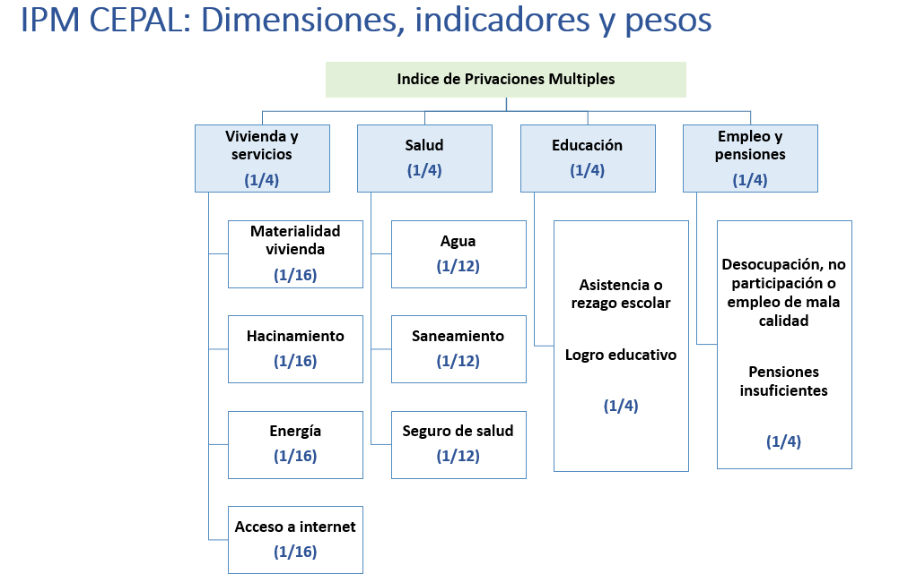

# Aplicación: Índice de Pobreza Multidimensional en Colombia. 

Nos centramos en la incidencia de la pobreza multidimensional descrito previamente. En este caso, requerimos $K = 9$ indicadores que se miden como privaciones: $y_{di}^{k} = 1$ si la persona tiene la privación y $y_{di}^{k} = 0$ si la persona no ha tenido la privación.

El índice requiere información para cada individuo $i = 1, \ldots, N_d$ en los dominios $d = 1, \ldots, D$, donde $N_d$ denota el tamaño de la población del dominio $d$.

La función indicadora $I(\cdot)$ es igual a 1 cuando se cumple la condición $q_{di} \ge z$. Para este estudio, utilizamos el valor de 0.4 para $z$, es decir, $I(\cdot)$ es igual a 1 cuando $q_{di} \ge 0.4$. $q_{di}$ es una cantidad ponderada que considera los $K = 9$ indicadores que conforman el índice. El valor de $q_{di}$ el dominio $d$ se calcula como:

  
$$
  q_{di} = \frac{1}{16}(y_{di}^{1} + y_{di}^{2} + y_{di}^{3} + y_{di}^{4}) + \frac{1}{12}(y_{di}^{5} + y_{di}^{6} + y_{di}^{7}) + \frac{1}{4}(y_{di}^{8} + y_{di}^{9}) 
$$
  
  Donde: 
  
  a. $y_{di}^{1}$ = Privación en material de construcción de la vivienda

  b. $y_{di}^{2}$ = Hacinamiento en el hogar. 

  c. $y_{di}^{3}$ = Acceso al servicio de Internet.

  d. $y_{di}^{4}$ = Acceso al servicio energía eléctrica. 

  e. $y_{di}^{5}$ = Privación en saneamiento.

  f. $y_{di}^{6}$ = Privación de acceso al agua potable. 
  
  g. $y_{di}^{7}$ = Privación en salud. 

  h. $y_{di}^{8}$ = Privación de la educación. 

  i. $y_{di}^{9}$ = Privación del empleo y la protección social.  

Las privaciones anteriores se agrupan por dimensiones como se muestran en la siguiente imagen 




Los datos de la encuesta y el censo han sido preparados previamente, la información sobre la cual realizaremos la predicción corresponde a Colombia en el 2019 


```r
encuesta_ipm <-
  readRDS("Modelo_bayes_HxA/COL/Data/encuesta_nbi.rds")
statelevel_predictors_df <-
  readRDS("Modelo_bayes_HxA/COL/Data/statelevel_predictors_df_dam2.rds") 

byAgrega <- c("dam",
              "dam2",
              "area",
              "sexo",
              "etnia",
              "anoest",
              "edad")
```

Agregando la información para los municipios de Colombia para los indicadores que conformarán el IPM


```r
names_ipm <- grep(pattern = "nbi", names(encuesta_ipm),value = TRUE)

encuesta_df <- map(setNames(names_ipm,names_ipm),
                   function(y){
                     encuesta_ipm$temp <- as.numeric(encuesta_ipm[[y]])
                     encuesta_ipm %>% 
                       group_by_at(all_of(byAgrega)) %>%
                       summarise(n = n(),
                                 yno = sum(temp),
                                 ysi = n - yno, .groups = "drop") %>% 
                       inner_join(statelevel_predictors_df,
                                  by = c("dam","dam2"))
                   })
```

La base resultante quedan de la siguiente forma:

<table class="table table-striped lightable-classic" style="width: auto !important; margin-left: auto; margin-right: auto; font-family: Arial Narrow; width: auto !important; margin-left: auto; margin-right: auto;">
<caption>(\#tab:unnamed-chunk-4)Privaci'on en material de construcci'on de la vivienda</caption>
 <thead>
  <tr>
   <th style="text-align:left;"> dam </th>
   <th style="text-align:left;"> dam2 </th>
   <th style="text-align:left;"> area </th>
   <th style="text-align:left;"> sexo </th>
   <th style="text-align:left;"> etnia </th>
   <th style="text-align:left;"> anoest </th>
   <th style="text-align:left;"> edad </th>
   <th style="text-align:right;"> n </th>
   <th style="text-align:right;"> yno </th>
   <th style="text-align:right;"> ysi </th>
   <th style="text-align:right;"> area1 </th>
   <th style="text-align:right;"> sexo2 </th>
   <th style="text-align:right;"> edad2 </th>
   <th style="text-align:right;"> edad3 </th>
   <th style="text-align:right;"> edad4 </th>
   <th style="text-align:right;"> edad5 </th>
   <th style="text-align:right;"> etnia2 </th>
   <th style="text-align:right;"> anoest2 </th>
   <th style="text-align:right;"> anoest3 </th>
   <th style="text-align:right;"> anoest4 </th>
   <th style="text-align:right;"> etnia1 </th>
   <th style="text-align:right;"> tiene_acueducto </th>
   <th style="text-align:right;"> piso_tierra </th>
   <th style="text-align:right;"> alfabeta </th>
   <th style="text-align:right;"> hacinamiento </th>
   <th style="text-align:right;"> tasa_desocupacion </th>
   <th style="text-align:right;"> luces_nocturnas </th>
   <th style="text-align:right;"> cubrimiento_cultivo </th>
   <th style="text-align:right;"> cubrimiento_urbano </th>
   <th style="text-align:right;"> modificacion_humana </th>
   <th style="text-align:right;"> accesibilidad_hospitales </th>
   <th style="text-align:right;"> accesibilidad_hosp_caminado </th>
  </tr>
 </thead>
<tbody>
  <tr>
   <td style="text-align:left;"> 11 </td>
   <td style="text-align:left;"> 11001 </td>
   <td style="text-align:left;"> 1 </td>
   <td style="text-align:left;"> 1 </td>
   <td style="text-align:left;"> 3 </td>
   <td style="text-align:left;"> 3 </td>
   <td style="text-align:left;"> 2 </td>
   <td style="text-align:right;"> 2439 </td>
   <td style="text-align:right;"> 53 </td>
   <td style="text-align:right;"> 2386 </td>
   <td style="text-align:right;"> 0.9979 </td>
   <td style="text-align:right;"> 0.5219 </td>
   <td style="text-align:right;"> 0.2690 </td>
   <td style="text-align:right;"> 0.2316 </td>
   <td style="text-align:right;"> 0.2251 </td>
   <td style="text-align:right;"> 0.0886 </td>
   <td style="text-align:right;"> 0.0093 </td>
   <td style="text-align:right;"> 0.2098 </td>
   <td style="text-align:right;"> 0.3810 </td>
   <td style="text-align:right;"> 0.2938 </td>
   <td style="text-align:right;"> 0.0027 </td>
   <td style="text-align:right;"> 0.0219 </td>
   <td style="text-align:right;"> 0.0026 </td>
   <td style="text-align:right;"> 0.0143 </td>
   <td style="text-align:right;"> 0.0848 </td>
   <td style="text-align:right;"> 0.0176 </td>
   <td style="text-align:right;"> 22.0069 </td>
   <td style="text-align:right;"> 9.1869 </td>
   <td style="text-align:right;"> 19.7751 </td>
   <td style="text-align:right;"> 0.5697 </td>
   <td style="text-align:right;"> 61.3823 </td>
   <td style="text-align:right;"> 259.2423 </td>
  </tr>
  <tr>
   <td style="text-align:left;"> 47 </td>
   <td style="text-align:left;"> 47001 </td>
   <td style="text-align:left;"> 1 </td>
   <td style="text-align:left;"> 2 </td>
   <td style="text-align:left;"> 3 </td>
   <td style="text-align:left;"> 3 </td>
   <td style="text-align:left;"> 2 </td>
   <td style="text-align:right;"> 2386 </td>
   <td style="text-align:right;"> 80 </td>
   <td style="text-align:right;"> 2306 </td>
   <td style="text-align:right;"> 0.9150 </td>
   <td style="text-align:right;"> 0.5158 </td>
   <td style="text-align:right;"> 0.2705 </td>
   <td style="text-align:right;"> 0.2125 </td>
   <td style="text-align:right;"> 0.1913 </td>
   <td style="text-align:right;"> 0.0719 </td>
   <td style="text-align:right;"> 0.0354 </td>
   <td style="text-align:right;"> 0.2539 </td>
   <td style="text-align:right;"> 0.4149 </td>
   <td style="text-align:right;"> 0.1837 </td>
   <td style="text-align:right;"> 0.0169 </td>
   <td style="text-align:right;"> 0.3002 </td>
   <td style="text-align:right;"> 0.0312 </td>
   <td style="text-align:right;"> 0.0364 </td>
   <td style="text-align:right;"> 0.2845 </td>
   <td style="text-align:right;"> 0.0015 </td>
   <td style="text-align:right;"> 4.3364 </td>
   <td style="text-align:right;"> 0.4577 </td>
   <td style="text-align:right;"> 1.7512 </td>
   <td style="text-align:right;"> 0.3278 </td>
   <td style="text-align:right;"> 210.3355 </td>
   <td style="text-align:right;"> 611.8750 </td>
  </tr>
  <tr>
   <td style="text-align:left;"> 23 </td>
   <td style="text-align:left;"> 23001 </td>
   <td style="text-align:left;"> 1 </td>
   <td style="text-align:left;"> 2 </td>
   <td style="text-align:left;"> 3 </td>
   <td style="text-align:left;"> 3 </td>
   <td style="text-align:left;"> 2 </td>
   <td style="text-align:right;"> 2359 </td>
   <td style="text-align:right;"> 226 </td>
   <td style="text-align:right;"> 2133 </td>
   <td style="text-align:right;"> 0.8192 </td>
   <td style="text-align:right;"> 0.5149 </td>
   <td style="text-align:right;"> 0.2631 </td>
   <td style="text-align:right;"> 0.2146 </td>
   <td style="text-align:right;"> 0.1961 </td>
   <td style="text-align:right;"> 0.0761 </td>
   <td style="text-align:right;"> 0.0170 </td>
   <td style="text-align:right;"> 0.2857 </td>
   <td style="text-align:right;"> 0.3634 </td>
   <td style="text-align:right;"> 0.1920 </td>
   <td style="text-align:right;"> 0.0072 </td>
   <td style="text-align:right;"> 0.1251 </td>
   <td style="text-align:right;"> 0.1412 </td>
   <td style="text-align:right;"> 0.0657 </td>
   <td style="text-align:right;"> 0.2275 </td>
   <td style="text-align:right;"> 0.0010 </td>
   <td style="text-align:right;"> 3.8284 </td>
   <td style="text-align:right;"> 19.0431 </td>
   <td style="text-align:right;"> 1.0209 </td>
   <td style="text-align:right;"> 0.4172 </td>
   <td style="text-align:right;"> 48.4391 </td>
   <td style="text-align:right;"> 234.8668 </td>
  </tr>
  <tr>
   <td style="text-align:left;"> 47 </td>
   <td style="text-align:left;"> 47001 </td>
   <td style="text-align:left;"> 1 </td>
   <td style="text-align:left;"> 1 </td>
   <td style="text-align:left;"> 3 </td>
   <td style="text-align:left;"> 3 </td>
   <td style="text-align:left;"> 2 </td>
   <td style="text-align:right;"> 2333 </td>
   <td style="text-align:right;"> 51 </td>
   <td style="text-align:right;"> 2282 </td>
   <td style="text-align:right;"> 0.9150 </td>
   <td style="text-align:right;"> 0.5158 </td>
   <td style="text-align:right;"> 0.2705 </td>
   <td style="text-align:right;"> 0.2125 </td>
   <td style="text-align:right;"> 0.1913 </td>
   <td style="text-align:right;"> 0.0719 </td>
   <td style="text-align:right;"> 0.0354 </td>
   <td style="text-align:right;"> 0.2539 </td>
   <td style="text-align:right;"> 0.4149 </td>
   <td style="text-align:right;"> 0.1837 </td>
   <td style="text-align:right;"> 0.0169 </td>
   <td style="text-align:right;"> 0.3002 </td>
   <td style="text-align:right;"> 0.0312 </td>
   <td style="text-align:right;"> 0.0364 </td>
   <td style="text-align:right;"> 0.2845 </td>
   <td style="text-align:right;"> 0.0015 </td>
   <td style="text-align:right;"> 4.3364 </td>
   <td style="text-align:right;"> 0.4577 </td>
   <td style="text-align:right;"> 1.7512 </td>
   <td style="text-align:right;"> 0.3278 </td>
   <td style="text-align:right;"> 210.3355 </td>
   <td style="text-align:right;"> 611.8750 </td>
  </tr>
  <tr>
   <td style="text-align:left;"> 11 </td>
   <td style="text-align:left;"> 11001 </td>
   <td style="text-align:left;"> 1 </td>
   <td style="text-align:left;"> 2 </td>
   <td style="text-align:left;"> 3 </td>
   <td style="text-align:left;"> 3 </td>
   <td style="text-align:left;"> 2 </td>
   <td style="text-align:right;"> 2246 </td>
   <td style="text-align:right;"> 50 </td>
   <td style="text-align:right;"> 2196 </td>
   <td style="text-align:right;"> 0.9979 </td>
   <td style="text-align:right;"> 0.5219 </td>
   <td style="text-align:right;"> 0.2690 </td>
   <td style="text-align:right;"> 0.2316 </td>
   <td style="text-align:right;"> 0.2251 </td>
   <td style="text-align:right;"> 0.0886 </td>
   <td style="text-align:right;"> 0.0093 </td>
   <td style="text-align:right;"> 0.2098 </td>
   <td style="text-align:right;"> 0.3810 </td>
   <td style="text-align:right;"> 0.2938 </td>
   <td style="text-align:right;"> 0.0027 </td>
   <td style="text-align:right;"> 0.0219 </td>
   <td style="text-align:right;"> 0.0026 </td>
   <td style="text-align:right;"> 0.0143 </td>
   <td style="text-align:right;"> 0.0848 </td>
   <td style="text-align:right;"> 0.0176 </td>
   <td style="text-align:right;"> 22.0069 </td>
   <td style="text-align:right;"> 9.1869 </td>
   <td style="text-align:right;"> 19.7751 </td>
   <td style="text-align:right;"> 0.5697 </td>
   <td style="text-align:right;"> 61.3823 </td>
   <td style="text-align:right;"> 259.2423 </td>
  </tr>
  <tr>
   <td style="text-align:left;"> 23 </td>
   <td style="text-align:left;"> 23001 </td>
   <td style="text-align:left;"> 1 </td>
   <td style="text-align:left;"> 1 </td>
   <td style="text-align:left;"> 3 </td>
   <td style="text-align:left;"> 3 </td>
   <td style="text-align:left;"> 2 </td>
   <td style="text-align:right;"> 2100 </td>
   <td style="text-align:right;"> 194 </td>
   <td style="text-align:right;"> 1906 </td>
   <td style="text-align:right;"> 0.8192 </td>
   <td style="text-align:right;"> 0.5149 </td>
   <td style="text-align:right;"> 0.2631 </td>
   <td style="text-align:right;"> 0.2146 </td>
   <td style="text-align:right;"> 0.1961 </td>
   <td style="text-align:right;"> 0.0761 </td>
   <td style="text-align:right;"> 0.0170 </td>
   <td style="text-align:right;"> 0.2857 </td>
   <td style="text-align:right;"> 0.3634 </td>
   <td style="text-align:right;"> 0.1920 </td>
   <td style="text-align:right;"> 0.0072 </td>
   <td style="text-align:right;"> 0.1251 </td>
   <td style="text-align:right;"> 0.1412 </td>
   <td style="text-align:right;"> 0.0657 </td>
   <td style="text-align:right;"> 0.2275 </td>
   <td style="text-align:right;"> 0.0010 </td>
   <td style="text-align:right;"> 3.8284 </td>
   <td style="text-align:right;"> 19.0431 </td>
   <td style="text-align:right;"> 1.0209 </td>
   <td style="text-align:right;"> 0.4172 </td>
   <td style="text-align:right;"> 48.4391 </td>
   <td style="text-align:right;"> 234.8668 </td>
  </tr>
</tbody>
</table>

<table class="table table-striped lightable-classic" style="width: auto !important; margin-left: auto; margin-right: auto; font-family: Arial Narrow; width: auto !important; margin-left: auto; margin-right: auto;">
<caption>(\#tab:unnamed-chunk-5)Hacinamiento</caption>
 <thead>
  <tr>
   <th style="text-align:left;"> dam </th>
   <th style="text-align:left;"> dam2 </th>
   <th style="text-align:left;"> area </th>
   <th style="text-align:left;"> sexo </th>
   <th style="text-align:left;"> etnia </th>
   <th style="text-align:left;"> anoest </th>
   <th style="text-align:left;"> edad </th>
   <th style="text-align:right;"> n </th>
   <th style="text-align:right;"> yno </th>
   <th style="text-align:right;"> ysi </th>
   <th style="text-align:right;"> area1 </th>
   <th style="text-align:right;"> sexo2 </th>
   <th style="text-align:right;"> edad2 </th>
   <th style="text-align:right;"> edad3 </th>
   <th style="text-align:right;"> edad4 </th>
   <th style="text-align:right;"> edad5 </th>
   <th style="text-align:right;"> etnia2 </th>
   <th style="text-align:right;"> anoest2 </th>
   <th style="text-align:right;"> anoest3 </th>
   <th style="text-align:right;"> anoest4 </th>
   <th style="text-align:right;"> etnia1 </th>
   <th style="text-align:right;"> tiene_acueducto </th>
   <th style="text-align:right;"> piso_tierra </th>
   <th style="text-align:right;"> alfabeta </th>
   <th style="text-align:right;"> hacinamiento </th>
   <th style="text-align:right;"> tasa_desocupacion </th>
   <th style="text-align:right;"> luces_nocturnas </th>
   <th style="text-align:right;"> cubrimiento_cultivo </th>
   <th style="text-align:right;"> cubrimiento_urbano </th>
   <th style="text-align:right;"> modificacion_humana </th>
   <th style="text-align:right;"> accesibilidad_hospitales </th>
   <th style="text-align:right;"> accesibilidad_hosp_caminado </th>
  </tr>
 </thead>
<tbody>
  <tr>
   <td style="text-align:left;"> 11 </td>
   <td style="text-align:left;"> 11001 </td>
   <td style="text-align:left;"> 1 </td>
   <td style="text-align:left;"> 1 </td>
   <td style="text-align:left;"> 3 </td>
   <td style="text-align:left;"> 3 </td>
   <td style="text-align:left;"> 2 </td>
   <td style="text-align:right;"> 2439 </td>
   <td style="text-align:right;"> 689 </td>
   <td style="text-align:right;"> 1750 </td>
   <td style="text-align:right;"> 0.9979 </td>
   <td style="text-align:right;"> 0.5219 </td>
   <td style="text-align:right;"> 0.2690 </td>
   <td style="text-align:right;"> 0.2316 </td>
   <td style="text-align:right;"> 0.2251 </td>
   <td style="text-align:right;"> 0.0886 </td>
   <td style="text-align:right;"> 0.0093 </td>
   <td style="text-align:right;"> 0.2098 </td>
   <td style="text-align:right;"> 0.3810 </td>
   <td style="text-align:right;"> 0.2938 </td>
   <td style="text-align:right;"> 0.0027 </td>
   <td style="text-align:right;"> 0.0219 </td>
   <td style="text-align:right;"> 0.0026 </td>
   <td style="text-align:right;"> 0.0143 </td>
   <td style="text-align:right;"> 0.0848 </td>
   <td style="text-align:right;"> 0.0176 </td>
   <td style="text-align:right;"> 22.0069 </td>
   <td style="text-align:right;"> 9.1869 </td>
   <td style="text-align:right;"> 19.7751 </td>
   <td style="text-align:right;"> 0.5697 </td>
   <td style="text-align:right;"> 61.3823 </td>
   <td style="text-align:right;"> 259.2423 </td>
  </tr>
  <tr>
   <td style="text-align:left;"> 47 </td>
   <td style="text-align:left;"> 47001 </td>
   <td style="text-align:left;"> 1 </td>
   <td style="text-align:left;"> 2 </td>
   <td style="text-align:left;"> 3 </td>
   <td style="text-align:left;"> 3 </td>
   <td style="text-align:left;"> 2 </td>
   <td style="text-align:right;"> 2386 </td>
   <td style="text-align:right;"> 1047 </td>
   <td style="text-align:right;"> 1339 </td>
   <td style="text-align:right;"> 0.9150 </td>
   <td style="text-align:right;"> 0.5158 </td>
   <td style="text-align:right;"> 0.2705 </td>
   <td style="text-align:right;"> 0.2125 </td>
   <td style="text-align:right;"> 0.1913 </td>
   <td style="text-align:right;"> 0.0719 </td>
   <td style="text-align:right;"> 0.0354 </td>
   <td style="text-align:right;"> 0.2539 </td>
   <td style="text-align:right;"> 0.4149 </td>
   <td style="text-align:right;"> 0.1837 </td>
   <td style="text-align:right;"> 0.0169 </td>
   <td style="text-align:right;"> 0.3002 </td>
   <td style="text-align:right;"> 0.0312 </td>
   <td style="text-align:right;"> 0.0364 </td>
   <td style="text-align:right;"> 0.2845 </td>
   <td style="text-align:right;"> 0.0015 </td>
   <td style="text-align:right;"> 4.3364 </td>
   <td style="text-align:right;"> 0.4577 </td>
   <td style="text-align:right;"> 1.7512 </td>
   <td style="text-align:right;"> 0.3278 </td>
   <td style="text-align:right;"> 210.3355 </td>
   <td style="text-align:right;"> 611.8750 </td>
  </tr>
  <tr>
   <td style="text-align:left;"> 23 </td>
   <td style="text-align:left;"> 23001 </td>
   <td style="text-align:left;"> 1 </td>
   <td style="text-align:left;"> 2 </td>
   <td style="text-align:left;"> 3 </td>
   <td style="text-align:left;"> 3 </td>
   <td style="text-align:left;"> 2 </td>
   <td style="text-align:right;"> 2359 </td>
   <td style="text-align:right;"> 1012 </td>
   <td style="text-align:right;"> 1347 </td>
   <td style="text-align:right;"> 0.8192 </td>
   <td style="text-align:right;"> 0.5149 </td>
   <td style="text-align:right;"> 0.2631 </td>
   <td style="text-align:right;"> 0.2146 </td>
   <td style="text-align:right;"> 0.1961 </td>
   <td style="text-align:right;"> 0.0761 </td>
   <td style="text-align:right;"> 0.0170 </td>
   <td style="text-align:right;"> 0.2857 </td>
   <td style="text-align:right;"> 0.3634 </td>
   <td style="text-align:right;"> 0.1920 </td>
   <td style="text-align:right;"> 0.0072 </td>
   <td style="text-align:right;"> 0.1251 </td>
   <td style="text-align:right;"> 0.1412 </td>
   <td style="text-align:right;"> 0.0657 </td>
   <td style="text-align:right;"> 0.2275 </td>
   <td style="text-align:right;"> 0.0010 </td>
   <td style="text-align:right;"> 3.8284 </td>
   <td style="text-align:right;"> 19.0431 </td>
   <td style="text-align:right;"> 1.0209 </td>
   <td style="text-align:right;"> 0.4172 </td>
   <td style="text-align:right;"> 48.4391 </td>
   <td style="text-align:right;"> 234.8668 </td>
  </tr>
  <tr>
   <td style="text-align:left;"> 47 </td>
   <td style="text-align:left;"> 47001 </td>
   <td style="text-align:left;"> 1 </td>
   <td style="text-align:left;"> 1 </td>
   <td style="text-align:left;"> 3 </td>
   <td style="text-align:left;"> 3 </td>
   <td style="text-align:left;"> 2 </td>
   <td style="text-align:right;"> 2333 </td>
   <td style="text-align:right;"> 1047 </td>
   <td style="text-align:right;"> 1286 </td>
   <td style="text-align:right;"> 0.9150 </td>
   <td style="text-align:right;"> 0.5158 </td>
   <td style="text-align:right;"> 0.2705 </td>
   <td style="text-align:right;"> 0.2125 </td>
   <td style="text-align:right;"> 0.1913 </td>
   <td style="text-align:right;"> 0.0719 </td>
   <td style="text-align:right;"> 0.0354 </td>
   <td style="text-align:right;"> 0.2539 </td>
   <td style="text-align:right;"> 0.4149 </td>
   <td style="text-align:right;"> 0.1837 </td>
   <td style="text-align:right;"> 0.0169 </td>
   <td style="text-align:right;"> 0.3002 </td>
   <td style="text-align:right;"> 0.0312 </td>
   <td style="text-align:right;"> 0.0364 </td>
   <td style="text-align:right;"> 0.2845 </td>
   <td style="text-align:right;"> 0.0015 </td>
   <td style="text-align:right;"> 4.3364 </td>
   <td style="text-align:right;"> 0.4577 </td>
   <td style="text-align:right;"> 1.7512 </td>
   <td style="text-align:right;"> 0.3278 </td>
   <td style="text-align:right;"> 210.3355 </td>
   <td style="text-align:right;"> 611.8750 </td>
  </tr>
  <tr>
   <td style="text-align:left;"> 11 </td>
   <td style="text-align:left;"> 11001 </td>
   <td style="text-align:left;"> 1 </td>
   <td style="text-align:left;"> 2 </td>
   <td style="text-align:left;"> 3 </td>
   <td style="text-align:left;"> 3 </td>
   <td style="text-align:left;"> 2 </td>
   <td style="text-align:right;"> 2246 </td>
   <td style="text-align:right;"> 667 </td>
   <td style="text-align:right;"> 1579 </td>
   <td style="text-align:right;"> 0.9979 </td>
   <td style="text-align:right;"> 0.5219 </td>
   <td style="text-align:right;"> 0.2690 </td>
   <td style="text-align:right;"> 0.2316 </td>
   <td style="text-align:right;"> 0.2251 </td>
   <td style="text-align:right;"> 0.0886 </td>
   <td style="text-align:right;"> 0.0093 </td>
   <td style="text-align:right;"> 0.2098 </td>
   <td style="text-align:right;"> 0.3810 </td>
   <td style="text-align:right;"> 0.2938 </td>
   <td style="text-align:right;"> 0.0027 </td>
   <td style="text-align:right;"> 0.0219 </td>
   <td style="text-align:right;"> 0.0026 </td>
   <td style="text-align:right;"> 0.0143 </td>
   <td style="text-align:right;"> 0.0848 </td>
   <td style="text-align:right;"> 0.0176 </td>
   <td style="text-align:right;"> 22.0069 </td>
   <td style="text-align:right;"> 9.1869 </td>
   <td style="text-align:right;"> 19.7751 </td>
   <td style="text-align:right;"> 0.5697 </td>
   <td style="text-align:right;"> 61.3823 </td>
   <td style="text-align:right;"> 259.2423 </td>
  </tr>
  <tr>
   <td style="text-align:left;"> 23 </td>
   <td style="text-align:left;"> 23001 </td>
   <td style="text-align:left;"> 1 </td>
   <td style="text-align:left;"> 1 </td>
   <td style="text-align:left;"> 3 </td>
   <td style="text-align:left;"> 3 </td>
   <td style="text-align:left;"> 2 </td>
   <td style="text-align:right;"> 2100 </td>
   <td style="text-align:right;"> 896 </td>
   <td style="text-align:right;"> 1204 </td>
   <td style="text-align:right;"> 0.8192 </td>
   <td style="text-align:right;"> 0.5149 </td>
   <td style="text-align:right;"> 0.2631 </td>
   <td style="text-align:right;"> 0.2146 </td>
   <td style="text-align:right;"> 0.1961 </td>
   <td style="text-align:right;"> 0.0761 </td>
   <td style="text-align:right;"> 0.0170 </td>
   <td style="text-align:right;"> 0.2857 </td>
   <td style="text-align:right;"> 0.3634 </td>
   <td style="text-align:right;"> 0.1920 </td>
   <td style="text-align:right;"> 0.0072 </td>
   <td style="text-align:right;"> 0.1251 </td>
   <td style="text-align:right;"> 0.1412 </td>
   <td style="text-align:right;"> 0.0657 </td>
   <td style="text-align:right;"> 0.2275 </td>
   <td style="text-align:right;"> 0.0010 </td>
   <td style="text-align:right;"> 3.8284 </td>
   <td style="text-align:right;"> 19.0431 </td>
   <td style="text-align:right;"> 1.0209 </td>
   <td style="text-align:right;"> 0.4172 </td>
   <td style="text-align:right;"> 48.4391 </td>
   <td style="text-align:right;"> 234.8668 </td>
  </tr>
</tbody>
</table>

## Definiendo de los modelos en Stan.

Para cada dimensión que compone el IPM se ajusta un modelo mixtos logit Bernoulli estimando mediante técnicas bayesiana. En este código se incluye el uso de la función `future_map` que permite procesar en paralelo cada modelo O puede compilar cada por separado, en nuestro caso se proceso cada modelo por separado.    


```r
library(furrr)
names_cov <-  statelevel_predictors_df %>%
  dplyr::select(-dam,-dam2) %>%
  names()
names_cov <- c("sexo","area",names_cov[16:19])
efec_aleat <-
  paste0("(1|",
         c("dam", "etnia"),
         ")",
         collapse = "+")

formula_mod <-
  formula(paste(
    " cbind(yno, ysi) ~",
    efec_aleat,
    "+",
    paste0(names_cov,
           collapse = " + ")
  ))

formula_mod
```

Ejecutando los modelos 


```r
plan(multisession, workers = 4)

fit <- future_map(encuesta_df, function(xdat){
stan_glmer(formula = formula_mod ,
  family = binomial(link = "logit"),
  data = xdat,
  cores = 4,
  chains = 4,
  iter = 500
)}, 
.progress = TRUE)

saveRDS(object = fit, "Data/fits_IPM.rds")
```

Terminado la compilación de los modelos después de realizar validaciones sobre esto, pasamos hacer las predicciones en el censo. 

## Proceso para la predicción $\pi_{di}^{kl}$

Los modelos fueron compilados de manera separada, por tanto, disponemos de un objeto `.rds` por cada dimensión del IPM 


```r
fit_agua <-
  readRDS(file = "Modelo_bayes_HxA/COL/Data/fit_agua.rds")
fit_educacion <-
  readRDS(file = "Modelo_bayes_HxA/COL/Data/fit_educacion.rds")
fit_empleo <-
  readRDS(file = "Modelo_bayes_HxA/COL/Data/fit_empleo.rds")
fit_energia <-
  readRDS(file = "Modelo_bayes_HxA/COL/Data/fit_energia.rds")
fit_hacinamiento <-
  readRDS(file = "Modelo_bayes_HxA/COL/Data/fit_hacina.rds")
fit_tic <-
  readRDS(file = "Modelo_bayes_HxA/COL/Data/fit_tic.rds")
fit_material <-
  readRDS(file = "Modelo_bayes_HxA/COL/Data/fit_matviv.rds")
fit_saneamiento <-
  readRDS(file = "Modelo_bayes_HxA/COL/Data/fit_saneamiento.rds")
fit_salud <-
  readRDS(file = "Modelo_bayes_HxA/COL/Data/fit_salud.rds")
```


Ahora, debemos leer la información del censo  y crear los **post-estrato **

```r
censo_ipm <- readRDS("Modelo_bayes_HxA/COL/Data/censo_COL.rds") %>%
  rename(dam = depto, dam2 = mpio) %>%
  group_by(dam,   dam2,  area,  sexo,  edad,  etnia, anoest) %>%
  summarise(n = sum(n), .groups = "drop")

statelevel_predictors_df <-
  readRDS("Modelo_bayes_HxA/COL/Data/statelevel_predictors_df_dam2.rds") 
```

Para realizar la predicción en el censo debemos incluir la información auxiliar 


```r
poststrat_df <- left_join(censo_ipm, statelevel_predictors_df,
                          by = c("dam", "dam2")) 
```


Para cada uno de los modelos anteriores debe tener las $L$ predicciones de $\pi_{di}^{kl}$,

-   Privación de acceso al agua potable. 

```r
temp <- poststrat_df 
epred_mat_agua <- posterior_epred(
  fit_agua,
  newdata = temp,
  type = "response",
  allow.new.levels = TRUE
)
```

-   Privación de la educación.


```r
epred_mat_educacion <-
  posterior_epred(
    fit_educacion,
    newdata = temp,
    type = "response",
    allow.new.levels = TRUE
  )
```

-   Privación del empleo y la protección social.


```r
epred_mat_empleo <-
  posterior_epred(
    fit_empleo,
    newdata = temp,
    type = "response",
    allow.new.levels = TRUE
  )
```

-   Acceso al servicio energía eléctrica.


```r
epred_mat_energia <-
  posterior_epred(
    fit_energia,
    newdata = temp,
    type = "response",
    allow.new.levels = TRUE
  )
```

-    Hacinamiento en el hogar.


```r
epred_mat_hacinamiento <-
  posterior_epred(
    fit_hacinamiento,
    newdata = temp,
    type = "response",
    allow.new.levels = TRUE
  )
```

-   Acceso al servicio de Internet.


```r
epred_mat_internet <-
  posterior_epred(
    fit_internet,
    newdata = temp,
    type = "response",
    allow.new.levels = TRUE
  )
```

-   Privación en material de construcción de la vivienda


```r
epred_mat_material <-
  posterior_epred(
    fit_material,
    newdata = temp,
    type = "response",
    allow.new.levels = TRUE
  )
```

-   Privación en saneamiento.


```r
epred_mat_saneamiento <-
  posterior_epred(
    fit_saneamiento,
    newdata = temp,
    type = "response",
    allow.new.levels = TRUE
  )
```

-   Privación en Salud.


```r
epred_mat_saneamiento <-
  posterior_epred(
    fit_salud,
    newdata = temp,
    type = "response",
    allow.new.levels = TRUE
  )
```


## Definiendo los hard estimates

Los resultados anteriores se deben procesarse para obtener los hard estimates, es decir, términos de carencia (1) y  no carencia (0) para la $k-esima$ dimensión . 

-    Privación de acceso al agua potable. 


```r
epred_mat_agua_dummy <-
  rbinom(n = nrow(epred_mat_agua) * ncol(epred_mat_agua) , 1,
         epred_mat_agua)

epred_mat_agua_dummy <- matrix(
  epred_mat_agua_dummy,
  nrow = nrow(epred_mat_agua),
  ncol = ncol(epred_mat_agua)
)
```

-   Privación de la educación.


```r
epred_mat_educacion_dummy <-
  rbinom(n = nrow(epred_mat_educacion) * ncol(epred_mat_educacion) ,
         1,
         epred_mat_educacion)

epred_mat_educacion_dummy <- matrix(
  epred_mat_educacion_dummy,
  nrow = nrow(epred_mat_educacion),
  ncol = ncol(epred_mat_educacion)
)
```

-    Acceso al servicio energía eléctrica 


```r
epred_mat_energia_dummy <-
  rbinom(n = nrow(epred_mat_energia) * ncol(epred_mat_energia) ,
         1,
         epred_mat_energia)

epred_mat_energia_dummy <- matrix(
  epred_mat_energia_dummy,
  nrow = nrow(epred_mat_energia),
  ncol = ncol(epred_mat_energia)
)
```

-   Hacinamiento en el hogar.


```r
epred_mat_hacinamiento_dummy <-
  rbinom(
    n = nrow(epred_mat_hacinamiento) * ncol(epred_mat_hacinamiento) ,
    1,
    epred_mat_hacinamiento
  )

epred_mat_hacinamiento_dummy <-
  matrix(
    epred_mat_hacinamiento_dummy,
    nrow = nrow(epred_mat_hacinamiento),
    ncol = ncol(epred_mat_hacinamiento)
  )
```

-   Acceso al servicio de Internet.


```r
epred_mat_internet_dummy <-
  rbinom(n = nrow(epred_mat_internet) * ncol(epred_mat_internet) ,
         1,
         epred_mat_internet)

epred_mat_internet_dummy <- matrix(
  epred_mat_internet_dummy,
  nrow = nrow(epred_mat_internet),
  ncol = ncol(epred_mat_internet)
)
```

-   Privación en material de construcción de la vivienda 


```r
epred_mat_material_dummy <-
  rbinom(n = nrow(epred_mat_material) * ncol(epred_mat_material) ,
         1,
         epred_mat_material)

epred_mat_material_dummy <- matrix(
  epred_mat_material_dummy,
  nrow = nrow(epred_mat_material),
  ncol = ncol(epred_mat_material)
)
```

-   Privación en saneamiento. 


```r
epred_mat_saneamiento_dummy <-
  rbinom(n = nrow(epred_mat_saneamiento) * ncol(epred_mat_saneamiento) ,
         1,
         epred_mat_saneamiento)

epred_mat_saneamiento_dummy <- matrix(
  epred_mat_saneamiento_dummy,
  nrow = nrow(epred_mat_saneamiento),
  ncol = ncol(epred_mat_saneamiento)
)
```

-   Privación del empleo y la protección social. 


```r
epred_mat_empleo_dummy <-
  rbinom(n = nrow(epred_mat_empleo) * ncol(epred_mat_empleo) ,
         1,
         epred_mat_empleo)

epred_mat_empleo_dummy <- matrix(
  epred_mat_empleo_dummy,
  nrow = nrow(epred_mat_empleo),
  ncol = ncol(epred_mat_empleo)
)
```

-   Privación en Salud. 


```r
epred_mat_salud_dummy <-
  rbinom(n = nrow(epred_mat_salud) * ncol(epred_mat_salud) ,
         1,
         epred_mat_salud)

epred_mat_salud_dummy <- matrix(
  epred_mat_salud_dummy,
  nrow = nrow(epred_mat_salud),
  ncol = ncol(epred_mat_salud)
)
```


## Calculando $q_{di}^{l}$, $I\left( q_{di}^{l} \ge z \right)$ y $c_{di}^{l}\left(z\right)$

Dado que los hard estimates fueron organizados en matrices, el calculo de $q^{l}_{id}$ es una simple operación matricial la cual se muestra a continuación 

```r
chain_q  <-
  # Vivienda y servicios
  (1 / 16) * (
    epred_mat_material_dummy +
      epred_mat_hacinamiento_dummy +
      epred_mat_energia_dummy +
      epred_mat_tic_dummy
  ) +
  # Salud
  (1 / 12) * (epred_mat_agua_dummy +
                epred_mat_saneamiento_dummy +
                epred_mat_salud_dummy) +
  # Educación
  (1 / 4) * epred_mat_educacion_dummy  +
  # Empleo
  (1 / 4) * epred_mat_empleo_dummy
```


Ahora, es posible tener el calculo de $I\left( q_{di}^{l} \ge z \right)$, tomando como umbral $z=0.4$. 


```r
chain_Ind <- chain_q
chain_Ind[chain_Ind < 0.4] <- 0
chain_Ind[chain_Ind != 0] <- 1
```

seguidamente calculamos $c_{di}^{l}\left(z\right)$ 


```r
chain_ci <- matrix(0,nrow = nrow(chain_q), ncol = ncol(chain_q))
chain_ci[chain_Ind == 1] <- chain_q[chain_Ind == 1]
```


```r
datos<-data.frame(t(chain_q[1:5,1:10]), t(chain_Ind[1:5,1:10]), t(chain_ci[1:5,1:10]),
                  N = censo_ipm$n[1:10] )
colnames(datos) <- c(paste0("q",1:5), paste0("Ind",1:5),paste0("c",1:5),"N")
tba(datos, "Cadenas obtenidas")
```

<table class="table table-striped lightable-classic" style="width: auto !important; margin-left: auto; margin-right: auto; font-family: Arial Narrow; width: auto !important; margin-left: auto; margin-right: auto;">
<caption>(\#tab:unnamed-chunk-35)Cadenas obtenidas</caption>
 <thead>
  <tr>
   <th style="text-align:right;"> q1 </th>
   <th style="text-align:right;"> q2 </th>
   <th style="text-align:right;"> q3 </th>
   <th style="text-align:right;"> q4 </th>
   <th style="text-align:right;"> q5 </th>
   <th style="text-align:right;"> Ind1 </th>
   <th style="text-align:right;"> Ind2 </th>
   <th style="text-align:right;"> Ind3 </th>
   <th style="text-align:right;"> Ind4 </th>
   <th style="text-align:right;"> Ind5 </th>
   <th style="text-align:right;"> c1 </th>
   <th style="text-align:right;"> c2 </th>
   <th style="text-align:right;"> c3 </th>
   <th style="text-align:right;"> c4 </th>
   <th style="text-align:right;"> c5 </th>
   <th style="text-align:right;"> N </th>
  </tr>
 </thead>
<tbody>
  <tr>
   <td style="text-align:right;"> 0.1875 </td>
   <td style="text-align:right;"> 0.6458 </td>
   <td style="text-align:right;"> 0.6250 </td>
   <td style="text-align:right;"> 0.1250 </td>
   <td style="text-align:right;"> 0.7083 </td>
   <td style="text-align:right;"> 0 </td>
   <td style="text-align:right;"> 1 </td>
   <td style="text-align:right;"> 1 </td>
   <td style="text-align:right;"> 0 </td>
   <td style="text-align:right;"> 1 </td>
   <td style="text-align:right;"> 0.0000 </td>
   <td style="text-align:right;"> 0.6458 </td>
   <td style="text-align:right;"> 0.6250 </td>
   <td style="text-align:right;"> 0.0000 </td>
   <td style="text-align:right;"> 0.7083 </td>
   <td style="text-align:right;"> 1 </td>
  </tr>
  <tr>
   <td style="text-align:right;"> 0.7083 </td>
   <td style="text-align:right;"> 0.3958 </td>
   <td style="text-align:right;"> 0.3125 </td>
   <td style="text-align:right;"> 0.7708 </td>
   <td style="text-align:right;"> 0.6250 </td>
   <td style="text-align:right;"> 1 </td>
   <td style="text-align:right;"> 0 </td>
   <td style="text-align:right;"> 0 </td>
   <td style="text-align:right;"> 1 </td>
   <td style="text-align:right;"> 1 </td>
   <td style="text-align:right;"> 0.7083 </td>
   <td style="text-align:right;"> 0.0000 </td>
   <td style="text-align:right;"> 0.0000 </td>
   <td style="text-align:right;"> 0.7708 </td>
   <td style="text-align:right;"> 0.6250 </td>
   <td style="text-align:right;"> 1 </td>
  </tr>
  <tr>
   <td style="text-align:right;"> 0.7708 </td>
   <td style="text-align:right;"> 0.5208 </td>
   <td style="text-align:right;"> 0.5625 </td>
   <td style="text-align:right;"> 0.6875 </td>
   <td style="text-align:right;"> 0.6250 </td>
   <td style="text-align:right;"> 1 </td>
   <td style="text-align:right;"> 1 </td>
   <td style="text-align:right;"> 1 </td>
   <td style="text-align:right;"> 1 </td>
   <td style="text-align:right;"> 1 </td>
   <td style="text-align:right;"> 0.7708 </td>
   <td style="text-align:right;"> 0.5208 </td>
   <td style="text-align:right;"> 0.5625 </td>
   <td style="text-align:right;"> 0.6875 </td>
   <td style="text-align:right;"> 0.6250 </td>
   <td style="text-align:right;"> 9 </td>
  </tr>
  <tr>
   <td style="text-align:right;"> 0.6250 </td>
   <td style="text-align:right;"> 0.4583 </td>
   <td style="text-align:right;"> 0.4583 </td>
   <td style="text-align:right;"> 0.3958 </td>
   <td style="text-align:right;"> 0.6250 </td>
   <td style="text-align:right;"> 1 </td>
   <td style="text-align:right;"> 1 </td>
   <td style="text-align:right;"> 1 </td>
   <td style="text-align:right;"> 0 </td>
   <td style="text-align:right;"> 1 </td>
   <td style="text-align:right;"> 0.6250 </td>
   <td style="text-align:right;"> 0.4583 </td>
   <td style="text-align:right;"> 0.4583 </td>
   <td style="text-align:right;"> 0.0000 </td>
   <td style="text-align:right;"> 0.6250 </td>
   <td style="text-align:right;"> 1 </td>
  </tr>
  <tr>
   <td style="text-align:right;"> 0.5625 </td>
   <td style="text-align:right;"> 0.3750 </td>
   <td style="text-align:right;"> 0.3750 </td>
   <td style="text-align:right;"> 0.3958 </td>
   <td style="text-align:right;"> 0.3125 </td>
   <td style="text-align:right;"> 1 </td>
   <td style="text-align:right;"> 0 </td>
   <td style="text-align:right;"> 0 </td>
   <td style="text-align:right;"> 0 </td>
   <td style="text-align:right;"> 0 </td>
   <td style="text-align:right;"> 0.5625 </td>
   <td style="text-align:right;"> 0.0000 </td>
   <td style="text-align:right;"> 0.0000 </td>
   <td style="text-align:right;"> 0.0000 </td>
   <td style="text-align:right;"> 0.0000 </td>
   <td style="text-align:right;"> 5 </td>
  </tr>
  <tr>
   <td style="text-align:right;"> 0.3125 </td>
   <td style="text-align:right;"> 0.6250 </td>
   <td style="text-align:right;"> 0.5625 </td>
   <td style="text-align:right;"> 0.5625 </td>
   <td style="text-align:right;"> 0.0625 </td>
   <td style="text-align:right;"> 0 </td>
   <td style="text-align:right;"> 1 </td>
   <td style="text-align:right;"> 1 </td>
   <td style="text-align:right;"> 1 </td>
   <td style="text-align:right;"> 0 </td>
   <td style="text-align:right;"> 0.0000 </td>
   <td style="text-align:right;"> 0.6250 </td>
   <td style="text-align:right;"> 0.5625 </td>
   <td style="text-align:right;"> 0.5625 </td>
   <td style="text-align:right;"> 0.0000 </td>
   <td style="text-align:right;"> 22 </td>
  </tr>
  <tr>
   <td style="text-align:right;"> 0.2500 </td>
   <td style="text-align:right;"> 0.3750 </td>
   <td style="text-align:right;"> 0.3958 </td>
   <td style="text-align:right;"> 0.3958 </td>
   <td style="text-align:right;"> 0.6458 </td>
   <td style="text-align:right;"> 0 </td>
   <td style="text-align:right;"> 0 </td>
   <td style="text-align:right;"> 0 </td>
   <td style="text-align:right;"> 0 </td>
   <td style="text-align:right;"> 1 </td>
   <td style="text-align:right;"> 0.0000 </td>
   <td style="text-align:right;"> 0.0000 </td>
   <td style="text-align:right;"> 0.0000 </td>
   <td style="text-align:right;"> 0.0000 </td>
   <td style="text-align:right;"> 0.6458 </td>
   <td style="text-align:right;"> 9 </td>
  </tr>
  <tr>
   <td style="text-align:right;"> 0.6250 </td>
   <td style="text-align:right;"> 0.2083 </td>
   <td style="text-align:right;"> 0.7083 </td>
   <td style="text-align:right;"> 0.3125 </td>
   <td style="text-align:right;"> 0.7083 </td>
   <td style="text-align:right;"> 1 </td>
   <td style="text-align:right;"> 0 </td>
   <td style="text-align:right;"> 1 </td>
   <td style="text-align:right;"> 0 </td>
   <td style="text-align:right;"> 1 </td>
   <td style="text-align:right;"> 0.6250 </td>
   <td style="text-align:right;"> 0.0000 </td>
   <td style="text-align:right;"> 0.7083 </td>
   <td style="text-align:right;"> 0.0000 </td>
   <td style="text-align:right;"> 0.7083 </td>
   <td style="text-align:right;"> 76 </td>
  </tr>
  <tr>
   <td style="text-align:right;"> 0.3958 </td>
   <td style="text-align:right;"> 0.7083 </td>
   <td style="text-align:right;"> 0.5625 </td>
   <td style="text-align:right;"> 0.5625 </td>
   <td style="text-align:right;"> 0.5625 </td>
   <td style="text-align:right;"> 0 </td>
   <td style="text-align:right;"> 1 </td>
   <td style="text-align:right;"> 1 </td>
   <td style="text-align:right;"> 1 </td>
   <td style="text-align:right;"> 1 </td>
   <td style="text-align:right;"> 0.0000 </td>
   <td style="text-align:right;"> 0.7083 </td>
   <td style="text-align:right;"> 0.5625 </td>
   <td style="text-align:right;"> 0.5625 </td>
   <td style="text-align:right;"> 0.5625 </td>
   <td style="text-align:right;"> 796 </td>
  </tr>
  <tr>
   <td style="text-align:right;"> 0.7083 </td>
   <td style="text-align:right;"> 0.6250 </td>
   <td style="text-align:right;"> 0.4583 </td>
   <td style="text-align:right;"> 0.5625 </td>
   <td style="text-align:right;"> 0.6250 </td>
   <td style="text-align:right;"> 1 </td>
   <td style="text-align:right;"> 1 </td>
   <td style="text-align:right;"> 1 </td>
   <td style="text-align:right;"> 1 </td>
   <td style="text-align:right;"> 1 </td>
   <td style="text-align:right;"> 0.7083 </td>
   <td style="text-align:right;"> 0.6250 </td>
   <td style="text-align:right;"> 0.4583 </td>
   <td style="text-align:right;"> 0.5625 </td>
   <td style="text-align:right;"> 0.6250 </td>
   <td style="text-align:right;"> 3549 </td>
  </tr>
</tbody>
</table>

## Estimación de $H$, $A$ e $IPM$
Para este proceso debemos realizar sumas ponderadas, dado que cada registro de la base de datos representa  un grupo de observaciones con las mismas características.  


```r
numIPM <- t(chain_ci) %>%
  as.data.frame() %>%
  mutate_all(~ . * censo_ipm$n) %>%
  as.matrix()

chain_N <- t(chain_Ind) %>%
  as.data.frame() %>%
  mutate_all(~ . * censo_ipm$n) %>%
  as.matrix()


IPM_l <- colSums(numIPM)/sum(censo_ipm$n)
Nz_l <- colSums(chain_N)
H_l <- Nz_l/sum(censo_ipm$n)
A_l <- colSums(numIPM)/Nz_l
```

<table class="table table-striped lightable-classic" style="width: auto !important; margin-left: auto; margin-right: auto; font-family: Arial Narrow; width: auto !important; margin-left: auto; margin-right: auto;">
<caption>(\#tab:unnamed-chunk-37)l-iteraciones</caption>
 <thead>
  <tr>
   <th style="text-align:left;">   </th>
   <th style="text-align:right;"> IPM_l </th>
   <th style="text-align:right;"> Nz_l </th>
   <th style="text-align:right;"> H_l </th>
   <th style="text-align:right;"> A_l </th>
   <th style="text-align:right;"> HA_l </th>
  </tr>
 </thead>
<tbody>
  <tr>
   <td style="text-align:left;"> l = 1 </td>
   <td style="text-align:right;"> 0.1840 </td>
   <td style="text-align:right;"> 10321871 </td>
   <td style="text-align:right;"> 0.3020 </td>
   <td style="text-align:right;"> 0.6093 </td>
   <td style="text-align:right;"> 0.1840 </td>
  </tr>
  <tr>
   <td style="text-align:left;"> l = 2 </td>
   <td style="text-align:right;"> 0.1803 </td>
   <td style="text-align:right;"> 10149096 </td>
   <td style="text-align:right;"> 0.2969 </td>
   <td style="text-align:right;"> 0.6074 </td>
   <td style="text-align:right;"> 0.1803 </td>
  </tr>
  <tr>
   <td style="text-align:left;"> l = 3 </td>
   <td style="text-align:right;"> 0.1932 </td>
   <td style="text-align:right;"> 10960239 </td>
   <td style="text-align:right;"> 0.3207 </td>
   <td style="text-align:right;"> 0.6025 </td>
   <td style="text-align:right;"> 0.1932 </td>
  </tr>
  <tr>
   <td style="text-align:left;"> l = 4 </td>
   <td style="text-align:right;"> 0.2134 </td>
   <td style="text-align:right;"> 12250636 </td>
   <td style="text-align:right;"> 0.3584 </td>
   <td style="text-align:right;"> 0.5954 </td>
   <td style="text-align:right;"> 0.2134 </td>
  </tr>
  <tr>
   <td style="text-align:left;"> l = 5 </td>
   <td style="text-align:right;"> 0.1777 </td>
   <td style="text-align:right;"> 9989464 </td>
   <td style="text-align:right;"> 0.2923 </td>
   <td style="text-align:right;"> 0.6079 </td>
   <td style="text-align:right;"> 0.1777 </td>
  </tr>
  <tr>
   <td style="text-align:left;"> l = 6 </td>
   <td style="text-align:right;"> 0.2187 </td>
   <td style="text-align:right;"> 12381895 </td>
   <td style="text-align:right;"> 0.3622 </td>
   <td style="text-align:right;"> 0.6037 </td>
   <td style="text-align:right;"> 0.2187 </td>
  </tr>
  <tr>
   <td style="text-align:left;"> l = 7 </td>
   <td style="text-align:right;"> 0.1895 </td>
   <td style="text-align:right;"> 10616144 </td>
   <td style="text-align:right;"> 0.3106 </td>
   <td style="text-align:right;"> 0.6102 </td>
   <td style="text-align:right;"> 0.1895 </td>
  </tr>
  <tr>
   <td style="text-align:left;"> l = 8 </td>
   <td style="text-align:right;"> 0.1945 </td>
   <td style="text-align:right;"> 11189155 </td>
   <td style="text-align:right;"> 0.3274 </td>
   <td style="text-align:right;"> 0.5941 </td>
   <td style="text-align:right;"> 0.1945 </td>
  </tr>
  <tr>
   <td style="text-align:left;"> l = 9 </td>
   <td style="text-align:right;"> 0.2068 </td>
   <td style="text-align:right;"> 11684389 </td>
   <td style="text-align:right;"> 0.3418 </td>
   <td style="text-align:right;"> 0.6049 </td>
   <td style="text-align:right;"> 0.2068 </td>
  </tr>
  <tr>
   <td style="text-align:left;"> l = 10 </td>
   <td style="text-align:right;"> 0.1909 </td>
   <td style="text-align:right;"> 10840874 </td>
   <td style="text-align:right;"> 0.3172 </td>
   <td style="text-align:right;"> 0.6020 </td>
   <td style="text-align:right;"> 0.1909 </td>
  </tr>
</tbody>
</table>


Por último se realiza las estimaciones puntuales y varianza para $H$, $A$ y $IPM$, esto es:  


```r
estimacion <- data.frame(H = mean(H_l),
           H_sd = sd(H_l),
           A = mean(A_l),
           A_sd = sd(A_l),
           IPM = mean(IPM_l),
           IPM_sd = sd(IPM_l))
```


<table class="table table-striped lightable-classic" style="width: auto !important; margin-left: auto; margin-right: auto; font-family: Arial Narrow; width: auto !important; margin-left: auto; margin-right: auto;">
<caption>(\#tab:unnamed-chunk-39)Estimaciones Nacionales</caption>
 <thead>
  <tr>
   <th style="text-align:right;"> H </th>
   <th style="text-align:right;"> H_sd </th>
   <th style="text-align:right;"> A </th>
   <th style="text-align:right;"> A_sd </th>
   <th style="text-align:right;"> IPM </th>
   <th style="text-align:right;"> IPM_sd </th>
  </tr>
 </thead>
<tbody>
  <tr>
   <td style="text-align:right;"> 0.318 </td>
   <td style="text-align:right;"> 0.0147 </td>
   <td style="text-align:right;"> 0.6046 </td>
   <td style="text-align:right;"> 0.0039 </td>
   <td style="text-align:right;"> 0.1922 </td>
   <td style="text-align:right;"> 0.0082 </td>
  </tr>
</tbody>
</table>
## Estimaciones desagregadas del IPM

Para realizar las estimaciones desagregadas se desarrollo una función que facilita el calculo, la estructura general el proceso es repetir el proceso anterior por subgrupos, por ejemplo, departamento (*dam*)


```r
source("Modelo_bayes_HxA/0funciones/Estimar_ipm.R")
ipm_dam <- estime_IPM(
  poststrat = censo_ipm,
  chain_ci = chain_ci,
  chain_ind = chain_ind,
  byMap = "dam"
) %>% data.frame()
```


<table class="table table-striped lightable-classic" style="width: auto !important; margin-left: auto; margin-right: auto; font-family: Arial Narrow; width: auto !important; margin-left: auto; margin-right: auto;">
<caption>(\#tab:unnamed-chunk-41)Estimaciones por departamento</caption>
 <thead>
  <tr>
   <th style="text-align:left;"> dam </th>
   <th style="text-align:right;"> H </th>
   <th style="text-align:right;"> H_sd </th>
   <th style="text-align:right;"> A </th>
   <th style="text-align:right;"> A_sd </th>
   <th style="text-align:right;"> IPM </th>
   <th style="text-align:right;"> IPM_sd </th>
  </tr>
 </thead>
<tbody>
  <tr>
   <td style="text-align:left;"> 05 </td>
   <td style="text-align:right;"> 0.2746 </td>
   <td style="text-align:right;"> 0.0316 </td>
   <td style="text-align:right;"> 0.5945 </td>
   <td style="text-align:right;"> 0.0079 </td>
   <td style="text-align:right;"> 0.1631 </td>
   <td style="text-align:right;"> 0.0175 </td>
  </tr>
  <tr>
   <td style="text-align:left;"> 08 </td>
   <td style="text-align:right;"> 0.2225 </td>
   <td style="text-align:right;"> 0.0478 </td>
   <td style="text-align:right;"> 0.5763 </td>
   <td style="text-align:right;"> 0.0149 </td>
   <td style="text-align:right;"> 0.1281 </td>
   <td style="text-align:right;"> 0.0270 </td>
  </tr>
  <tr>
   <td style="text-align:left;"> 11 </td>
   <td style="text-align:right;"> 0.1182 </td>
   <td style="text-align:right;"> 0.0745 </td>
   <td style="text-align:right;"> 0.5510 </td>
   <td style="text-align:right;"> 0.0386 </td>
   <td style="text-align:right;"> 0.0650 </td>
   <td style="text-align:right;"> 0.0411 </td>
  </tr>
  <tr>
   <td style="text-align:left;"> 13 </td>
   <td style="text-align:right;"> 0.3630 </td>
   <td style="text-align:right;"> 0.0340 </td>
   <td style="text-align:right;"> 0.6090 </td>
   <td style="text-align:right;"> 0.0089 </td>
   <td style="text-align:right;"> 0.2209 </td>
   <td style="text-align:right;"> 0.0192 </td>
  </tr>
  <tr>
   <td style="text-align:left;"> 15 </td>
   <td style="text-align:right;"> 0.3966 </td>
   <td style="text-align:right;"> 0.0182 </td>
   <td style="text-align:right;"> 0.6019 </td>
   <td style="text-align:right;"> 0.0039 </td>
   <td style="text-align:right;"> 0.2387 </td>
   <td style="text-align:right;"> 0.0103 </td>
  </tr>
  <tr>
   <td style="text-align:left;"> 17 </td>
   <td style="text-align:right;"> 0.2915 </td>
   <td style="text-align:right;"> 0.0328 </td>
   <td style="text-align:right;"> 0.5921 </td>
   <td style="text-align:right;"> 0.0090 </td>
   <td style="text-align:right;"> 0.1725 </td>
   <td style="text-align:right;"> 0.0182 </td>
  </tr>
  <tr>
   <td style="text-align:left;"> 18 </td>
   <td style="text-align:right;"> 0.4597 </td>
   <td style="text-align:right;"> 0.0463 </td>
   <td style="text-align:right;"> 0.6066 </td>
   <td style="text-align:right;"> 0.0090 </td>
   <td style="text-align:right;"> 0.2787 </td>
   <td style="text-align:right;"> 0.0269 </td>
  </tr>
  <tr>
   <td style="text-align:left;"> 19 </td>
   <td style="text-align:right;"> 0.5735 </td>
   <td style="text-align:right;"> 0.0192 </td>
   <td style="text-align:right;"> 0.6382 </td>
   <td style="text-align:right;"> 0.0054 </td>
   <td style="text-align:right;"> 0.3660 </td>
   <td style="text-align:right;"> 0.0114 </td>
  </tr>
  <tr>
   <td style="text-align:left;"> 20 </td>
   <td style="text-align:right;"> 0.3637 </td>
   <td style="text-align:right;"> 0.0376 </td>
   <td style="text-align:right;"> 0.5980 </td>
   <td style="text-align:right;"> 0.0086 </td>
   <td style="text-align:right;"> 0.2174 </td>
   <td style="text-align:right;"> 0.0213 </td>
  </tr>
  <tr>
   <td style="text-align:left;"> 23 </td>
   <td style="text-align:right;"> 0.5332 </td>
   <td style="text-align:right;"> 0.0258 </td>
   <td style="text-align:right;"> 0.6341 </td>
   <td style="text-align:right;"> 0.0068 </td>
   <td style="text-align:right;"> 0.3380 </td>
   <td style="text-align:right;"> 0.0149 </td>
  </tr>
  <tr>
   <td style="text-align:left;"> 25 </td>
   <td style="text-align:right;"> 0.3015 </td>
   <td style="text-align:right;"> 0.0222 </td>
   <td style="text-align:right;"> 0.5980 </td>
   <td style="text-align:right;"> 0.0059 </td>
   <td style="text-align:right;"> 0.1802 </td>
   <td style="text-align:right;"> 0.0123 </td>
  </tr>
  <tr>
   <td style="text-align:left;"> 27 </td>
   <td style="text-align:right;"> 0.7231 </td>
   <td style="text-align:right;"> 0.0320 </td>
   <td style="text-align:right;"> 0.6541 </td>
   <td style="text-align:right;"> 0.0088 </td>
   <td style="text-align:right;"> 0.4728 </td>
   <td style="text-align:right;"> 0.0186 </td>
  </tr>
  <tr>
   <td style="text-align:left;"> 41 </td>
   <td style="text-align:right;"> 0.3937 </td>
   <td style="text-align:right;"> 0.0298 </td>
   <td style="text-align:right;"> 0.5964 </td>
   <td style="text-align:right;"> 0.0068 </td>
   <td style="text-align:right;"> 0.2347 </td>
   <td style="text-align:right;"> 0.0169 </td>
  </tr>
  <tr>
   <td style="text-align:left;"> 44 </td>
   <td style="text-align:right;"> 0.5963 </td>
   <td style="text-align:right;"> 0.0208 </td>
   <td style="text-align:right;"> 0.6708 </td>
   <td style="text-align:right;"> 0.0121 </td>
   <td style="text-align:right;"> 0.3999 </td>
   <td style="text-align:right;"> 0.0143 </td>
  </tr>
  <tr>
   <td style="text-align:left;"> 47 </td>
   <td style="text-align:right;"> 0.3823 </td>
   <td style="text-align:right;"> 0.0381 </td>
   <td style="text-align:right;"> 0.6027 </td>
   <td style="text-align:right;"> 0.0091 </td>
   <td style="text-align:right;"> 0.2303 </td>
   <td style="text-align:right;"> 0.0218 </td>
  </tr>
  <tr>
   <td style="text-align:left;"> 50 </td>
   <td style="text-align:right;"> 0.3457 </td>
   <td style="text-align:right;"> 0.0445 </td>
   <td style="text-align:right;"> 0.5962 </td>
   <td style="text-align:right;"> 0.0094 </td>
   <td style="text-align:right;"> 0.2059 </td>
   <td style="text-align:right;"> 0.0249 </td>
  </tr>
  <tr>
   <td style="text-align:left;"> 52 </td>
   <td style="text-align:right;"> 0.5283 </td>
   <td style="text-align:right;"> 0.0235 </td>
   <td style="text-align:right;"> 0.6267 </td>
   <td style="text-align:right;"> 0.0055 </td>
   <td style="text-align:right;"> 0.3310 </td>
   <td style="text-align:right;"> 0.0138 </td>
  </tr>
  <tr>
   <td style="text-align:left;"> 54 </td>
   <td style="text-align:right;"> 0.4260 </td>
   <td style="text-align:right;"> 0.0519 </td>
   <td style="text-align:right;"> 0.6021 </td>
   <td style="text-align:right;"> 0.0105 </td>
   <td style="text-align:right;"> 0.2563 </td>
   <td style="text-align:right;"> 0.0297 </td>
  </tr>
  <tr>
   <td style="text-align:left;"> 63 </td>
   <td style="text-align:right;"> 0.2612 </td>
   <td style="text-align:right;"> 0.0489 </td>
   <td style="text-align:right;"> 0.5753 </td>
   <td style="text-align:right;"> 0.0115 </td>
   <td style="text-align:right;"> 0.1501 </td>
   <td style="text-align:right;"> 0.0273 </td>
  </tr>
  <tr>
   <td style="text-align:left;"> 66 </td>
   <td style="text-align:right;"> 0.3059 </td>
   <td style="text-align:right;"> 0.0425 </td>
   <td style="text-align:right;"> 0.5881 </td>
   <td style="text-align:right;"> 0.0098 </td>
   <td style="text-align:right;"> 0.1797 </td>
   <td style="text-align:right;"> 0.0237 </td>
  </tr>
  <tr>
   <td style="text-align:left;"> 68 </td>
   <td style="text-align:right;"> 0.3345 </td>
   <td style="text-align:right;"> 0.0275 </td>
   <td style="text-align:right;"> 0.6036 </td>
   <td style="text-align:right;"> 0.0066 </td>
   <td style="text-align:right;"> 0.2018 </td>
   <td style="text-align:right;"> 0.0154 </td>
  </tr>
  <tr>
   <td style="text-align:left;"> 70 </td>
   <td style="text-align:right;"> 0.5240 </td>
   <td style="text-align:right;"> 0.0281 </td>
   <td style="text-align:right;"> 0.6313 </td>
   <td style="text-align:right;"> 0.0066 </td>
   <td style="text-align:right;"> 0.3307 </td>
   <td style="text-align:right;"> 0.0162 </td>
  </tr>
  <tr>
   <td style="text-align:left;"> 73 </td>
   <td style="text-align:right;"> 0.3575 </td>
   <td style="text-align:right;"> 0.0357 </td>
   <td style="text-align:right;"> 0.6040 </td>
   <td style="text-align:right;"> 0.0086 </td>
   <td style="text-align:right;"> 0.2158 </td>
   <td style="text-align:right;"> 0.0201 </td>
  </tr>
  <tr>
   <td style="text-align:left;"> 76 </td>
   <td style="text-align:right;"> 0.2645 </td>
   <td style="text-align:right;"> 0.0341 </td>
   <td style="text-align:right;"> 0.5848 </td>
   <td style="text-align:right;"> 0.0089 </td>
   <td style="text-align:right;"> 0.1546 </td>
   <td style="text-align:right;"> 0.0190 </td>
  </tr>
  <tr>
   <td style="text-align:left;"> 81 </td>
   <td style="text-align:right;"> 0.4945 </td>
   <td style="text-align:right;"> 0.0659 </td>
   <td style="text-align:right;"> 0.6170 </td>
   <td style="text-align:right;"> 0.0159 </td>
   <td style="text-align:right;"> 0.3054 </td>
   <td style="text-align:right;"> 0.0440 </td>
  </tr>
  <tr>
   <td style="text-align:left;"> 85 </td>
   <td style="text-align:right;"> 0.4412 </td>
   <td style="text-align:right;"> 0.0665 </td>
   <td style="text-align:right;"> 0.6088 </td>
   <td style="text-align:right;"> 0.0133 </td>
   <td style="text-align:right;"> 0.2688 </td>
   <td style="text-align:right;"> 0.0425 </td>
  </tr>
  <tr>
   <td style="text-align:left;"> 86 </td>
   <td style="text-align:right;"> 0.5667 </td>
   <td style="text-align:right;"> 0.0551 </td>
   <td style="text-align:right;"> 0.6334 </td>
   <td style="text-align:right;"> 0.0151 </td>
   <td style="text-align:right;"> 0.3595 </td>
   <td style="text-align:right;"> 0.0407 </td>
  </tr>
  <tr>
   <td style="text-align:left;"> 88 </td>
   <td style="text-align:right;"> 0.3488 </td>
   <td style="text-align:right;"> 0.0694 </td>
   <td style="text-align:right;"> 0.5951 </td>
   <td style="text-align:right;"> 0.0194 </td>
   <td style="text-align:right;"> 0.2077 </td>
   <td style="text-align:right;"> 0.0430 </td>
  </tr>
  <tr>
   <td style="text-align:left;"> 91 </td>
   <td style="text-align:right;"> 0.6427 </td>
   <td style="text-align:right;"> 0.0683 </td>
   <td style="text-align:right;"> 0.6691 </td>
   <td style="text-align:right;"> 0.0211 </td>
   <td style="text-align:right;"> 0.4302 </td>
   <td style="text-align:right;"> 0.0489 </td>
  </tr>
  <tr>
   <td style="text-align:left;"> 94 </td>
   <td style="text-align:right;"> 0.7041 </td>
   <td style="text-align:right;"> 0.0604 </td>
   <td style="text-align:right;"> 0.6738 </td>
   <td style="text-align:right;"> 0.0226 </td>
   <td style="text-align:right;"> 0.4747 </td>
   <td style="text-align:right;"> 0.0472 </td>
  </tr>
  <tr>
   <td style="text-align:left;"> 95 </td>
   <td style="text-align:right;"> 0.5507 </td>
   <td style="text-align:right;"> 0.0701 </td>
   <td style="text-align:right;"> 0.6293 </td>
   <td style="text-align:right;"> 0.0190 </td>
   <td style="text-align:right;"> 0.3468 </td>
   <td style="text-align:right;"> 0.0471 </td>
  </tr>
  <tr>
   <td style="text-align:left;"> 97 </td>
   <td style="text-align:right;"> 0.7882 </td>
   <td style="text-align:right;"> 0.0493 </td>
   <td style="text-align:right;"> 0.6932 </td>
   <td style="text-align:right;"> 0.0289 </td>
   <td style="text-align:right;"> 0.5468 </td>
   <td style="text-align:right;"> 0.0465 </td>
  </tr>
  <tr>
   <td style="text-align:left;"> 99 </td>
   <td style="text-align:right;"> 0.7288 </td>
   <td style="text-align:right;"> 0.0477 </td>
   <td style="text-align:right;"> 0.6823 </td>
   <td style="text-align:right;"> 0.0283 </td>
   <td style="text-align:right;"> 0.4979 </td>
   <td style="text-align:right;"> 0.0454 </td>
  </tr>
</tbody>
</table>

Otra estimación desagregada que es posible obtener es la combinación por departamento y sexo, para ellos se usa la sintaxis. 


```r
ipm_dam_sexo <- estime_IPM(
  poststrat = censo_ipm,
  chain_ci = chain_ci,
  chain_ind = chain_ind,
  byMap = c("dam", "sexo")
) %>% data.frame()
```


<table class="table table-striped lightable-classic" style="width: auto !important; margin-left: auto; margin-right: auto; font-family: Arial Narrow; width: auto !important; margin-left: auto; margin-right: auto;">
<caption>(\#tab:unnamed-chunk-44)Estimaciones por departamento y sexo</caption>
 <thead>
  <tr>
   <th style="text-align:left;"> dam </th>
   <th style="text-align:left;"> sexo </th>
   <th style="text-align:right;"> H </th>
   <th style="text-align:right;"> H_sd </th>
   <th style="text-align:right;"> A </th>
   <th style="text-align:right;"> A_sd </th>
   <th style="text-align:right;"> IPM </th>
   <th style="text-align:right;"> IPM_sd </th>
  </tr>
 </thead>
<tbody>
  <tr>
   <td style="text-align:left;"> 05 </td>
   <td style="text-align:left;"> 1 </td>
   <td style="text-align:right;"> 0.2801 </td>
   <td style="text-align:right;"> 0.0413 </td>
   <td style="text-align:right;"> 0.6001 </td>
   <td style="text-align:right;"> 0.0104 </td>
   <td style="text-align:right;"> 0.1678 </td>
   <td style="text-align:right;"> 0.0228 </td>
  </tr>
  <tr>
   <td style="text-align:left;"> 05 </td>
   <td style="text-align:left;"> 2 </td>
   <td style="text-align:right;"> 0.2697 </td>
   <td style="text-align:right;"> 0.0457 </td>
   <td style="text-align:right;"> 0.5903 </td>
   <td style="text-align:right;"> 0.0107 </td>
   <td style="text-align:right;"> 0.1589 </td>
   <td style="text-align:right;"> 0.0252 </td>
  </tr>
  <tr>
   <td style="text-align:left;"> 08 </td>
   <td style="text-align:left;"> 1 </td>
   <td style="text-align:right;"> 0.2224 </td>
   <td style="text-align:right;"> 0.0676 </td>
   <td style="text-align:right;"> 0.5784 </td>
   <td style="text-align:right;"> 0.0207 </td>
   <td style="text-align:right;"> 0.1283 </td>
   <td style="text-align:right;"> 0.0382 </td>
  </tr>
  <tr>
   <td style="text-align:left;"> 08 </td>
   <td style="text-align:left;"> 2 </td>
   <td style="text-align:right;"> 0.2226 </td>
   <td style="text-align:right;"> 0.0665 </td>
   <td style="text-align:right;"> 0.5757 </td>
   <td style="text-align:right;"> 0.0198 </td>
   <td style="text-align:right;"> 0.1279 </td>
   <td style="text-align:right;"> 0.0377 </td>
  </tr>
  <tr>
   <td style="text-align:left;"> 11 </td>
   <td style="text-align:left;"> 1 </td>
   <td style="text-align:right;"> 0.1143 </td>
   <td style="text-align:right;"> 0.1066 </td>
   <td style="text-align:right;"> 0.5533 </td>
   <td style="text-align:right;"> 0.0480 </td>
   <td style="text-align:right;"> 0.0628 </td>
   <td style="text-align:right;"> 0.0588 </td>
  </tr>
  <tr>
   <td style="text-align:left;"> 11 </td>
   <td style="text-align:left;"> 2 </td>
   <td style="text-align:right;"> 0.1217 </td>
   <td style="text-align:right;"> 0.1043 </td>
   <td style="text-align:right;"> 0.5517 </td>
   <td style="text-align:right;"> 0.0445 </td>
   <td style="text-align:right;"> 0.0669 </td>
   <td style="text-align:right;"> 0.0575 </td>
  </tr>
  <tr>
   <td style="text-align:left;"> 13 </td>
   <td style="text-align:left;"> 1 </td>
   <td style="text-align:right;"> 0.3765 </td>
   <td style="text-align:right;"> 0.0472 </td>
   <td style="text-align:right;"> 0.6141 </td>
   <td style="text-align:right;"> 0.0116 </td>
   <td style="text-align:right;"> 0.2309 </td>
   <td style="text-align:right;"> 0.0269 </td>
  </tr>
  <tr>
   <td style="text-align:left;"> 13 </td>
   <td style="text-align:left;"> 2 </td>
   <td style="text-align:right;"> 0.3501 </td>
   <td style="text-align:right;"> 0.0516 </td>
   <td style="text-align:right;"> 0.6046 </td>
   <td style="text-align:right;"> 0.0123 </td>
   <td style="text-align:right;"> 0.2113 </td>
   <td style="text-align:right;"> 0.0291 </td>
  </tr>
  <tr>
   <td style="text-align:left;"> 15 </td>
   <td style="text-align:left;"> 1 </td>
   <td style="text-align:right;"> 0.4112 </td>
   <td style="text-align:right;"> 0.0239 </td>
   <td style="text-align:right;"> 0.6051 </td>
   <td style="text-align:right;"> 0.0056 </td>
   <td style="text-align:right;"> 0.2487 </td>
   <td style="text-align:right;"> 0.0137 </td>
  </tr>
  <tr>
   <td style="text-align:left;"> 15 </td>
   <td style="text-align:left;"> 2 </td>
   <td style="text-align:right;"> 0.3828 </td>
   <td style="text-align:right;"> 0.0263 </td>
   <td style="text-align:right;"> 0.5988 </td>
   <td style="text-align:right;"> 0.0056 </td>
   <td style="text-align:right;"> 0.2292 </td>
   <td style="text-align:right;"> 0.0148 </td>
  </tr>
  <tr>
   <td style="text-align:left;"> 17 </td>
   <td style="text-align:left;"> 1 </td>
   <td style="text-align:right;"> 0.3040 </td>
   <td style="text-align:right;"> 0.0434 </td>
   <td style="text-align:right;"> 0.5955 </td>
   <td style="text-align:right;"> 0.0120 </td>
   <td style="text-align:right;"> 0.1808 </td>
   <td style="text-align:right;"> 0.0242 </td>
  </tr>
  <tr>
   <td style="text-align:left;"> 17 </td>
   <td style="text-align:left;"> 2 </td>
   <td style="text-align:right;"> 0.2800 </td>
   <td style="text-align:right;"> 0.0473 </td>
   <td style="text-align:right;"> 0.5896 </td>
   <td style="text-align:right;"> 0.0126 </td>
   <td style="text-align:right;"> 0.1648 </td>
   <td style="text-align:right;"> 0.0262 </td>
  </tr>
  <tr>
   <td style="text-align:left;"> 18 </td>
   <td style="text-align:left;"> 1 </td>
   <td style="text-align:right;"> 0.4815 </td>
   <td style="text-align:right;"> 0.0627 </td>
   <td style="text-align:right;"> 0.6124 </td>
   <td style="text-align:right;"> 0.0126 </td>
   <td style="text-align:right;"> 0.2945 </td>
   <td style="text-align:right;"> 0.0364 </td>
  </tr>
  <tr>
   <td style="text-align:left;"> 18 </td>
   <td style="text-align:left;"> 2 </td>
   <td style="text-align:right;"> 0.4376 </td>
   <td style="text-align:right;"> 0.0699 </td>
   <td style="text-align:right;"> 0.6010 </td>
   <td style="text-align:right;"> 0.0129 </td>
   <td style="text-align:right;"> 0.2627 </td>
   <td style="text-align:right;"> 0.0402 </td>
  </tr>
  <tr>
   <td style="text-align:left;"> 19 </td>
   <td style="text-align:left;"> 1 </td>
   <td style="text-align:right;"> 0.5898 </td>
   <td style="text-align:right;"> 0.0269 </td>
   <td style="text-align:right;"> 0.6415 </td>
   <td style="text-align:right;"> 0.0076 </td>
   <td style="text-align:right;"> 0.3782 </td>
   <td style="text-align:right;"> 0.0160 </td>
  </tr>
  <tr>
   <td style="text-align:left;"> 19 </td>
   <td style="text-align:left;"> 2 </td>
   <td style="text-align:right;"> 0.5579 </td>
   <td style="text-align:right;"> 0.0274 </td>
   <td style="text-align:right;"> 0.6351 </td>
   <td style="text-align:right;"> 0.0075 </td>
   <td style="text-align:right;"> 0.3542 </td>
   <td style="text-align:right;"> 0.0160 </td>
  </tr>
  <tr>
   <td style="text-align:left;"> 20 </td>
   <td style="text-align:left;"> 1 </td>
   <td style="text-align:right;"> 0.3790 </td>
   <td style="text-align:right;"> 0.0529 </td>
   <td style="text-align:right;"> 0.6014 </td>
   <td style="text-align:right;"> 0.0118 </td>
   <td style="text-align:right;"> 0.2277 </td>
   <td style="text-align:right;"> 0.0300 </td>
  </tr>
  <tr>
   <td style="text-align:left;"> 20 </td>
   <td style="text-align:left;"> 2 </td>
   <td style="text-align:right;"> 0.3491 </td>
   <td style="text-align:right;"> 0.0557 </td>
   <td style="text-align:right;"> 0.5953 </td>
   <td style="text-align:right;"> 0.0119 </td>
   <td style="text-align:right;"> 0.2075 </td>
   <td style="text-align:right;"> 0.0317 </td>
  </tr>
  <tr>
   <td style="text-align:left;"> 23 </td>
   <td style="text-align:left;"> 1 </td>
   <td style="text-align:right;"> 0.5489 </td>
   <td style="text-align:right;"> 0.0341 </td>
   <td style="text-align:right;"> 0.6388 </td>
   <td style="text-align:right;"> 0.0098 </td>
   <td style="text-align:right;"> 0.3505 </td>
   <td style="text-align:right;"> 0.0198 </td>
  </tr>
  <tr>
   <td style="text-align:left;"> 23 </td>
   <td style="text-align:left;"> 2 </td>
   <td style="text-align:right;"> 0.5180 </td>
   <td style="text-align:right;"> 0.0379 </td>
   <td style="text-align:right;"> 0.6295 </td>
   <td style="text-align:right;"> 0.0095 </td>
   <td style="text-align:right;"> 0.3259 </td>
   <td style="text-align:right;"> 0.0221 </td>
  </tr>
  <tr>
   <td style="text-align:left;"> 25 </td>
   <td style="text-align:left;"> 1 </td>
   <td style="text-align:right;"> 0.3104 </td>
   <td style="text-align:right;"> 0.0307 </td>
   <td style="text-align:right;"> 0.6023 </td>
   <td style="text-align:right;"> 0.0081 </td>
   <td style="text-align:right;"> 0.1868 </td>
   <td style="text-align:right;"> 0.0171 </td>
  </tr>
  <tr>
   <td style="text-align:left;"> 25 </td>
   <td style="text-align:left;"> 2 </td>
   <td style="text-align:right;"> 0.2929 </td>
   <td style="text-align:right;"> 0.0328 </td>
   <td style="text-align:right;"> 0.5941 </td>
   <td style="text-align:right;"> 0.0078 </td>
   <td style="text-align:right;"> 0.1739 </td>
   <td style="text-align:right;"> 0.0182 </td>
  </tr>
  <tr>
   <td style="text-align:left;"> 27 </td>
   <td style="text-align:left;"> 1 </td>
   <td style="text-align:right;"> 0.7294 </td>
   <td style="text-align:right;"> 0.0403 </td>
   <td style="text-align:right;"> 0.6615 </td>
   <td style="text-align:right;"> 0.0116 </td>
   <td style="text-align:right;"> 0.4823 </td>
   <td style="text-align:right;"> 0.0242 </td>
  </tr>
  <tr>
   <td style="text-align:left;"> 27 </td>
   <td style="text-align:left;"> 2 </td>
   <td style="text-align:right;"> 0.7171 </td>
   <td style="text-align:right;"> 0.0490 </td>
   <td style="text-align:right;"> 0.6473 </td>
   <td style="text-align:right;"> 0.0130 </td>
   <td style="text-align:right;"> 0.4638 </td>
   <td style="text-align:right;"> 0.0283 </td>
  </tr>
  <tr>
   <td style="text-align:left;"> 41 </td>
   <td style="text-align:left;"> 1 </td>
   <td style="text-align:right;"> 0.4081 </td>
   <td style="text-align:right;"> 0.0393 </td>
   <td style="text-align:right;"> 0.5997 </td>
   <td style="text-align:right;"> 0.0095 </td>
   <td style="text-align:right;"> 0.2446 </td>
   <td style="text-align:right;"> 0.0225 </td>
  </tr>
  <tr>
   <td style="text-align:left;"> 41 </td>
   <td style="text-align:left;"> 2 </td>
   <td style="text-align:right;"> 0.3796 </td>
   <td style="text-align:right;"> 0.0455 </td>
   <td style="text-align:right;"> 0.5934 </td>
   <td style="text-align:right;"> 0.0096 </td>
   <td style="text-align:right;"> 0.2251 </td>
   <td style="text-align:right;"> 0.0258 </td>
  </tr>
  <tr>
   <td style="text-align:left;"> 44 </td>
   <td style="text-align:left;"> 1 </td>
   <td style="text-align:right;"> 0.5997 </td>
   <td style="text-align:right;"> 0.0301 </td>
   <td style="text-align:right;"> 0.6743 </td>
   <td style="text-align:right;"> 0.0169 </td>
   <td style="text-align:right;"> 0.4042 </td>
   <td style="text-align:right;"> 0.0202 </td>
  </tr>
  <tr>
   <td style="text-align:left;"> 44 </td>
   <td style="text-align:left;"> 2 </td>
   <td style="text-align:right;"> 0.5931 </td>
   <td style="text-align:right;"> 0.0302 </td>
   <td style="text-align:right;"> 0.6677 </td>
   <td style="text-align:right;"> 0.0169 </td>
   <td style="text-align:right;"> 0.3959 </td>
   <td style="text-align:right;"> 0.0207 </td>
  </tr>
  <tr>
   <td style="text-align:left;"> 47 </td>
   <td style="text-align:left;"> 1 </td>
   <td style="text-align:right;"> 0.3961 </td>
   <td style="text-align:right;"> 0.0527 </td>
   <td style="text-align:right;"> 0.6069 </td>
   <td style="text-align:right;"> 0.0127 </td>
   <td style="text-align:right;"> 0.2401 </td>
   <td style="text-align:right;"> 0.0300 </td>
  </tr>
  <tr>
   <td style="text-align:left;"> 47 </td>
   <td style="text-align:left;"> 2 </td>
   <td style="text-align:right;"> 0.3688 </td>
   <td style="text-align:right;"> 0.0515 </td>
   <td style="text-align:right;"> 0.5990 </td>
   <td style="text-align:right;"> 0.0130 </td>
   <td style="text-align:right;"> 0.2207 </td>
   <td style="text-align:right;"> 0.0296 </td>
  </tr>
  <tr>
   <td style="text-align:left;"> 50 </td>
   <td style="text-align:left;"> 1 </td>
   <td style="text-align:right;"> 0.3621 </td>
   <td style="text-align:right;"> 0.0599 </td>
   <td style="text-align:right;"> 0.6013 </td>
   <td style="text-align:right;"> 0.0124 </td>
   <td style="text-align:right;"> 0.2173 </td>
   <td style="text-align:right;"> 0.0337 </td>
  </tr>
  <tr>
   <td style="text-align:left;"> 50 </td>
   <td style="text-align:left;"> 2 </td>
   <td style="text-align:right;"> 0.3290 </td>
   <td style="text-align:right;"> 0.0642 </td>
   <td style="text-align:right;"> 0.5916 </td>
   <td style="text-align:right;"> 0.0131 </td>
   <td style="text-align:right;"> 0.1942 </td>
   <td style="text-align:right;"> 0.0360 </td>
  </tr>
  <tr>
   <td style="text-align:left;"> 52 </td>
   <td style="text-align:left;"> 1 </td>
   <td style="text-align:right;"> 0.5400 </td>
   <td style="text-align:right;"> 0.0317 </td>
   <td style="text-align:right;"> 0.6303 </td>
   <td style="text-align:right;"> 0.0076 </td>
   <td style="text-align:right;"> 0.3403 </td>
   <td style="text-align:right;"> 0.0186 </td>
  </tr>
  <tr>
   <td style="text-align:left;"> 52 </td>
   <td style="text-align:left;"> 2 </td>
   <td style="text-align:right;"> 0.5174 </td>
   <td style="text-align:right;"> 0.0340 </td>
   <td style="text-align:right;"> 0.6233 </td>
   <td style="text-align:right;"> 0.0080 </td>
   <td style="text-align:right;"> 0.3224 </td>
   <td style="text-align:right;"> 0.0199 </td>
  </tr>
  <tr>
   <td style="text-align:left;"> 54 </td>
   <td style="text-align:left;"> 1 </td>
   <td style="text-align:right;"> 0.4384 </td>
   <td style="text-align:right;"> 0.0716 </td>
   <td style="text-align:right;"> 0.6070 </td>
   <td style="text-align:right;"> 0.0142 </td>
   <td style="text-align:right;"> 0.2657 </td>
   <td style="text-align:right;"> 0.0412 </td>
  </tr>
  <tr>
   <td style="text-align:left;"> 54 </td>
   <td style="text-align:left;"> 2 </td>
   <td style="text-align:right;"> 0.4143 </td>
   <td style="text-align:right;"> 0.0751 </td>
   <td style="text-align:right;"> 0.5983 </td>
   <td style="text-align:right;"> 0.0139 </td>
   <td style="text-align:right;"> 0.2475 </td>
   <td style="text-align:right;"> 0.0429 </td>
  </tr>
  <tr>
   <td style="text-align:left;"> 63 </td>
   <td style="text-align:left;"> 1 </td>
   <td style="text-align:right;"> 0.2647 </td>
   <td style="text-align:right;"> 0.0662 </td>
   <td style="text-align:right;"> 0.5797 </td>
   <td style="text-align:right;"> 0.0153 </td>
   <td style="text-align:right;"> 0.1531 </td>
   <td style="text-align:right;"> 0.0371 </td>
  </tr>
  <tr>
   <td style="text-align:left;"> 63 </td>
   <td style="text-align:left;"> 2 </td>
   <td style="text-align:right;"> 0.2581 </td>
   <td style="text-align:right;"> 0.0718 </td>
   <td style="text-align:right;"> 0.5726 </td>
   <td style="text-align:right;"> 0.0155 </td>
   <td style="text-align:right;"> 0.1474 </td>
   <td style="text-align:right;"> 0.0399 </td>
  </tr>
  <tr>
   <td style="text-align:left;"> 66 </td>
   <td style="text-align:left;"> 1 </td>
   <td style="text-align:right;"> 0.3136 </td>
   <td style="text-align:right;"> 0.0625 </td>
   <td style="text-align:right;"> 0.5935 </td>
   <td style="text-align:right;"> 0.0140 </td>
   <td style="text-align:right;"> 0.1857 </td>
   <td style="text-align:right;"> 0.0352 </td>
  </tr>
  <tr>
   <td style="text-align:left;"> 66 </td>
   <td style="text-align:left;"> 2 </td>
   <td style="text-align:right;"> 0.2991 </td>
   <td style="text-align:right;"> 0.0599 </td>
   <td style="text-align:right;"> 0.5842 </td>
   <td style="text-align:right;"> 0.0135 </td>
   <td style="text-align:right;"> 0.1744 </td>
   <td style="text-align:right;"> 0.0335 </td>
  </tr>
  <tr>
   <td style="text-align:left;"> 68 </td>
   <td style="text-align:left;"> 1 </td>
   <td style="text-align:right;"> 0.3499 </td>
   <td style="text-align:right;"> 0.0372 </td>
   <td style="text-align:right;"> 0.6087 </td>
   <td style="text-align:right;"> 0.0091 </td>
   <td style="text-align:right;"> 0.2128 </td>
   <td style="text-align:right;"> 0.0209 </td>
  </tr>
  <tr>
   <td style="text-align:left;"> 68 </td>
   <td style="text-align:left;"> 2 </td>
   <td style="text-align:right;"> 0.3201 </td>
   <td style="text-align:right;"> 0.0392 </td>
   <td style="text-align:right;"> 0.5989 </td>
   <td style="text-align:right;"> 0.0093 </td>
   <td style="text-align:right;"> 0.1915 </td>
   <td style="text-align:right;"> 0.0217 </td>
  </tr>
  <tr>
   <td style="text-align:left;"> 70 </td>
   <td style="text-align:left;"> 1 </td>
   <td style="text-align:right;"> 0.5399 </td>
   <td style="text-align:right;"> 0.0391 </td>
   <td style="text-align:right;"> 0.6358 </td>
   <td style="text-align:right;"> 0.0089 </td>
   <td style="text-align:right;"> 0.3431 </td>
   <td style="text-align:right;"> 0.0226 </td>
  </tr>
  <tr>
   <td style="text-align:left;"> 70 </td>
   <td style="text-align:left;"> 2 </td>
   <td style="text-align:right;"> 0.5081 </td>
   <td style="text-align:right;"> 0.0431 </td>
   <td style="text-align:right;"> 0.6269 </td>
   <td style="text-align:right;"> 0.0095 </td>
   <td style="text-align:right;"> 0.3184 </td>
   <td style="text-align:right;"> 0.0249 </td>
  </tr>
  <tr>
   <td style="text-align:left;"> 73 </td>
   <td style="text-align:left;"> 1 </td>
   <td style="text-align:right;"> 0.3712 </td>
   <td style="text-align:right;"> 0.0486 </td>
   <td style="text-align:right;"> 0.6090 </td>
   <td style="text-align:right;"> 0.0117 </td>
   <td style="text-align:right;"> 0.2258 </td>
   <td style="text-align:right;"> 0.0274 </td>
  </tr>
  <tr>
   <td style="text-align:left;"> 73 </td>
   <td style="text-align:left;"> 2 </td>
   <td style="text-align:right;"> 0.3442 </td>
   <td style="text-align:right;"> 0.0524 </td>
   <td style="text-align:right;"> 0.5998 </td>
   <td style="text-align:right;"> 0.0119 </td>
   <td style="text-align:right;"> 0.2061 </td>
   <td style="text-align:right;"> 0.0294 </td>
  </tr>
  <tr>
   <td style="text-align:left;"> 76 </td>
   <td style="text-align:left;"> 1 </td>
   <td style="text-align:right;"> 0.2689 </td>
   <td style="text-align:right;"> 0.0483 </td>
   <td style="text-align:right;"> 0.5894 </td>
   <td style="text-align:right;"> 0.0121 </td>
   <td style="text-align:right;"> 0.1582 </td>
   <td style="text-align:right;"> 0.0271 </td>
  </tr>
  <tr>
   <td style="text-align:left;"> 76 </td>
   <td style="text-align:left;"> 2 </td>
   <td style="text-align:right;"> 0.2607 </td>
   <td style="text-align:right;"> 0.0501 </td>
   <td style="text-align:right;"> 0.5818 </td>
   <td style="text-align:right;"> 0.0124 </td>
   <td style="text-align:right;"> 0.1514 </td>
   <td style="text-align:right;"> 0.0277 </td>
  </tr>
  <tr>
   <td style="text-align:left;"> 81 </td>
   <td style="text-align:left;"> 1 </td>
   <td style="text-align:right;"> 0.5108 </td>
   <td style="text-align:right;"> 0.0733 </td>
   <td style="text-align:right;"> 0.6214 </td>
   <td style="text-align:right;"> 0.0203 </td>
   <td style="text-align:right;"> 0.3177 </td>
   <td style="text-align:right;"> 0.0486 </td>
  </tr>
  <tr>
   <td style="text-align:left;"> 81 </td>
   <td style="text-align:left;"> 2 </td>
   <td style="text-align:right;"> 0.4779 </td>
   <td style="text-align:right;"> 0.0814 </td>
   <td style="text-align:right;"> 0.6127 </td>
   <td style="text-align:right;"> 0.0191 </td>
   <td style="text-align:right;"> 0.2930 </td>
   <td style="text-align:right;"> 0.0518 </td>
  </tr>
  <tr>
   <td style="text-align:left;"> 85 </td>
   <td style="text-align:left;"> 1 </td>
   <td style="text-align:right;"> 0.4568 </td>
   <td style="text-align:right;"> 0.0796 </td>
   <td style="text-align:right;"> 0.6133 </td>
   <td style="text-align:right;"> 0.0167 </td>
   <td style="text-align:right;"> 0.2803 </td>
   <td style="text-align:right;"> 0.0503 </td>
  </tr>
  <tr>
   <td style="text-align:left;"> 85 </td>
   <td style="text-align:left;"> 2 </td>
   <td style="text-align:right;"> 0.4254 </td>
   <td style="text-align:right;"> 0.0796 </td>
   <td style="text-align:right;"> 0.6045 </td>
   <td style="text-align:right;"> 0.0158 </td>
   <td style="text-align:right;"> 0.2572 </td>
   <td style="text-align:right;"> 0.0487 </td>
  </tr>
  <tr>
   <td style="text-align:left;"> 86 </td>
   <td style="text-align:left;"> 1 </td>
   <td style="text-align:right;"> 0.5805 </td>
   <td style="text-align:right;"> 0.0596 </td>
   <td style="text-align:right;"> 0.6375 </td>
   <td style="text-align:right;"> 0.0176 </td>
   <td style="text-align:right;"> 0.3705 </td>
   <td style="text-align:right;"> 0.0436 </td>
  </tr>
  <tr>
   <td style="text-align:left;"> 86 </td>
   <td style="text-align:left;"> 2 </td>
   <td style="text-align:right;"> 0.5528 </td>
   <td style="text-align:right;"> 0.0607 </td>
   <td style="text-align:right;"> 0.6293 </td>
   <td style="text-align:right;"> 0.0158 </td>
   <td style="text-align:right;"> 0.3483 </td>
   <td style="text-align:right;"> 0.0427 </td>
  </tr>
  <tr>
   <td style="text-align:left;"> 88 </td>
   <td style="text-align:left;"> 1 </td>
   <td style="text-align:right;"> 0.3473 </td>
   <td style="text-align:right;"> 0.0854 </td>
   <td style="text-align:right;"> 0.5978 </td>
   <td style="text-align:right;"> 0.0269 </td>
   <td style="text-align:right;"> 0.2077 </td>
   <td style="text-align:right;"> 0.0522 </td>
  </tr>
  <tr>
   <td style="text-align:left;"> 88 </td>
   <td style="text-align:left;"> 2 </td>
   <td style="text-align:right;"> 0.3500 </td>
   <td style="text-align:right;"> 0.0861 </td>
   <td style="text-align:right;"> 0.5936 </td>
   <td style="text-align:right;"> 0.0253 </td>
   <td style="text-align:right;"> 0.2078 </td>
   <td style="text-align:right;"> 0.0520 </td>
  </tr>
  <tr>
   <td style="text-align:left;"> 91 </td>
   <td style="text-align:left;"> 1 </td>
   <td style="text-align:right;"> 0.6501 </td>
   <td style="text-align:right;"> 0.0846 </td>
   <td style="text-align:right;"> 0.6728 </td>
   <td style="text-align:right;"> 0.0256 </td>
   <td style="text-align:right;"> 0.4372 </td>
   <td style="text-align:right;"> 0.0577 </td>
  </tr>
  <tr>
   <td style="text-align:left;"> 91 </td>
   <td style="text-align:left;"> 2 </td>
   <td style="text-align:right;"> 0.6344 </td>
   <td style="text-align:right;"> 0.0877 </td>
   <td style="text-align:right;"> 0.6661 </td>
   <td style="text-align:right;"> 0.0255 </td>
   <td style="text-align:right;"> 0.4224 </td>
   <td style="text-align:right;"> 0.0586 </td>
  </tr>
  <tr>
   <td style="text-align:left;"> 94 </td>
   <td style="text-align:left;"> 1 </td>
   <td style="text-align:right;"> 0.7090 </td>
   <td style="text-align:right;"> 0.0729 </td>
   <td style="text-align:right;"> 0.6780 </td>
   <td style="text-align:right;"> 0.0281 </td>
   <td style="text-align:right;"> 0.4809 </td>
   <td style="text-align:right;"> 0.0553 </td>
  </tr>
  <tr>
   <td style="text-align:left;"> 94 </td>
   <td style="text-align:left;"> 2 </td>
   <td style="text-align:right;"> 0.6985 </td>
   <td style="text-align:right;"> 0.0782 </td>
   <td style="text-align:right;"> 0.6697 </td>
   <td style="text-align:right;"> 0.0271 </td>
   <td style="text-align:right;"> 0.4677 </td>
   <td style="text-align:right;"> 0.0556 </td>
  </tr>
  <tr>
   <td style="text-align:left;"> 95 </td>
   <td style="text-align:left;"> 1 </td>
   <td style="text-align:right;"> 0.5763 </td>
   <td style="text-align:right;"> 0.0865 </td>
   <td style="text-align:right;"> 0.6350 </td>
   <td style="text-align:right;"> 0.0238 </td>
   <td style="text-align:right;"> 0.3661 </td>
   <td style="text-align:right;"> 0.0574 </td>
  </tr>
  <tr>
   <td style="text-align:left;"> 95 </td>
   <td style="text-align:left;"> 2 </td>
   <td style="text-align:right;"> 0.5200 </td>
   <td style="text-align:right;"> 0.0933 </td>
   <td style="text-align:right;"> 0.6229 </td>
   <td style="text-align:right;"> 0.0238 </td>
   <td style="text-align:right;"> 0.3236 </td>
   <td style="text-align:right;"> 0.0578 </td>
  </tr>
  <tr>
   <td style="text-align:left;"> 97 </td>
   <td style="text-align:left;"> 1 </td>
   <td style="text-align:right;"> 0.7905 </td>
   <td style="text-align:right;"> 0.0583 </td>
   <td style="text-align:right;"> 0.6973 </td>
   <td style="text-align:right;"> 0.0363 </td>
   <td style="text-align:right;"> 0.5516 </td>
   <td style="text-align:right;"> 0.0531 </td>
  </tr>
  <tr>
   <td style="text-align:left;"> 97 </td>
   <td style="text-align:left;"> 2 </td>
   <td style="text-align:right;"> 0.7853 </td>
   <td style="text-align:right;"> 0.0677 </td>
   <td style="text-align:right;"> 0.6885 </td>
   <td style="text-align:right;"> 0.0336 </td>
   <td style="text-align:right;"> 0.5411 </td>
   <td style="text-align:right;"> 0.0576 </td>
  </tr>
  <tr>
   <td style="text-align:left;"> 99 </td>
   <td style="text-align:left;"> 1 </td>
   <td style="text-align:right;"> 0.7347 </td>
   <td style="text-align:right;"> 0.0573 </td>
   <td style="text-align:right;"> 0.6840 </td>
   <td style="text-align:right;"> 0.0351 </td>
   <td style="text-align:right;"> 0.5031 </td>
   <td style="text-align:right;"> 0.0526 </td>
  </tr>
  <tr>
   <td style="text-align:left;"> 99 </td>
   <td style="text-align:left;"> 2 </td>
   <td style="text-align:right;"> 0.7218 </td>
   <td style="text-align:right;"> 0.0567 </td>
   <td style="text-align:right;"> 0.6804 </td>
   <td style="text-align:right;"> 0.0364 </td>
   <td style="text-align:right;"> 0.4916 </td>
   <td style="text-align:right;"> 0.0511 </td>
  </tr>
</tbody>
</table>

## Estimaciones por dimension del IPM 
Dado que el Índice de Pobreza Multidimensional (IPM) está compuesto por diversas dimensiones, resulta fundamental analizar cada una de estas dimensiones de manera individual. Esto permite comprender la naturaleza compleja y multifacética de la pobreza, lo cual a su vez posibilita diseñar estrategias de reducción efectivas. Esta aproximación garantiza una toma de decisiones fundamentada, la distribución eficiente de recursos y un impacto más profundo en la mejora de las condiciones de vida de las personas vulnerables. En este contexto, los "hard estimates" previamente obtenidos para cada dimensión resultan esenciales para obtener las estimaciones correspondientes a cada una de ellas.

El proceso de cálculo se basa en una media ponderada y se aplica a la dimensión de **Hacinamiento**, siguiendo una lógica similar para las demás dimensiones del IPM.


```r
n_filtered <- censo_ipm$n
epred_mat_filtered <- epred_mat_hacinamiento_dummy
mrp_estimates <- epred_mat_filtered %*% n_filtered / sum(n_filtered)
datos <- data.frame(
  estimate = mean(mrp_estimates),
  estimate_se = sd(mrp_estimates)
)
```

<table class="table table-striped lightable-classic" style="width: auto !important; margin-left: auto; margin-right: auto; font-family: Arial Narrow; width: auto !important; margin-left: auto; margin-right: auto;">
<caption>(\#tab:unnamed-chunk-47)Estimaciones nacional para  Hacinamiento</caption>
 <thead>
  <tr>
   <th style="text-align:right;"> estimate </th>
   <th style="text-align:right;"> estimate_se </th>
  </tr>
 </thead>
<tbody>
  <tr>
   <td style="text-align:right;"> 0.2372 </td>
   <td style="text-align:right;"> 0.0178 </td>
  </tr>
</tbody>
</table>

Con el objetivo de agilizar el proceso de calculo se define crea la función **agregado_dim_ipm** que hace los cálculos. La forma de uso es la siguiente. 


```r
source("Modelo_bayes_HxA/0funciones/agregado_dim_ipm.r")
datos_dam_haci <- agregado_dim_ipm(poststrat = censo_ipm,
           epredmat = epred_mat_hacinamiento_dummy,
           byMap = "dam")
```


<table class="table table-striped lightable-classic" style="width: auto !important; margin-left: auto; margin-right: auto; font-family: Arial Narrow; width: auto !important; margin-left: auto; margin-right: auto;">
<caption>(\#tab:unnamed-chunk-49)Estimaciones por departamento para Hacinamiento</caption>
 <thead>
  <tr>
   <th style="text-align:left;"> dam </th>
   <th style="text-align:right;"> estimate </th>
   <th style="text-align:right;"> estimate_se </th>
  </tr>
 </thead>
<tbody>
  <tr>
   <td style="text-align:left;"> 05 </td>
   <td style="text-align:right;"> 0.1872 </td>
   <td style="text-align:right;"> 0.0375 </td>
  </tr>
  <tr>
   <td style="text-align:left;"> 08 </td>
   <td style="text-align:right;"> 0.4005 </td>
   <td style="text-align:right;"> 0.0599 </td>
  </tr>
  <tr>
   <td style="text-align:left;"> 11 </td>
   <td style="text-align:right;"> 0.1924 </td>
   <td style="text-align:right;"> 0.0902 </td>
  </tr>
  <tr>
   <td style="text-align:left;"> 13 </td>
   <td style="text-align:right;"> 0.3326 </td>
   <td style="text-align:right;"> 0.0418 </td>
  </tr>
  <tr>
   <td style="text-align:left;"> 15 </td>
   <td style="text-align:right;"> 0.1816 </td>
   <td style="text-align:right;"> 0.0183 </td>
  </tr>
  <tr>
   <td style="text-align:left;"> 17 </td>
   <td style="text-align:right;"> 0.1556 </td>
   <td style="text-align:right;"> 0.0341 </td>
  </tr>
  <tr>
   <td style="text-align:left;"> 18 </td>
   <td style="text-align:right;"> 0.1667 </td>
   <td style="text-align:right;"> 0.0368 </td>
  </tr>
  <tr>
   <td style="text-align:left;"> 19 </td>
   <td style="text-align:right;"> 0.2594 </td>
   <td style="text-align:right;"> 0.0213 </td>
  </tr>
  <tr>
   <td style="text-align:left;"> 20 </td>
   <td style="text-align:right;"> 0.3593 </td>
   <td style="text-align:right;"> 0.0409 </td>
  </tr>
  <tr>
   <td style="text-align:left;"> 23 </td>
   <td style="text-align:right;"> 0.3890 </td>
   <td style="text-align:right;"> 0.0286 </td>
  </tr>
  <tr>
   <td style="text-align:left;"> 25 </td>
   <td style="text-align:right;"> 0.2148 </td>
   <td style="text-align:right;"> 0.0258 </td>
  </tr>
  <tr>
   <td style="text-align:left;"> 27 </td>
   <td style="text-align:right;"> 0.2308 </td>
   <td style="text-align:right;"> 0.0264 </td>
  </tr>
  <tr>
   <td style="text-align:left;"> 41 </td>
   <td style="text-align:right;"> 0.1854 </td>
   <td style="text-align:right;"> 0.0285 </td>
  </tr>
  <tr>
   <td style="text-align:left;"> 44 </td>
   <td style="text-align:right;"> 0.4464 </td>
   <td style="text-align:right;"> 0.0328 </td>
  </tr>
  <tr>
   <td style="text-align:left;"> 47 </td>
   <td style="text-align:right;"> 0.3689 </td>
   <td style="text-align:right;"> 0.0434 </td>
  </tr>
  <tr>
   <td style="text-align:left;"> 50 </td>
   <td style="text-align:right;"> 0.1781 </td>
   <td style="text-align:right;"> 0.0430 </td>
  </tr>
  <tr>
   <td style="text-align:left;"> 52 </td>
   <td style="text-align:right;"> 0.3224 </td>
   <td style="text-align:right;"> 0.0249 </td>
  </tr>
  <tr>
   <td style="text-align:left;"> 54 </td>
   <td style="text-align:right;"> 0.2879 </td>
   <td style="text-align:right;"> 0.0508 </td>
  </tr>
  <tr>
   <td style="text-align:left;"> 63 </td>
   <td style="text-align:right;"> 0.1471 </td>
   <td style="text-align:right;"> 0.0420 </td>
  </tr>
  <tr>
   <td style="text-align:left;"> 66 </td>
   <td style="text-align:right;"> 0.1645 </td>
   <td style="text-align:right;"> 0.0394 </td>
  </tr>
  <tr>
   <td style="text-align:left;"> 68 </td>
   <td style="text-align:right;"> 0.1949 </td>
   <td style="text-align:right;"> 0.0294 </td>
  </tr>
  <tr>
   <td style="text-align:left;"> 70 </td>
   <td style="text-align:right;"> 0.3893 </td>
   <td style="text-align:right;"> 0.0315 </td>
  </tr>
  <tr>
   <td style="text-align:left;"> 73 </td>
   <td style="text-align:right;"> 0.1921 </td>
   <td style="text-align:right;"> 0.0341 </td>
  </tr>
  <tr>
   <td style="text-align:left;"> 76 </td>
   <td style="text-align:right;"> 0.1558 </td>
   <td style="text-align:right;"> 0.0356 </td>
  </tr>
  <tr>
   <td style="text-align:left;"> 81 </td>
   <td style="text-align:right;"> 0.2488 </td>
   <td style="text-align:right;"> 0.1000 </td>
  </tr>
  <tr>
   <td style="text-align:left;"> 85 </td>
   <td style="text-align:right;"> 0.2417 </td>
   <td style="text-align:right;"> 0.1004 </td>
  </tr>
  <tr>
   <td style="text-align:left;"> 86 </td>
   <td style="text-align:right;"> 0.2713 </td>
   <td style="text-align:right;"> 0.0971 </td>
  </tr>
  <tr>
   <td style="text-align:left;"> 88 </td>
   <td style="text-align:right;"> 0.2522 </td>
   <td style="text-align:right;"> 0.1035 </td>
  </tr>
  <tr>
   <td style="text-align:left;"> 91 </td>
   <td style="text-align:right;"> 0.3226 </td>
   <td style="text-align:right;"> 0.1152 </td>
  </tr>
  <tr>
   <td style="text-align:left;"> 94 </td>
   <td style="text-align:right;"> 0.3462 </td>
   <td style="text-align:right;"> 0.1179 </td>
  </tr>
  <tr>
   <td style="text-align:left;"> 95 </td>
   <td style="text-align:right;"> 0.2584 </td>
   <td style="text-align:right;"> 0.1054 </td>
  </tr>
  <tr>
   <td style="text-align:left;"> 97 </td>
   <td style="text-align:right;"> 0.3714 </td>
   <td style="text-align:right;"> 0.1283 </td>
  </tr>
  <tr>
   <td style="text-align:left;"> 99 </td>
   <td style="text-align:right;"> 0.3313 </td>
   <td style="text-align:right;"> 0.1198 </td>
  </tr>
</tbody>
</table>

El resultado por municipio y para todas las dimensiones se muestra en la siguiente tabla
<table class="table table-striped lightable-classic" style="width: auto !important; margin-left: auto; margin-right: auto; font-family: Arial Narrow; width: auto !important; margin-left: auto; margin-right: auto;">
<caption>(\#tab:unnamed-chunk-50)Estimacion puntual por municipio y dimension</caption>
 <thead>
  <tr>
   <th style="text-align:left;"> dam2 </th>
   <th style="text-align:right;"> Agua </th>
   <th style="text-align:right;"> Educacion </th>
   <th style="text-align:right;"> Empleo </th>
   <th style="text-align:right;"> Energia </th>
   <th style="text-align:right;"> Hacinamienot </th>
   <th style="text-align:right;"> Internet </th>
   <th style="text-align:right;"> Material </th>
   <th style="text-align:right;"> Salud </th>
   <th style="text-align:right;"> Saneamiento </th>
  </tr>
 </thead>
<tbody>
  <tr>
   <td style="text-align:left;"> 05001 </td>
   <td style="text-align:right;"> 0.0012 </td>
   <td style="text-align:right;"> 0.2518 </td>
   <td style="text-align:right;"> 0.4725 </td>
   <td style="text-align:right;"> 0.0025 </td>
   <td style="text-align:right;"> 0.1924 </td>
   <td style="text-align:right;"> 0.4783 </td>
   <td style="text-align:right;"> 0.0083 </td>
   <td style="text-align:right;"> 0.0537 </td>
   <td style="text-align:right;"> 0.0524 </td>
  </tr>
  <tr>
   <td style="text-align:left;"> 05002 </td>
   <td style="text-align:right;"> 0.1645 </td>
   <td style="text-align:right;"> 0.6267 </td>
   <td style="text-align:right;"> 0.7798 </td>
   <td style="text-align:right;"> 0.2160 </td>
   <td style="text-align:right;"> 0.2009 </td>
   <td style="text-align:right;"> 0.8866 </td>
   <td style="text-align:right;"> 0.1695 </td>
   <td style="text-align:right;"> 0.0423 </td>
   <td style="text-align:right;"> 0.2852 </td>
  </tr>
  <tr>
   <td style="text-align:left;"> 05004 </td>
   <td style="text-align:right;"> 0.2000 </td>
   <td style="text-align:right;"> 0.6593 </td>
   <td style="text-align:right;"> 0.7985 </td>
   <td style="text-align:right;"> 0.2673 </td>
   <td style="text-align:right;"> 0.2007 </td>
   <td style="text-align:right;"> 0.9089 </td>
   <td style="text-align:right;"> 0.1951 </td>
   <td style="text-align:right;"> 0.0429 </td>
   <td style="text-align:right;"> 0.3250 </td>
  </tr>
  <tr>
   <td style="text-align:left;"> 05021 </td>
   <td style="text-align:right;"> 0.1319 </td>
   <td style="text-align:right;"> 0.5715 </td>
   <td style="text-align:right;"> 0.7442 </td>
   <td style="text-align:right;"> 0.1656 </td>
   <td style="text-align:right;"> 0.1905 </td>
   <td style="text-align:right;"> 0.8532 </td>
   <td style="text-align:right;"> 0.1430 </td>
   <td style="text-align:right;"> 0.0390 </td>
   <td style="text-align:right;"> 0.2461 </td>
  </tr>
  <tr>
   <td style="text-align:left;"> 05030 </td>
   <td style="text-align:right;"> 0.0925 </td>
   <td style="text-align:right;"> 0.5443 </td>
   <td style="text-align:right;"> 0.7119 </td>
   <td style="text-align:right;"> 0.1046 </td>
   <td style="text-align:right;"> 0.1921 </td>
   <td style="text-align:right;"> 0.8295 </td>
   <td style="text-align:right;"> 0.1116 </td>
   <td style="text-align:right;"> 0.0484 </td>
   <td style="text-align:right;"> 0.2237 </td>
  </tr>
  <tr>
   <td style="text-align:left;"> 05031 </td>
   <td style="text-align:right;"> 0.1352 </td>
   <td style="text-align:right;"> 0.5731 </td>
   <td style="text-align:right;"> 0.7481 </td>
   <td style="text-align:right;"> 0.1722 </td>
   <td style="text-align:right;"> 0.1892 </td>
   <td style="text-align:right;"> 0.8542 </td>
   <td style="text-align:right;"> 0.1433 </td>
   <td style="text-align:right;"> 0.0433 </td>
   <td style="text-align:right;"> 0.2481 </td>
  </tr>
  <tr>
   <td style="text-align:left;"> 05034 </td>
   <td style="text-align:right;"> 0.1391 </td>
   <td style="text-align:right;"> 0.5837 </td>
   <td style="text-align:right;"> 0.7512 </td>
   <td style="text-align:right;"> 0.1703 </td>
   <td style="text-align:right;"> 0.1933 </td>
   <td style="text-align:right;"> 0.8599 </td>
   <td style="text-align:right;"> 0.1429 </td>
   <td style="text-align:right;"> 0.0417 </td>
   <td style="text-align:right;"> 0.2568 </td>
  </tr>
  <tr>
   <td style="text-align:left;"> 05036 </td>
   <td style="text-align:right;"> 0.1227 </td>
   <td style="text-align:right;"> 0.5818 </td>
   <td style="text-align:right;"> 0.7383 </td>
   <td style="text-align:right;"> 0.1272 </td>
   <td style="text-align:right;"> 0.1946 </td>
   <td style="text-align:right;"> 0.8660 </td>
   <td style="text-align:right;"> 0.1299 </td>
   <td style="text-align:right;"> 0.0445 </td>
   <td style="text-align:right;"> 0.2465 </td>
  </tr>
  <tr>
   <td style="text-align:left;"> 05038 </td>
   <td style="text-align:right;"> 0.2084 </td>
   <td style="text-align:right;"> 0.6816 </td>
   <td style="text-align:right;"> 0.8165 </td>
   <td style="text-align:right;"> 0.2823 </td>
   <td style="text-align:right;"> 0.2022 </td>
   <td style="text-align:right;"> 0.9242 </td>
   <td style="text-align:right;"> 0.2013 </td>
   <td style="text-align:right;"> 0.0423 </td>
   <td style="text-align:right;"> 0.3307 </td>
  </tr>
  <tr>
   <td style="text-align:left;"> 05040 </td>
   <td style="text-align:right;"> 0.1636 </td>
   <td style="text-align:right;"> 0.6089 </td>
   <td style="text-align:right;"> 0.7721 </td>
   <td style="text-align:right;"> 0.2093 </td>
   <td style="text-align:right;"> 0.1954 </td>
   <td style="text-align:right;"> 0.8784 </td>
   <td style="text-align:right;"> 0.1688 </td>
   <td style="text-align:right;"> 0.0391 </td>
   <td style="text-align:right;"> 0.2794 </td>
  </tr>
</tbody>
</table>


<table class="table table-striped lightable-classic" style="width: auto !important; margin-left: auto; margin-right: auto; font-family: Arial Narrow; width: auto !important; margin-left: auto; margin-right: auto;">
<caption>(\#tab:unnamed-chunk-51)Error de estimacion por municipio y dimension</caption>
 <thead>
  <tr>
   <th style="text-align:left;"> dam2 </th>
   <th style="text-align:right;"> Agua_se </th>
   <th style="text-align:right;"> Educacion_se </th>
   <th style="text-align:right;"> Empleo_se </th>
   <th style="text-align:right;"> Energia_se </th>
   <th style="text-align:right;"> Hacinamienot_se </th>
   <th style="text-align:right;"> Internet_se </th>
   <th style="text-align:right;"> Material_se </th>
   <th style="text-align:right;"> Salud_se </th>
   <th style="text-align:right;"> Saneamiento_se </th>
  </tr>
 </thead>
<tbody>
  <tr>
   <td style="text-align:left;"> 05001 </td>
   <td style="text-align:right;"> 0.0082 </td>
   <td style="text-align:right;"> 0.0981 </td>
   <td style="text-align:right;"> 0.1089 </td>
   <td style="text-align:right;"> 0.0081 </td>
   <td style="text-align:right;"> 0.0871 </td>
   <td style="text-align:right;"> 0.1138 </td>
   <td style="text-align:right;"> 0.0195 </td>
   <td style="text-align:right;"> 0.0516 </td>
   <td style="text-align:right;"> 0.0493 </td>
  </tr>
  <tr>
   <td style="text-align:left;"> 05002 </td>
   <td style="text-align:right;"> 0.0753 </td>
   <td style="text-align:right;"> 0.0820 </td>
   <td style="text-align:right;"> 0.0718 </td>
   <td style="text-align:right;"> 0.0775 </td>
   <td style="text-align:right;"> 0.0778 </td>
   <td style="text-align:right;"> 0.0470 </td>
   <td style="text-align:right;"> 0.0766 </td>
   <td style="text-align:right;"> 0.0397 </td>
   <td style="text-align:right;"> 0.0837 </td>
  </tr>
  <tr>
   <td style="text-align:left;"> 05004 </td>
   <td style="text-align:right;"> 0.0772 </td>
   <td style="text-align:right;"> 0.0883 </td>
   <td style="text-align:right;"> 0.0697 </td>
   <td style="text-align:right;"> 0.0857 </td>
   <td style="text-align:right;"> 0.0779 </td>
   <td style="text-align:right;"> 0.0428 </td>
   <td style="text-align:right;"> 0.0752 </td>
   <td style="text-align:right;"> 0.0407 </td>
   <td style="text-align:right;"> 0.0925 </td>
  </tr>
  <tr>
   <td style="text-align:left;"> 05021 </td>
   <td style="text-align:right;"> 0.0572 </td>
   <td style="text-align:right;"> 0.0877 </td>
   <td style="text-align:right;"> 0.0777 </td>
   <td style="text-align:right;"> 0.0608 </td>
   <td style="text-align:right;"> 0.0709 </td>
   <td style="text-align:right;"> 0.0622 </td>
   <td style="text-align:right;"> 0.0628 </td>
   <td style="text-align:right;"> 0.0356 </td>
   <td style="text-align:right;"> 0.0758 </td>
  </tr>
  <tr>
   <td style="text-align:left;"> 05030 </td>
   <td style="text-align:right;"> 0.0491 </td>
   <td style="text-align:right;"> 0.0798 </td>
   <td style="text-align:right;"> 0.0777 </td>
   <td style="text-align:right;"> 0.0529 </td>
   <td style="text-align:right;"> 0.0703 </td>
   <td style="text-align:right;"> 0.0604 </td>
   <td style="text-align:right;"> 0.0542 </td>
   <td style="text-align:right;"> 0.0368 </td>
   <td style="text-align:right;"> 0.0717 </td>
  </tr>
  <tr>
   <td style="text-align:left;"> 05031 </td>
   <td style="text-align:right;"> 0.0562 </td>
   <td style="text-align:right;"> 0.0827 </td>
   <td style="text-align:right;"> 0.0764 </td>
   <td style="text-align:right;"> 0.0564 </td>
   <td style="text-align:right;"> 0.0697 </td>
   <td style="text-align:right;"> 0.0614 </td>
   <td style="text-align:right;"> 0.0580 </td>
   <td style="text-align:right;"> 0.0360 </td>
   <td style="text-align:right;"> 0.0739 </td>
  </tr>
  <tr>
   <td style="text-align:left;"> 05034 </td>
   <td style="text-align:right;"> 0.0570 </td>
   <td style="text-align:right;"> 0.0796 </td>
   <td style="text-align:right;"> 0.0710 </td>
   <td style="text-align:right;"> 0.0609 </td>
   <td style="text-align:right;"> 0.0668 </td>
   <td style="text-align:right;"> 0.0549 </td>
   <td style="text-align:right;"> 0.0596 </td>
   <td style="text-align:right;"> 0.0341 </td>
   <td style="text-align:right;"> 0.0715 </td>
  </tr>
  <tr>
   <td style="text-align:left;"> 05036 </td>
   <td style="text-align:right;"> 0.0625 </td>
   <td style="text-align:right;"> 0.0825 </td>
   <td style="text-align:right;"> 0.0719 </td>
   <td style="text-align:right;"> 0.0616 </td>
   <td style="text-align:right;"> 0.0712 </td>
   <td style="text-align:right;"> 0.0508 </td>
   <td style="text-align:right;"> 0.0622 </td>
   <td style="text-align:right;"> 0.0374 </td>
   <td style="text-align:right;"> 0.0745 </td>
  </tr>
  <tr>
   <td style="text-align:left;"> 05038 </td>
   <td style="text-align:right;"> 0.0936 </td>
   <td style="text-align:right;"> 0.0931 </td>
   <td style="text-align:right;"> 0.0797 </td>
   <td style="text-align:right;"> 0.0969 </td>
   <td style="text-align:right;"> 0.0861 </td>
   <td style="text-align:right;"> 0.0397 </td>
   <td style="text-align:right;"> 0.0903 </td>
   <td style="text-align:right;"> 0.0414 </td>
   <td style="text-align:right;"> 0.1049 </td>
  </tr>
  <tr>
   <td style="text-align:left;"> 05040 </td>
   <td style="text-align:right;"> 0.0652 </td>
   <td style="text-align:right;"> 0.0836 </td>
   <td style="text-align:right;"> 0.0750 </td>
   <td style="text-align:right;"> 0.0686 </td>
   <td style="text-align:right;"> 0.0700 </td>
   <td style="text-align:right;"> 0.0531 </td>
   <td style="text-align:right;"> 0.0637 </td>
   <td style="text-align:right;"> 0.0349 </td>
   <td style="text-align:right;"> 0.0807 </td>
  </tr>
</tbody>
</table>


