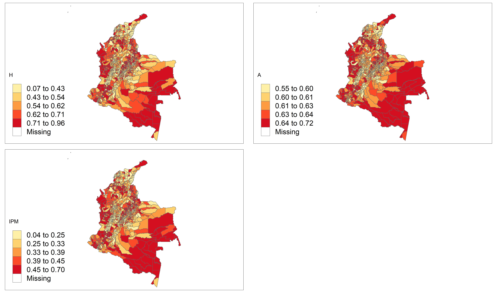
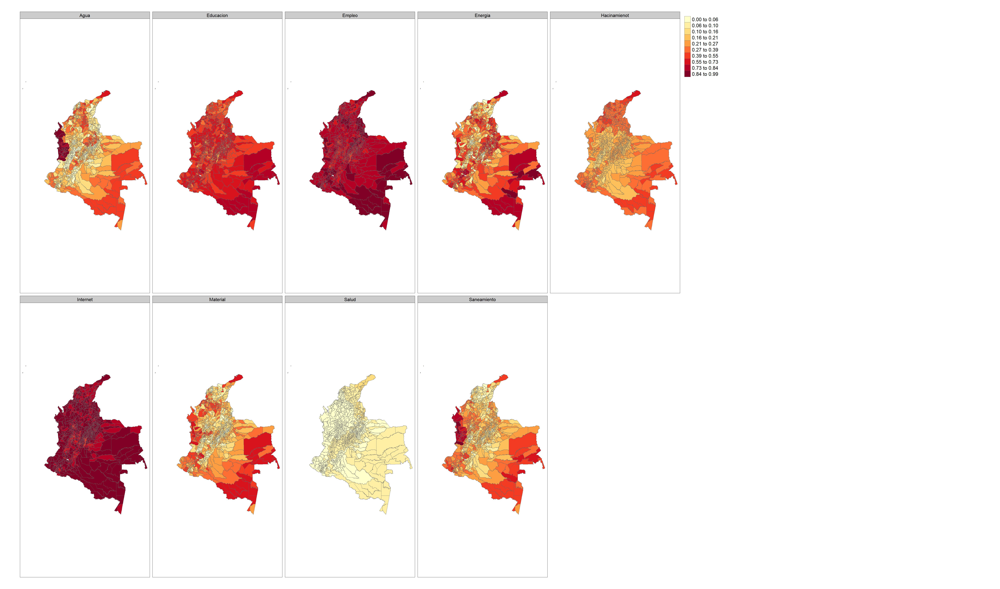

# Mapa del IPM por municipio de Colombia

Dado que los municipios son otro nivel de desagregción, es posible realizar un mapa municipal para $H$, $A$ e $IPM$. Para realizar el proceso, previamente se guardaron las estimaciones necesarias en un archivo _.rds_ el cual usaremos a continuación:
  

```r
library(sf)
library(tmap)
estimado_ipm <- readRDS(file = "Modelo_bayes_HxA/COL/Data/estimado_ipm_HA.rds")
temp_estimate_mpio <- readRDS("Modelo_bayes_HxA/COL/data/temp_estimate_mpio.rds")

brks_H <-
  round(quantile(estimado_ipm$dam2$H, probs = c(0, 0.2, 0.4, 0.6, 0.8, 1)), 2)
brks_ipm <-
  round(quantile(estimado_ipm$dam2$IPM, probs = c(0, 0.2, 0.4, 0.6, 0.8, 1)), 2)
brks_A <-
  round(quantile(estimado_ipm$dam2$A, probs = c(0, 0.2, 0.4, 0.6, 0.8, 1)), 2)

maps3 <- tm_shape(ShapeSAE %>%
                    left_join(estimado_ipm,  by = "dam2"))
```

Para crear los mapas se usa la siguiente sintaxis 


```r
thema_map <- tm_layout(legend.only = FALSE,
                legend.height = -0.5,
                legend.width = -0.4,
                asp = 1.5,
                legend.text.size = 5,
                legend.title.size = 4)

Mapa_H <-
  maps3 + tm_polygons(
    "H",
    breaks = brks_H,
    title = "H",
    palette = "YlOrRd",
    colorNA = "white"
  ) + thema_map

Mapa_A <-
  maps3 + tm_polygons(
    "A",
    breaks = brks_A,
    title = "A",
    palette = "YlOrRd",
    colorNA = "white"
  ) + thema_map
Mapa_ipm <-
  maps3 + tm_polygons(
    "IPM",
    breaks = brks_ipm,
    title = "IPM",
    palette = "YlOrRd",
    colorNA = "white"
  ) + thema_map


Mapas <- tmap_arrange(Mapa_H, Mapa_A, Mapa_ipm)

tmap_save(
  Mapas,
  "Modelo_bayes_HxA/COL/Output/COL_IPM.jpeg",
  width = 6920,
  height = 4080,
  asp = 0
)
```




## Mapa municipal por dimensión del IPM


```r
temp_estimate_mpio <- readRDS("Modelo_bayes_HxA/COL/data/temp_estimate_mpio.rds")

brks_dim <- round(quantile(
  temp_estimate_mpio$estimate,
  probs = c(0, 0.1, 0.2, 0.3, 0.4, 0.5, 0.6, 0.7, 0.8, 0.9, 1)
), 2)

maps2 <- tm_shape(ShapeSAE %>%
                    inner_join(temp_estimate_mpio,  by = "dam2"))

Mapa_ing2 <-
  maps2 + tm_polygons(
    "estimate",
    breaks = brks_dim,
    title = "",
    palette = "YlOrRd",
    colorNA = "white"
  ) + thema_map +
  tm_facets(by = "Indicador", ncol = 4)

tmap_save(
  Mapa_ing2,
  "Modelo_bayes_HxA/COL/Output/COL_dims_ipm.jpeg",
  width = 6920,
  height = 4080,
  asp = 0
)
```


